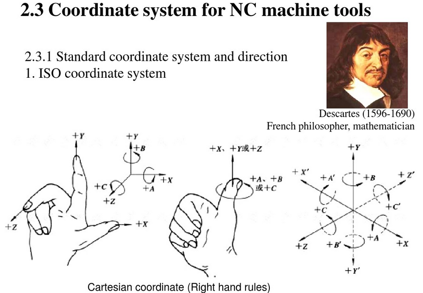

## 1.2 background

官方实现：
- The NIST RS274/NGC Interpreter
- RS274KT

Stand-Alone Interpreter (SAI)

# 2 Machining Center Overview

## 2.1 加工中心（Machining Centers）
对 RS274/NGC的输入 language与输出规范加工功能（canonical machining functions）都有一个视图
- (1) 受控加工中心的机械部件和 
- (2) 加工中心可以控制什么活动, 哪些数据在控制中被使用。
  
这两种视图下机械部件非常相似, 规范加工功能（canonical machining functions）包含额外的几个组件。

控制和数据的两种视图差异很大, 规范在大多数情况下, 规范加工功能视图简单得多;翻译器处理许多复杂的 RS274/NGC 语言, 使较低的控制级别不需要。为
例如, RS274/NGC 语言包含一个命令来执行啄钻循环（peck drilling cycle）。翻译器将这个复杂的单一命令分解成许多简单的 straight_feed 和
straight_traverse 规范加工功能调用。

在2.2节，介绍了在两个视图间共享的元素，两个视图的非共享部分将在3.2节(RS274/NGC language) 与 4.2 节(canonical machining functions)介绍.

### 2.1.1 机械部件（Mechanical Components）
加工中心（machining center）有许多可控制的机械部件（mechanical components）或可能影响控制的行使方式。本节描述这些组件中与解释器交互的子集 。
不直接与解释器交互的机械组件 (如 "手动 jog buttons" 按钮) 在这里没有描述, 即使它们影响控制。

#### 2.1.1.1 线性轴（Linear Axes）
加工中心（machining center）具有独立机制（注）, 用于在三个相互正交方向上产生刀具和工件的相对直线运动。这些是 X、Y 和 Z 轴。

- 注：如果机械部件的运动不是独立的, 就像六足机器一样, RS274/NGC语言和规范化加工功能仍然可以使用, 只要较低的控制级别知道如何控制实际的机制, 产生相同的工具和工件相对运动将由独立的轴产生。

#### 2.1.1.2 旋转轴（Rotational axes）
另外三个外的独立机制产生工件和刀具的相对旋转围绕轴。 这些机制 (通常是一个旋转工作台上的工件安装或主轴安装的滚筒) 称为旋转轴, 标签为 A、B 和 C。
通常A 轴与 X 轴平行。B 与 Y 轴平行, C 与 Z轴 平行。每个旋转机构可能会或可能没有 它可以旋转多远的机械限制。

- 注：任何语言都没有 旋转轴是否与线性轴平行的要求

#### 2.1.1.3 主轴（Spindle）
加工中心有一个主轴, 它拥有一个刀具, 探头, 或其他东西。主轴可以在任一方向旋转, 并且可以以恒定速率旋转, 这个速率可以被改变。除了在主轴可以移动旋转轴移动的机器上,
主轴轴与 z 轴保持平行, 当 X 和 Y 为零时与 z 轴重合。主轴可以在固定方向停止或随意方向停止

#### 2.1.1.4 coolant冷却

加工中心具有提供 mist(雾状)冷却液和/或 flood(溢流)冷却液的部件。典型的加工功能视图也有贯穿刀具冷却液；见第4.2.2.1节。

#### 2.1.1.5 Pallet Shuttle托盘穿梭机

加工中心有一个托盘穿梭系统。该系统有两个可移动托盘工件可以固定。一次只能在一个位置加工托盘。

#### 2.1.1.6 Tool Carousel刀架

加工中心有一个刀架，刀架上有固定刀具的槽。

#### 2.1.1.7 Tool Changer刀库

加工中心有一个用于在主轴和刀具转盘。

#### 2.1.1.8 Message Display信息显示

加工中心有一个可以显示信息的设备。

#### 2.1.1.9 Feed and Speed Override Switches进给和速度超驰开关

加工中心有单独的进给和速度超越开关，允许操作员指定加工中使用的实际进给速度或主轴速度应为编程速率。见第2.1.2.15节和第2.2.1节。

#### 2.1.1.10 Block Delete Switch块删除开关

加工中心有一个块删除开关。见第2.2.2节。

#### 2.1.1.11 Optional Program Stop Switch可选程序停止开关

加工中心有一个可选的程序停止开关。见第2.2.3节。


### 2.1.2 控制与数据部件（Control and Data Components）

#### 2.1.2.1 线性轴
X、Y 和 Z 轴形成正交线性轴的标准右手坐标系。三直线运动机构的位置用这些轴上的坐标表示。

#### 2.1.2.2 旋转轴
旋转轴以度为单位测量, 其方向为缠绕的线性轴。当从相应的 X 的正端查看时, 正旋转是逆时针的,Y 或 Z 轴。我们指的是 "绕线轴", 即角位置增加的一个
没有限制 (走向加无穷大), 因为轴逆时针旋转, 没有限制 (走向负无穷大), 因为轴顺时针旋转。使用包线轴无论是否有机械的旋转极限。

顺时针或逆时针是从工件的角度来看。如果工件是固定在一个转盘上转动的轴, 从点逆时针转工件的视图是通过转动转盘的方向完成的 (对于大多数普通机器配置) 从站在某人的角度看顺时针方向机器旁边

#### 2.1.2.3 控制点（Controlled Point）
控制点是控制位置和运动速度的点。当工具长度偏移量为零 (默认值), 这是主轴轴上的点 (通常称为量规点 gauge point), 这是超过主轴端一些固定的距离, 通常接近适用于主轴的支架的末尾。控制点的位置可以沿 主轴轴通过为刀具长度偏移指定一些正值得。该值为通常为正在使用刀具的长度, 使受控点在刀具末端。

#### 2.1.2.4 协同线性运动（Coordinated Linear Motion）
要沿指定路径驱动刀具, 加工中心必须经常协同几个轴。我们使用 "协同线性运动" 一词来描述这种情况,
通常, 每个轴以恒定的速度移动，并且在同一时间所有轴都在从他们的起始位置到他们的结束位置移动。如果只有 X、Y 和 Z 轴 (或其中的任何一个或两个)
移动, 这会产生直线的运动, 即本节中的 "线性"含义。在实际移动中, 通常不可能保持恒定的速度, 因为在移动中需要加速度或减速。但是, 控制轴是可行的, 
所以, 在任何时候, 每个轴都要完成其他轴需要它完成的部分。 这使工具沿着相同的路径移动, 我们也称之为这种运动协调线性运动。
协调线性运动可以在当前的进给速率或遍历速率下进行。如果轴速度的物理限制使所需的速率无法得到, 所有轴都减慢以保持所需的路径。

#### 2.1.2.5 进料率（Feed Rate）
控制点或轴移动的速率名义上是一个稳定的速率, 可由用户设置。在解释器中, 除非在 RS274/NGC 视图中使用反向时间进给速率模式 (请参见3.5.19 节), 否则对进纸速率的解释如下面描述。4.3.5.1 节中所述的进给速率的规范化加工功能视图具有不同的应用条件, 但在解释器中没有使用。
- a. 对于涉及一个或多个 X、Y 和 Z 轴 (有或不同时旋转轴运动) 的运动, 进给速率意味着沿编程 XYZ 路径每分钟的长度单位, 就好像旋转轴没有移动一样。
- b. 对于一个旋转轴的运动, X、Y 和 Z 轴不移动, 进给速率表示旋转轴的每分钟旋转的度数。
- c. 对于不移动的 X、Y 和 Z 轴的三个旋转轴的运动, 该速率应用如下。让 dA、dB 和 dC 分别是 A、B 和 C 轴各自必须移动的角度。让 D =。从概念上讲, D 是一个总角运动的度量, 使用通常的欧几里德度量。让 T 是以每分钟以度为单位, 以当前的进给速率在 D 度上移动所需的时间量。旋转轴应在协调线性运动中移动, 以便从开始到运动结束的时间是 T 加上加速度或减速所需的任何时间。


#### 2.1.2.6 Arc Motion
任何一对线性轴 (XY, YZ, XZ) 都可以被控制 以在这对轴的平面上的做圆弧移动。当这种情况发生时, 第三个线性轴和旋转轴可以
控制在有效的恒定速率同时移动。在协同线性运动中,可以协同运动, 使加速度和减速不影响路径。如果转动的轴不移动, 但第三个线性轴移动, 轨道的控制点是一个螺旋。

在弧运动中的进给速率是如上文2.1.2.5 节 a 项所述。在螺旋运动的情况下, 该速率沿螺旋线应用。在 RS274 的其他版本中,
该速率适用于所选平面上的螺旋线投影的圆弧。

#### 2.1.2.11 选中的平面（Selected Plane）
总是有一个 "选中的平面", 这必须是加工中心的 XY 平面, YZ 平面, 或 XZ 平面。Z 轴垂直于 XY 平面, X 轴垂直于YZ-平面, 和 Y 轴垂直于 XZ 平面。

## 2.2 解释器于开关交互（Interpreter Interaction with Switches）
如2.1.2 节所述, 解释器与三开关交互。本节介绍更详细的交互。在任何情况下, 解释器知道这些开关是什么设置。

## 2.3 工具文件（Tool File）
使用解释器时需要一个工具文件。该文件告诉哪些工具在其中的旋转槽以及每个刀具的长度和直径。
解释器不直接处理工具文件。工具文件由 EMC 系统或SAI读取。


The “POCKET” 列包含一个无符号整形值，它代表放置工具的工具转盘槽（tool carousel slot）的pocket number (slotnumber) .此列中的项必须全部不同。 

The “FMS” 列包含一个无符号整形值，它该工具的code number。 

The “TLO” 列包含一个实数代表工具的长度偏移量。当选中该pocket，并且使用该工具长度偏移量时，TLO的值将被使用。
它通常是一个正值，但如果它永远不被使用，那它可以是0或任何其他值。

The “DIAM” 列包含一个实数. 仅当该pocket的工具半径补偿被打开时，该值才会被使用. 如果在补偿过程中编程的路径是被切割的材料的边缘, 
这应该是一个正实数代表测量刀具直径。如果在补偿过程中编程的路径是工具的路径, 其直径是标称的, 这应该是一个小数目 (正数, 负数, 或零), 
代表刀具的测量直径与公称直径的差值。如果刀具半径补偿不与工具一起使用, 在该列中的数字不重要。

用于刀具长度和直径的单位可以是毫米或英寸, 但如果该数据由 NC 程序使用, 用户必须确保文件中用于工具的单位是与使用工具数据的 NC 代码被解释时有效的单位相同。


#  3 Input: the RS274/NGC Language

RS274/NGC 语言基于代码行。每行 (也称为 "块block") 可能包括多个到加工中心的命令到做几件不同的事情。

典型的代码行由一个可选行号开始, 后跟一个或更多的 "words"。word由字母后跟数字 (或计算结果为数字)。word 可以给出命令或向命令提供参数。
例如, "G1 X3" 是一个有效的代码行, 其中有两个word。"G1" 是一个命令意思是"移动在编程提要速率的直线, "X3"提供一个参数值 (X 的值
在移动结束时应为 3)。大多数 RS274/NGC 命令以 G 或 M 开头 (for miscellaneous)。这些命令的word称为 “G codes” and “M codes.”。

一个文件可以按以下方式进行分界。
- 文件的第一个非空行可能只包含一个百分比符号 "%", 该百分比符号可能被空白环绕, 稍后在文件中 (通常位于文件末尾) 可能有类似的行。
- 如果文件在开始时有百分比行, 但不在末尾, 则会发出错误信号。按百分数划分的文件的有用内容在第二个百分比行之后停止。之后的任何事情都被忽略了。
- 如果文件中有 M2 或 M30, 则上面介绍的通过"%"进行标定是可选的, 但如果不是这样, 则"%"是必需的。

## 3.2 从RS274/NGC语言眼中看到的加工中心（ RS274/NGC Language View of a Machining Center） 
The RS274/NGC语言是基于被控制的加工中心是什么样。该视图已经在2.1节描述了，这里再补充其他额外的部分。

### 3.2.1 Parameters
在 RS274/NGC 语言视图中, 加工中心维护长度5400的数组参数。其中许多都有具体用途。参数数组应持久化, 即使如果加工中心断电。RS274/NGC 语言没有规定
关于如何确保持久性。EMC 项目使用参数文件来确保持久性并给出解释器维护文件的责任。当它启动时解释器读取文件, 并在退出时写入该文件。

| Parameter number  |  Parameter value  |  Comment    || Parameter number  |  Parameter value  |  Comment    |
|--|--|--|--|--|--|--|
|5281 | 0.0  |coord. system 4 X|  | 5161 | 0.0  | G28 home X  |          
|5282 | 0.0  |coord. system 4 Y|  | 5162 | 0.0  | G28 home Y  |          
|5283 | 0.0  |coord. system 4 Z|  | 5163 | 0.0  | G28 home Z  |          
|5284 | 0.0  |coord. system 4 A|  | 5164 | 0.0  | G28 home A  |          
|5285 | 0.0  |coord. system 4 B|  | 5165 | 0.0  | G28 home B  |          
|5286 | 0.0  |coord. system 4 C|  | 5166 | 0.0  | G28 home C  |          
|5301 | 0.0  |coord. system 5 X|  | 5181 | 0.0  | G30 home X  |          
|5302 | 0.0  |coord. system 5 Y|  | 5182 | 0.0  | G30 home Y  |          
|5303 | 0.0  |coord. system 5 Z|  | 5183 | 0.0  | G30 home Z  |          
|5304 | 0.0  |coord. system 5 A|  | 5184 | 0.0  | G30 home A  |          
|5305 | 0.0  |coord. system 5 B|  | 5185 | 0.0  | G30 home B  |          
|5306 | 0.0  |coord. system 5 C|  | 5186 | 0.0  | G30 home C  |          
|5321 | 0.0  |coord. system 6 X|  | 5211 | 0.0  | G92 offset X  |        
|5322 | 0.0  |coord. system 6 Y|  | 5212 | 0.0  | G92 offset Y  |        
|5323 | 0.0  |coord. system 6 Z|  | 5213 | 0.0  | G92 offset Z  |        
|5324 | 0.0  |coord. system 6 A|  | 5214 | 0.0  | G92 offset A  |        
|5325 | 0.0  |coord. system 6 B|  | 5215 | 0.0  | G92 offset B  |        
|5326 | 0.0  |coord. system 6 C|  | 5216 | 0.0  | G92 offset C  |        
|5341 | 0.0  |coord. system 7 X|  | 5220 | 1.0  | coord. system number  |
|5342 | 0.0  |coord. system 7 Y|  | 5221 | 0.0  | coord. system 1 X  |   
|5343 | 0.0  |coord. system 7 Z|  | 5222 | 0.0  | coord. system 1 Y  |   
|5344 | 0.0  |coord. system 7 A|  | 5223 | 0.0  | coord. system 1 Z  |   
|5345 | 0.0  |coord. system 7 B|  | 5224 | 0.0  | coord. system 1 A  |   
|5346 | 0.0  |coord. system 7 C|  | 5225 | 0.0  | coord. system 1 B  |   
|5361 | 0.0  |coord. system 8 X|  | 5226 | 0.0  | coord. system 1 C  |   
|5362 | 0.0  |coord. system 8 Y|  | 5241 | 0.0  | coord. system 2 X  |   
|5363 | 0.0  |coord. system 8 Z|  | 5242 | 0.0  | coord. system 2 Y  |   
|5364 | 0.0  |coord. system 8 A|  | 5243 | 0.0  | coord. system 2 Z  |   
|5365 | 0.0  |coord. system 8 B|  | 5244 | 0.0  | coord. system 2 A  |   
|5366 | 0.0  |coord. system 8 C|  | 5245 | 0.0  | coord. system 2 B  |   
|5381 | 0.0  |coord. system 9 X|  | 5246 | 0.0  | coord. system 2 C  |   
|5382 | 0.0  |coord. system 9 Y|  | 5261 | 0.0  | coord. system 3 X  |   
|5383 | 0.0  |coord. system 9 Z|  | 5262 | 0.0  | coord. system 3 Y  |   
|5384 | 0.0  |coord. system 9 A|  | 5263 | 0.0  | coord. system 3 Z  |   
|5385 | 0.0  |coord. system 9 B|  | 5264 | 0.0  | coord. system 3 A  |   
|5386 | 0.0  |coord. system 9 C|  | 5265 | 0.0  | coord. system 3 B  |   
|     |      |                 |  | 5266 | 0.0  | coord. system 3 C  |   


### 3.2.2 坐标系统（Coordinate Systems）
在 RS274/NGC language 视图中, 加工中心具有绝对坐标系和九程序坐标系（nine program coordinate systems）。

您可以使用 G10 L2 Pn 设置九程序坐标系的偏移量 (n 是坐标系编号), 其值为轴的绝对坐标系（参看3.5.5 节）。
您可以使用 G54、G55、G56、G57、G58、G59、G59.1、G59.2 或G59.3 (见3.5.13 节) 从这九个系统中选择一个。不可能直接选择绝对坐标系。
您可以使用 G92 或 G92.3 来偏移当前坐标系。此偏移量将应用于所有九程序坐标系（nine program coordinate systems）。此偏移量可以用 G92.1 或 G92.2 取消（请参阅3.5.18节）

您可以通过使用 G53（与G0 或 G1） 在绝对机器坐标系中进行直线移动（见3.5.12 节）
坐标系统的数据存储在参数中。

在初始化期间, 将选择由参数5220指定的坐标系。值1表示第一个坐标系 ( G54 激活), 值2表示第二坐标系统 ( G55 激活), 等等。参数5220只能是【1，9】间的整数。

workpiece coordinate system known as program coordinate



## 3.3 代码行格式（Format of a Line）

输入 RS274/NGC 代码的允许行包括以下顺序的内容，代码行最大字符数为256。
- 1. 可选的块删除字符, 这是一个斜线 "/"。
- 2. 可选行号。
- 3. 任意数量的words, parameter settings, and comments.
- 4. 代码行结束符 (/r  or  /n 或/r/n)。
   
任何未显式允许的输入都是非法的, 并将导致解释器发出返回错误。为了使允许的代码行的规格精确, 我们在附录 E 中定义了它 (Wirth 语法表示法)。

除注释外，在代码行的任何位置都允许使用空格和制表符, 并且不更改代码行的含义, 。这使得一些看起来奇怪的输入合法。“g0x +0. 12 34y 7”等价于 “g0 x+0.1234 y7”。
输入中允许有空行。他们将被忽略。输入不区分大小写, 除非在注释中, 也就是说, 注释之外的任何字母都可能位于上或小写, 而不改变代码行含义。

### 3.3.1 代码行号（Line Number）
行号是字母 N 后跟一个在[0,99999]范围的无符号整数( 类似000009 是不合法的)。行号可以重复或无序, 但通常的做法是避免这种用法。行号也可能是跳过, 这是正常的做法。行号不是必须的, 但如果使用则必须在适当的地方 。

### 3.3.2 Word
word是 N 以外的字母, 后跟一个真正的值。
单词可能以table 3中显示的任何字母（letters）开头。为了完整性，该table中包含了 N ,尽管如上所述, 代码行号不是word。 几个letter (I、J、K、L、P、R) 可能在不同的语境中有不同的含义。
- table 3 Word-starting Letters
    |Letter| Meaning|
    |--|--|
    | A | A-axis of machine|
    | B | B-axis of machine|
    | C | C-axis of machine|
    | D | tool radius compensation number|
    | F | feedrate|
    | G | general function (see Table 5)|
    | H | tool length offset index|
    | I | X-axis offset for arcs|
    | X | offset in G87 canned cycle|
    | J | Y-axis offset for arcs|
    | Y | offset in G87 canned cycle|
    | K | Z-axis offset for arcs|
    | Z | offset in G87 canned cycle|
    | L | number of repetitions in canned cycles，key used with G10|
    | M | miscellaneous function (see Table 7)|
    | N | line number|
    | P | dwell time in canned cycles，dwell time with G4，key used with G10|
    | Q | feed increment in G83 canned cycle|
    | R | arc radius，canned cycle plane|
    | S | spindle speed|
    | T | tool selection|
    | X | X-axis of machine|
    | Y | Y-axis of machine|
    | Z | Z-axis of machine|


### 3.3.3 参数设置（Parameter Setting）
参数设置为以下有序的四项: 
- (1) 字符#, 
- (2) 一个计算结果为介于1和5399之间的整数 
- (3) 赋值符号"=", 
- (4) 实际值。例如 "#3 = 15" 是一个参数设置,含义是 "设置参数3为 15"。

参数赋值在代码行的所有参数都被发现后才会被赋值起效，例如, 如果"参数3"以前设置为 15, 并且代码行 "#3 = 6 G1 x#3" 被解释为： 直接移动到一个点（ x 等于15）， 参数值3将被赋值为6。


### 3.3.4 Comments and Messages
"("开始注释， 注释结束于其后发现的第一个")"。一旦"("放置在一行上, 匹配的")"必须出现在行尾之前。注释不得嵌套; 下面是包含注释的行的示例:"G80 M5 (stop motion)"。注释不会导致加工中心做任何事情。

如果 "MSG" 出现在"("之后，则表明注释中包含一条消息 。这种情况下，")"前的字符的其余部分会被视为消息。消息应显示在消息显示设备上。不包含消息的注释不需要在显示设备那里显示。

### 3.3.5 关于重复的说明（Item Repeats）
一个代码行可以有任意数量的G word, 但属于同一个modal group（参见3.4节）的两个G words不应出现在同一代码行上。

一个代码行可能有0~4个M words。但属于同一个modal group（参见3.4节）的两个M words不应出现在同一代码行上。

对于所有其他合法 letters, 一个代码行应只能由一个以该letter开始的word存在。

如果在同一个代码行上重复对同一参数进行参数设置, 例如 "#3 = 15 #3 = 6", 则只有最后一个设置才能生效。在同一代码行设置相同的参数两次这是愚蠢的, 但不是非法的。

如果一行中出现多个注释, 则只使用最后一个批注;其他注释将被读取, 其格式将被选中, 但此后将被忽略。在一行上放置多个注释非常少见。

### 3.3.6 关于顺序的说明（Item order）

对 word, parameter setting, and comment， 它们的顺序在不同的代码行可能不同。

- 对word：  可以以任何方式重新排序, 而不改变代码行的含义。
- 对parameter：(参数设置)可以被重新排序, 在代码行中的含义不会有任何更改。除非同一参数设置不止一次。在这种情况下, 只有最后一个设置参数将生效。例如, 在 "#3 = 15 #3 = 6" 行被解释后,参数3的值将为6。如果将订单反转到 "#3 = 6 #3 = 15", 并且该行被解释, 则
参数3的值将为15。
- 对comment： (注释) 包含多个注释并重新排序, 则只有最后一个注释会被使用。

如果每个组保持有序或重新排序, 并且不更改代码行的含义, 例如代码行 "g40 g1 #3 = 15 (foo) #4 =-7.0" 有五项（5 item），将会有120种含义完全一样的可能组合命令(如 "#4 =-7.0 g1 #3 = 15 g40 (foo)") 。

### 3.3.7 命令和机器模式（Commands and Machine Modes）
在 RS274/NGC 中, 许多命令导致加工中心从一种模式（mode）变为另一种模式,并且该模式保持活动状态, 直到其他命令隐式或显式更改为止。

这样命令称为 "模态 modal"。例如, 如果coolant冷却打开, 它将一直保持, 直到它显式地关闭。运动的 G 代码也是“模态 modal”的。例如如果给出了 G1 (直移) 命令， 如果行中有一个或多个 axis words, 则在下一行上将再次执行该行, 除非使用axis words在下一行上给出显式命令或取消motion。

"非模态 Non-modal" 代码只对它们发生的代码行产生影响。例如, G4 (驻留dwell) 是非模态的命令。


## 3.4 模态组（Modal Groups）
Modal commands are arranged in sets called “modal groups”, and only one member of a modal
group may be in force at any given time. In general, a modal group contains commands for which
it is logically impossible for two members to be in effect at the same time — like measure in
inches vs. measure in millimeters. A machining center may be in many modes at the same time,
with one mode from each modal group being in effect. The modal groups are shown in Table 4.

3.4 
模态命令（modal commands）在组合排列在称为 "模态组modal group" 的集合, 在任何特定时间某个模态组中只能有一个成员生效。通常, 模式组包含命令, 其中
这是在逻辑上不可能的两个成员是在同一时间的措施生效，例如度量的英寸与毫米为单位在同一时间只能有一个生效。加工中心可以同时处于多种模式下,但每个模态组中只有一个模式有效。模式组显示在table 4中。

- The modal groups for G codes are:
    |G code modal group|description|
    |--|--|
    |group 1= {G0, G1, G2, G3, G38.2, G80, G81, G82, G83, G84, G85, G86, G87, G88, G89} |motion|
    |group 2 = {G17, G18, G19} |plane selection|
    |group 3 = {G90, G91} |distance mode|
    |group 5 = {G93, G94} |feed rate mode|
    |group 6 = {G20, G21} |units|
    |group 7 = {G40, G41, G42} |cutter radius compensation|
    |group 8 = {G43, G49} |tool length offset|
    |group 10 = {G98, G99} |return mode in canned cycles|
    |group 12 = {G54, G55, G56, G57, G58, G59, G59.1, G59.2, G59.3} |coordinate system selection|
    |group 13 = {G61, G61.1, G64} |path control mode|

- The modal groups for M codes are:
```text
group 4 = {M0, M1, M2, M30, M60} stopping
group 6 = {M6} tool change
group 7 = {M3, M4, M5} spindle turning
group 8 = {M7, M8, M9} coolant (special case: M7 and M8 may be active at the same time)
group 9 = {M48, M49} enable/disable feed and speed override switches
```
- In addition to the above modal groups, there is a group for non-modal G codes:
```text
group 0 = {G4, G10, G28, G30, G53, G92, G92.1, G92.2, G92.3}
```
对于这些模态组（modal group）, 当加工中心准备接受命令时, 模态组组中的某个成员必须有效。这些模式组有默认设置。当该加工中心开启或以其他方式重新初始化时, 默认值自动生效。

对"group 1", 是一组G codes for motion。其中一个总是处于有效状态，它被称为当前的运动模式（current motion mode）。

如果将"group 1"与"group 2"中的G code放置在同一个代码行中，并且它们都使用了axis words，那这会是错误。

对"axis words",如果在"group 1"中的被某个使用axis words的"G code"隐式地生效 (通过在较早的行上激活)， 并且使用该“axis words”的属于“group 0”的“G code”在同一个代码行出现了，那么该属于"group 1"的“G code”将被在该代码行被抑制。  使用“axis words”并属于“group 0”的“G code”有 G10, G28, G30 和 G92。

## 3.5 G命令（G Codes）
G codes of the RS274/NGC language are shown in Table 5 and described following that.
The descriptions contain command prototypes, set in helvetica type.
In the command prototypes, three dots (…) stand for a real value. As described earlier, a real
value may be (1) an explicit number, 4, for example, (2) an expression, [2+2], for example, (3) a
parameter value, #88, for example, or (4) a unary function value, acos[0], for example.

In most cases, if axis words (any or all of X…, Y…, Z…, A…, B…, C…) are given, they specify
a destination point. Axis numbers are in the currently active coordinate system, unless explicitly
described as being in the absolute coordinate system. Where axis words are optional, any omitted
axes will have their current value. Any items in the command prototypes not explicitly described
as optional are required. It is an error if a required item is omitted.

In the prototypes, the values following letters are often given as explicit numbers. Unless stated
otherwise, the explicit numbers can be real values. For example, G10 L2 could equally well be
written G[2*5] L[1+1]. If the value of parameter 100 were 2, G10 L#100 would also mean the
same. Using real values which are not explicit numbers as just shown in the examples is rarely
useful.
If L… is written in a prototype the “…” will often be referred to as the “L number”. Similarly the
“…” in H… may be called the “H number”, and so on for any other letter.

每个命令的描述包含黑体字型的命令原型（command prototypes）, 在在命令原型中, 三点 (...) 代表一个确定的值。如前所述, 一个确定的值可以是 (1) 显式数字, 例如4 (2) 表达式, 例如[2 + 2],  (3)参数值, 例如#88, 或 (4) 一元函数值, 例如acos[0]。 在大多数情况下, 如果轴字“Axis words” (any or all of X…, Y…, Z…, A…, B…, C…) 被提供了，他们指示一个目标点（destination point）。轴数字（Axis number）位于当前活动坐标系中, 除非显式描述为在绝对坐标系中。如果坐标轴词是可选的, 则省略坐标轴将具有其当前值。未明确描述的命令原型中的任何项
作为可选的要求。如果省略了所需的项, 则为错误。
在原型中, 以下字母的值通常作为显式数字提供。除非说明
否则, 显式数字可以是实值。例如 “G10 L2 ” 也可以写为“G [2*5] L[1+1]” 。如果参数100的值为 2, G10 L#100 也是等价的。使用不是显式数字的真实值, 就像示例中所示, 很少有用。

如果在命令原型中写“ L… ”， “ … ”通常被称为 "L number"。类似的对“ H… ”， “ … ”通常被称为 "H number"，其他letter也类似。

- table 5
    |G     |  Code Meaning|
    |--|--|  
    |G0    |  rapid positioning|
    |G1    |  linear interpolation|
    |G2    |  circular/helical interpolation (clockwise)|
    |G3    |  circular/helical interpolation (counterclockwise)|
    |G4    |  dwell|
    |G10   |  coordinate system origin setting|
    |G17   |  XY-plane selection|
    |G18   |  XZ-plane selection|
    |G19   |  YZ-plane selection|
    |G20   |  inch system selection|
    |G21   |  millimeter system selection|
    |G28   |  return to home|
    |G30   |  return to secondary home|
    |G38.2 | straight probe|
    |G40   | cancel cutter radius compensation|
    |G41   | start cutter radius compensation left|
    |G42   | start cutter radius compensation right|
    |G43   | tool length offset (plus)|
    |G49   | cancel tool length offset|
    |G53   | motion in machine coordinate system|
    |G54   | use preset work coordinate system 1|
    |G55   | use preset work coordinate system 2|
    |G56   | use preset work coordinate system 3|
    |G57   | use preset work coordinate system 4|
    |G58   | use preset work coordinate system 5|
    |G59   | use preset work coordinate system 6|
    |G59.1 | use preset work coordinate system 7|
    |G59.2 | use preset work coordinate system 8|
    |G59.3 | use preset work coordinate system 9|
    |G61   | set path control mode: exact path|
    |G61.1 | set path control mode: exact stop|
    |G64   | set path control mode: continuous|
    |G80   | cancel motion mode (including any canned cycle)|
    |G81   | canned cycle: drilling|
    |G82   | canned cycle: drilling with dwell|
    |G83   | canned cycle: peck drilling|
    |G84   | canned cycle: right hand tapping|
    |G85   | canned cycle: boring, no dwell, feed out|
    |G86   | canned cycle: boring, spindle stop, rapid out|
    |G87   | canned cycle: back boring|
    |G88   | canned cycle: boring, spindle stop, manual out|
    |G89   | canned cycle: boring, dwell, feed out|
    |G90   | absolute distance mode|
    |G91   | incremental distance mode|
    |G92   | offset coordinate systems and set parameters|
    |G92.1 | cancel offset coordinate systems and set parameters to zero|
    |G92.2 | cancel offset coordinate systems but do not reset parameters|
    |G92.3 | apply parameters to offset coordinate systems|
    |G93   | inverse time feed rate mode|
    |G94   | units per minute feed rate mode|
    |G98   | initial level return in canned cycles|
    |G99   | R-point level return in canned cycles  |

### 3.5.1 Rapid Linear Motion — G0
For rapid linear motion, program G0 **X… Y… Z… A… B… C…**, where all the axis words are
optional, except that at least one must be used. The G0 is optional if the current motion mode is
G0. This will produce coordinated linear motion to the destination point at the current traverse
rate (or slower if the machine will not go that fast). It is expected that cutting will not take place
when a G0 command is executing.
It is an error if:
• all axis words are omitted.
If cutter radius compensation is active, the motion will differ from the above; see Appendix B. If
G53 is programmed on the same line, the motion will also differ; see Section 3.5.12.


### 3.5.5 Set Coordinate System Data （origin） — G10
坐标系统的 RS274/NGC language视图在3.2.2 节中描述。 该命令为坐标系的原点设置坐标值, 对**G10 L2 P … X… Y… Z… A… B… C…**, 其中 P  number 必须是计算结果为一个范围1到 9 (对应于 G54 到 G59.3)的整数。该命令总的所有axis words都是可选的。

由P number指定的坐标系的原点（orgin）被重置为该命令中给定的坐标值（绝对坐标中的值），记住，只有命令中显示给出的axis word的坐标值会被重置。

It is an error if:
• the P number does not evaluate to an integer in the range 1 to 9.

If origin offsets (made by G92 or G92.3) were in effect before G10 is used, they will continue to
be in effect afterwards.
The coordinate system whose origin is set by a G10 command may be active or inactive at the
time the G10 is executed.


例子：**G10 L2 P1 x 3.5 y 17.2** 设置“the first coordinate system (the one selected by G54)”的原点为“X is 3.5 and Y is 17.2 (in absolute coordinates)”。原点的Z坐标将是该代码行执行之前的值。


### 3.5.18 坐标系统偏移量（Coordinate System Offsets — G92, G92.1, G92.2, G92.3）
坐标系统的 RS274/NGC language视图，即有关坐标系的概述在3.2.2 节中描述。

在不移动情况下，要使当前点具有所需的坐标,通过 **" G92 X…Y… Z… A… B… C… "**命令来实现。 所有的axis word都是可选的，除了至少有axis word一个被使用的条件。如果某个axis word没有在命令中给出，那意味这个当前点的该axis word坐标值不会更改。

如果存在以下情况, 则会出现错误:
·所有轴字均被省略。
当执行 G92被执行了, 当前活动坐标系的原点将被移动。为了该移动，原点偏移量将被计算，以使得当前点（current point）是基于G92代码行指定的目标原点。 另外parameters 5211 to 5216 会被设置为X、Y、Z、A、B 和 C的axis offset。坐标轴的偏移量是原点必须移动, 以便坐标轴上受控点的坐标具有指定的值。

Here is an example. Suppose the current point is at X=4 in the currently specified coordinate system and the current X-axis offset is zero, then G92 x7 sets the X-axis offset to -3, sets parameter 5211 to -3, and causes the X-coordinate of the current point to be 7.
The axis offsets are always used when motion is specified in absolute distance mode using any of
the nine coordinate systems (those designated by G54 - G59.3). Thus all nine coordinate systems
are affected by G92.
Being in incremental distance mode has no effect on the action of G92.
Non-zero offsets may be already be in effect when the G92 is called. If this is the case, the new 
value of each offset is A+B, where A is what the offset would be if the old offset were zero, and B
is the old offset. For example, after the previous example, the X-value of the current point is 7. If
G92 x9 is then programmed, the new X-axis offset is -5, which is calculated by [[7-9] + -3].
To reset axis offsets to zero, program G92.1 or G92.2. G92.1 sets parameters 5211 to 5216 to
zero, whereas G92.2 leaves their current values alone.
To set the axis offset values to the values given in parameters 5211 to 5216, program G92.3.
You can set axis offsets in one program and use the same offsets in another program. Program
G92 in the first program. This will set parameters 5211 to 5216. Do not use G92.1 in the
remainder of the first program. The parameter values will be saved when the first program exits
and restored when the second one starts up. Use G92.3 near the beginning of the second program.
That will restore the offsets saved in the first program. If other programs are to run between the
the program that sets the offsets and the one that restores them, make a copy of the parameter file
written by the first program and use it as the parameter file for the second program.


下面是一个例子。假设当前点位于当前指定坐标的 X=4 中
系统和当前 x 轴偏移量为零, 则 G92 x7 将 X 轴偏移量设置为-3, 设置参数5211到-3, 并导致当前点的 X 坐标为7。当以绝对距离模式指定运动时, 总是使用轴偏移量。

九坐标系 (那些由 G54-G59.3 指定)。因而所有九个坐标系
受 G92 的影响。
在增量距离模式下, 对 G92 的作用没有影响。
当调用 G92 时, 非零偏移量可能已经生效。如果是这种情况, 则每个偏移量的新值为 + B, 如果旧偏移量为零, 则偏移量是什么, 而 b
是旧偏移量。例如, 在上一个示例之后, 当前点的 X 值为7。如果
G92 x9 然后被编程, 新的 X 轴偏移量是-5, 由 [[7-9] +-3] 计算。
将轴偏移重置为零, 程序 G92.1 或 G92.2。G92.1 将参数设置为5211到 5216, 以
零, 而 G92.2 仅留下其当前值。
要将坐标轴偏移值设置为参数5211到5216中给定的值, 请程序 G92.3。
您可以在一个程序中设置坐标轴偏移量, 并在另一个程序中使用相同的偏移量。程序
G92 在第一个程序中。这将设置参数5211到5216。不要在 G92.1 中使用
第一个程序的其余部分。当第一个程序退出时, 参数值将被保存
当第二个启动时恢复。使用 G92.3 接近第二个程序的开始。
这将恢复保存在第一个程序中的偏移量。如果其他程序运行在
设置偏移量和还原它们的程序, 制作参数文件的副本
由第一个程序编写, 并将其用作第二个程序的参数文件。

```dot
digraph finite_state_machine {

        node [shape = doublecircle]; IDLE FINISHED
        node [shape = circle];
        rankdir=LR;
        START -> IDLE [ label = "errors" ];
        START -> UNLOCK [ label = "unlock needed" ];
        START -> UNLOCK_WAIT [ label = "unlock not needed" ];
        UNLOCK -> UNLOCK_WAIT
        UNLOCK_WAIT -> SET_SWITCH_POSITION [ label = "searchvel 0 latchvel 0" ];
        UNLOCK_WAIT -> INDEX_ONLY_START [ label = "searchvel 0 latchvel !0 useindex" ];
        UNLOCK_WAIT -> INITIAL_SEARCH_START [ label = "searchvel !0 latchvel !0" ];
        INITIAL_BACKOFF_START -> INITIAL_BACKOFF_WAIT [ label = "delay times out" ];
        INITIAL_BACKOFF_WAIT -> INITIAL_SEARCH_START [ label = "!switch" ];
        INITIAL_SEARCH_START -> INITIAL_BACKOFF_START [ label = "switch" ];
        INITIAL_SEARCH_START -> INITIAL_SEARCH_WAIT [ label = "!switch" ];
        INITIAL_SEARCH_WAIT -> SET_COARSE_POSITION [ label = "switch" ];
        SET_COARSE_POSITION -> FINAL_BACKOFF_START [ label = "search/latch opposite" ];
        SET_COARSE_POSITION -> FALL_SEARCH_START [ label = "search/latch same sign" ];
        FINAL_BACKOFF_START -> FINAL_BACKOFF_WAIT [ label = "switch" ];
        FINAL_BACKOFF_WAIT -> RISE_SEARCH_START [ label = "!switch" ];
        RISE_SEARCH_START -> RISE_SEARCH_WAIT [ label = "!switch" ];
        RISE_SEARCH_WAIT -> INDEX_SEARCH_START [ label = "switch & index" ];
        RISE_SEARCH_WAIT -> SET_SWITCH_POSITION [ label = "switch & !index" ];
        FALL_SEARCH_START -> FALL_SEARCH_WAIT [ label = "switch" ];
        FALL_SEARCH_WAIT -> INDEX_SEARCH_START [ label = "!switch & index" ];
        FALL_SEARCH_WAIT -> SET_SWITCH_POSITION [ label = "!switch & !index" ];
        SET_SWITCH_POSITION -> FINAL_MOVE_START
        INDEX_ONLY_START -> INDEX_SEARCH_WAIT
        INDEX_SEARCH_START -> INDEX_SEARCH_WAIT
        INDEX_SEARCH_WAIT -> SET_INDEX_POSITION [ label = "index found" ];
        SET_INDEX_POSITION -> FINAL_MOVE_START
        FINAL_MOVE_START -> FINAL_MOVE_WAIT
        FINAL_MOVE_WAIT -> LOCK [ label = "in position" ];
        LOCK -> LOCK_WAIT
        LOCK_WAIT -> FINISHED

        FINISHED -> IDLE
        IDLE -> START 
}

```





