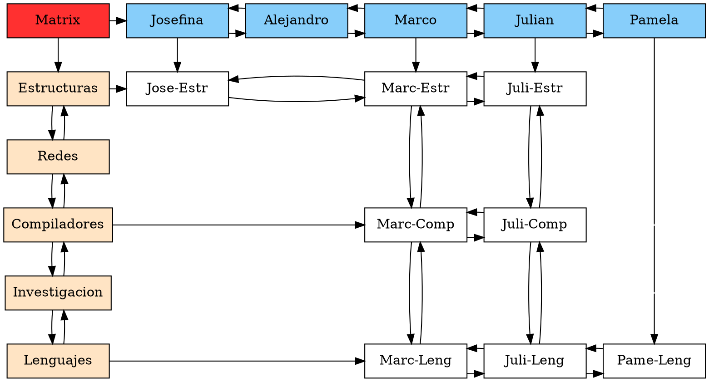

## 数学

- 整数集 简称 Z.  *the set of integers*
- 有理数集 简称 Q.   *the set of rational numbers*
- 实数集 简称 R.    *the set of real numbers*
- 复数集合，简称 C. *the set of complex numbers*
- arg:复数的辐角。 *argument of a complex number* 
- Im: *Imaginary Part*; 复数的虚部


# chapter 1 复数 p4
- 有理数的运算规则   
    | 运算规则 | |      
    |---------|--|      
    |加法交换律| $a+b=b+a$|
    |乘法结合律| $ab=ba$|
    |加法结合律| $a+(b+c)=(a+b)+c$|
    |乘法结合律| $a(bc)=(ab)c$|
    |分配律    |$(a+b)c=ac+bc$|

- 复数运算定义   
   |运算||
   |--|--|
   |加减法|$(a+bi) \pm (c+di) := (a \pm c) +(b \pm d)i$|
   |乘法|$(a+bi) (c+di) := (ac - bd) + (bc + ad)i$|
   |乘法|$z_{1}z_{2}=(r_{1}cis\theta_{1})(r_{2}cis\theta_{2})=(r_{1}r_{2})cis( \theta_{1} + \theta_{21} )$|
   |除法|$\frac{a+bi}{c+di} := \frac{ac+bd}{c^{2}+d^{2}} + \frac{ac-bd}{c^{2}+d^{2}}i$|


$$\frac{a+bi}{c+di} := \frac{ac+bd}{c^{2}+d^{2}} + \frac{ac-bd}{c^{2}+d^{2}}i$$


假设质量为$m_{1},m_{2},m_{3},...m_{n}$的$n$个质点分别位于复平面的$z_{1},z_{2},z_{3},...z_{n}$处，说明该系统的质心是点： 

- $( z_{2}- z_{1} )$表达的是一个$z_{1}$指向$z_{2}$ 的新向量. 显然向量的加减法可以直观的看出复数模$\bar{z}$具有三角不等式关系.   
- 复共轭  点$z=a+bi$ 关于实轴的对称点是$z=a-bi$. 下面的定义给这个概念一个特别的记号．$\bar{z}=a-bi$
- 运算
    - $$\overline{ z_{1} + z_{2} }= \bar{z_{1}}+\bar{z_{2}}$$   
    - $$\overline{ z_{1} - z_{2} }= \bar{z_{1}}-\bar{z_{2}}$$   
    - $$\overline{ z_{1}  z_{2} }= \bar{z_{1}}\bar{z_{2}}$$   
    - $$\overline{ (\frac{z_{1}}{z_{2}}) }=\frac { \bar{z_{1}}} {\bar{z_{2}} }$$   


指数函数$f(x)=e^{x}$在复平面有自然而且特别有用的推广。

$$\frac{de^{iy} }{d(iy)}=e^{iy}$$

- 欧拉euler方程： $e^{z}:=e^{x}(cosy+i * siny)$,其中$z=x+iy$
- 欧拉euler方程： $z=r*cis\theta = r(cos\theta+i*sin\theta)=re^{i\theta}$

- 对应几个推导恒等式：$e^{2\pi i}=e^{i0}=e^{-2\pi i}=e^{4\pi i}={-4\pi i}=...=1$, 
- $e^{(\pi/2)i}=i$, $e^{(-\pi/2)i}=-i$


## Item-based算法详细过程


https://github.com/jingchenUSTC/SVDRecommenderSystem

https://blog.csdn.net/zhongkejingwang/article/details/43083603
https://github.com/james-bowman/nlp


[[5类系统推荐算法]](https://blog.csdn.net/u010670689/article/details/71513133)

[[论文]](http://wwwconference.org/proceedings/www10/papers/pdf/p519.pdf)

在下图,物品（item）$i$与$j$是$m$维的两个向量，m是用户数量。


# 敏感词

[[敏感词过滤算法实现]](http://hellohank.iteye.com/blog/1327903)


# 相似度计算    
   Item-based算法首选计算物品之间的相似度，计算相似度的方法有以下几种：

在数据处理中有个结论：在数据标准化（$ \mu=0,\sigma=1 $）后，Pearson相关性系数、Cosine相似度、欧式距离的平方可认为是等价的。

标准差是一组数据平均值分散程度的一种度量。一个较大的标准差，代表大部分数值和其平均值之间差异较大；一个较小的标准差，代表这些数值较接近平均值。标准计算公式：
假设有一组数值X₁,X₂,X₃,......Xn（皆为实数），其平均值（算术平均值）为$\mu$，标准差也被称为标准偏差，或者实验标准差，公式为 
$$\sigma=\sqrt{ \frac{1}{N}\sum_{i=1}^{N}\left(x_{i}-\mu\right)^{2}  }$$

- 1、(0,1)标准化：

这是最简单也是最容易想到的方法，通过遍历feature vector里的每一个数据，将Max和Min的记录下来，并通过Max-Min作为基数（即Min=0，Max=1）进行数据的归一化处理：
$${x}_{normalization}=\frac{x-Min}{Max-Min}$$
```python
    def MaxMinNormalization(x,Max,Min):  
        x = (x - Min) / (Max - Min);  
        return x;  
```
找大小的方法直接用np.max()和np.min()就行了，尽量不要用python内建的max()和min()，除非你喜欢用List管理数字

- 2、Z-score标准化：

这种方法给予原始数据的均值（mean）和标准差（standard deviation）进行数据的标准化。经过处理的数据符合标准正态分布，即均值为0，标准差为1，这里的关键在于复合标准正态分布，转化函数为：
$${x}_{normalization}=\frac{x-\mu }{\sigma }$$

```python
    def Z_ScoreNormalization(x,mu,sigma):  
        x = (x - mu) / sigma;  
        return x;  
```
这里一样，mu（即均值）用np.average()，sigma（即标准差）用np.std()即可。

- 3、Sigmoid函数

Sigmoid函数是一个具有S形曲线的函数，是良好的阈值函数，在(0, 0.5)处中心对称，在(0, 0.5)附近有比较大的斜率，而当数据趋向于正无穷和负无穷的时候，映射出来的值就会无限趋向于1和0，根据公式的改变，就可以改变分割阈值，这里作为归一化方法，我们只考虑(0, 0.5)作为分割阈值的点的情况：
$${x}_{normalization}=\frac{1}{1+{e}^{-x}}$$
```python
    def sigmoid(X,useStatus):  
        if useStatus:  
            return 1.0 / (1 + np.exp(-float(X)));  
        else:  
            return float(X);  
```
这里useStatus管理是否使用sigmoid的状态，方便调试使用。


## 基于余弦（Cosine-based similarity）的相似度计算，     
通过计算两个向量之间的夹角余弦值来计算物品之间的相似性，其中分子为两个向量的内积，即两个向量相同位置的数字相乘。分母是两个向量的欧几里得范数乘积。公式如下：
   $$sim(i,j)=\cos( \vec{i},\vec{j} )= \frac{ \vec{i}.\vec{j} }{ \left \| \vec{i} \right \|_{2} * \left \| \vec{j} \right \|_{2} }$$

 上面的这个公式，要求两个向量的所有维度都是有值。为解决这个问题，下面的peason-r方法通过“去中心化”来解决这个问题：没有值的维度都认为是零，然后大家都减去这个向量的平均值。  

- 下面是一个计算的例子：

|主题 |  年龄 x  |  葡萄糖水平 y  | Xy   |  X2   |  Y2   |
|-----|----------|----------------|------|-------|-------|
|1    |  43      |  99            | 4257 |  1849 |  9801 |
|2    |  21      |  65            | 1365 |  441  |  4225 |
|3    |  25      |  79            | 1975 |  625  |  6241 |
|4    |  42      |  75            | 3150 |  1764 |  5625 |         
|5    |  57      |  87            | 4959 |  3249 |  7569 |    
|6    |  59      |  81            |4779  |  3481 |  6561 |    
|Σ    |  247     |  486           |20485 |  11409|  40022|


## 基于关联（Correlation-based）的相似度计算，
计算两个向量之间的[[Pearson-r关联度]](https://blog.csdn.net/wenbingoon/article/details/17414063)(或参考[[Pearson_correlation_coefficient]](https://en.wikipedia.org/wiki/Pearson_correlation_coefficient))，其中 $R_{u,i}$ 表示用户u对物品i的打分，$\bar{R_{i}}$表示第i个物品打分的平均值。公式如下：
    
   $$sim(i,j)=\frac{ \sum_{ u\in U}(R_{u,i}-\bar{R_{i}})(R_{u,j}-\bar{R_{j}}) }{ \sqrt{ \sum_{ u\in U}\left(R_{u,i}-\bar{R_{i}}\right)^{2} } . \sqrt{ \sum_{ u\in U}\left(R_{u,j}-\bar{R_{j}}\right)^{2} } }$$

从上面公式可以看出，皮尔逊相关系数的思路是, 把null的维度都填上0, 然后让所有其他维度减去这个向量各维度的平均值, 这样的操作叫作中心化. 中心化之后所有维度的平均值就是0了, 也满足进行余弦计算的要求. 然后再进行我们的余弦计算得到结果. 这样先中心化再余弦计得到的相关系数叫作皮尔逊相关系数. 所以, 从本质上, 皮尔逊相关系数是余弦相似度在维度值缺失情况下的一种改进


   [golang算法实现](https://github.com/dgryski/go-onlinestats)     
   [[Statistics package for Go]](https://github.com/gonum/stat#Correlation)


## 调整的余弦（Adjusted Cosine）相似度计算，
由于基于余弦的相似度计算没有考虑不同用户的打分情况，可能有的用户偏向于给高分，而有的用户偏向于给低分，该方法通过减去用户打分的平均值消除不同用户打分习惯的影响，其中$R_{u}$表示用户u打分的平均值。公式如下：
    $$sim(i,j)=\frac{ \sum_{ u\in U}(R_{u,i}-R_{u})(R_{u,j}-R_{u}) }{ \sqrt{ \sum_{ u\in U} \left (R_{u,i}-R_{u} \right)^{2} } . \sqrt{ \sum_{ u\in U} \left (R_{u,j}-R_{u} \right)^{2} } }$$


# 预测值计算   
 根据之前算好的物品之间的相似度，接下来对用户未打分的物品进行预测，有两种预测方法：
 weighted sum方法，与regression-based方法，其中$s_{i,j}$代表物品$i$与物品$j$间的相似度.
![[预测]](image/预测.png)

## 1. 加权求和（Weighted Sum）。   
  用过对用户u已打分的物品的分数进行加权求和，权值为各个物品与物品i的相似度，然后对所有物品相似度的和求平均，计算得到用户u对物品i打分，公式如下：
  $$P_{u,i} = \frac{ \sum_{all similar items,N} \left( S_{i,N} * R_{u,N} \right) }{ \sum_{all similar items,N} \left( \left|S_{i,N}\right|\right) }$$
其中$S_{i,N}$为物品i与物品N的相似度，$R_{u,N}$为用户u对物品N的打分。

## 2. 回归。    
  和上面加权求和的方法类似，但回归的方法不直接使用相似物品N的打分值$R_{u,N}$，因为用余弦法或Pearson关联法计算相似度时存在一个误区，即两个打分向量可能相距比较远（欧氏距离），但有可能有很高的相似度。因为不同用户的打分习惯不同，有的偏向打高分，有的偏向打低分。如果两个用户都喜欢一样的物品，因为打分习惯不同，他们的欧式距离可能比较远，但他们应该有较高的相似度。在这种情况下用户原始的相似物品的打分值进行计算会造成糟糕的预测结果。通过用线性回归的方式重新估算一个新的$R_{u,N}$值，运用上面同样的方法进行预测。重新计算$R_{u,N}$的方法如下：
  $$R_{N}^{'}=\alpha \bar{R_{i}}+\beta +\epsilon $$
  
  其中物品N是物品$i$的相似物品，$\alpha$ 和 $\beta$通过对物品N和$i$的打分向量进行线性回归计算得到，$\epsilon$为回归模型的误差。具体怎么进行线性回归文章里面没有说明，需要查阅另外的相关文献。
  
[最常用的回归方法](https://blog.csdn.net/lynnucas/article/details/47948639)：

### 1. Linear Regression线性回归

它是最为人熟知的建模技术之一。线性回归通常是人们在学习预测模型时首选的技术之一。在这种技术中，因变量是连续的，自变量可以是连续的也可以是离散的，回归线的性质是线性的。

线性回归使用最佳的拟合直线（也就是回归线）在因变量（Y）和一个或多个自变量（X）之间建立一种关系。

用一个方程式来表示它，即Y=a+b*X + e，其中a表示截距，b表示直线的斜率，e是误差项。这个方程可以根据给定的预测变量（s）来预测目标变量的值。


### 2.Logistic Regression逻辑回归

逻辑回归是用来计算“事件=Success”和“事件=Failure”的概率。当因变量的类型属于二元（1 / 0，真/假，是/否）变量时，我们就应该使用逻辑回归。这里，Y的值从0到1，它可以用下方程表示。

odds= p/ (1-p) = probability of event occurrence / probability of not event occurrence
ln(odds) = ln(p/(1-p))
logit(p) = ln(p/(1-p)) = b0+b1X1+b2X2+b3X3....+bkXk

上述式子中，p表述具有某个特征的概率。你应该会问这样一个问题：“我们为什么要在公式中使用对数log呢？”。

因为在这里我们使用的是的二项分布（因变量），我们需要选择一个对于这个分布最佳的连结函数。它就是Logit函数。在上述方程中，通过观测样本的极大似然估计值来选择参数，而不是最小化平方和误差（如在普通回归使用的）。


### 3. Polynomial Regression多项式回归

对于一个回归方程，如果自变量的指数大于1，那么它就是多项式回归方程。如下方程所示：

y=a+b*x^2

在这种回归技术中，最佳拟合线不是直线。而是一个用于拟合数据点的曲线。


  四、结论
  
  作者通过实验对比结果得出结论：1. Item-based算法的预测结果比User-based算法的质量要高一点。2. 由于Item-based算法可以预先计算好物品的相似度，所以在线的预测性能要比User-based算法的高。3. 用物品的一个小部分子集也可以得到高质量的预测结果。


# 范数   
##  向量范数
1-范数： 
$\left\|X\right\|_{1} = \sum_{i=1}^N|x_i|$，即向量元素绝对值之和，matlab调用函数norm(x, 1) 。

在$C^{2}$维向量空间，并且$\left\|X\right\|=1$情况下的几何图形如下所示：
```gnuplot {cmd=true output="html" }
set terminal svg
set size ratio 1
set xrange [-1:1]
plot 1-abs(x), -( 1-abs(x) )
```


2-范数：
$$\left\|X\right\|_{2} =\sqrt{\sum_{i=1}^Nx_i^2}$$，Euclid范数（欧几里得范数，常用计算向量长度），即向量元素绝对值的平方和再开方，matlab调用函数norm(x, 2)。

在$C^{2}$维向量空间，并且$\left\|X\right\|=1$情况下的几何图形如下所示：
```gnuplot {cmd=true output="html" }
set terminal svg
set size ratio 1
set xrange [-1:1]
plot sqrt( 1- x**2 ), -sqrt( 1- x**2 )
```

```gnuplot {cmd=true output="html" }
set terminal svg
set size ratio 1
set samples 100
set xrange [-1:1]
set yrange [-1:1]
set zrange [-1:1]
set view equal xyz
splot sqrt( 1- x**2 -y**2),-sqrt( 1- x**2 -y**2)
```


$\infty$-范数：$||\textbf{x}||_\infty = \max_{i}|x_i|$，即所有向量元素绝对值中的最大值，matlab调用函数norm(x, inf)。

在$C^{2}$维向量空间，并且$\left\|X\right\|=1$情况下的几何图形如下所示：

```gnuplot {cmd=true output="html" }
set terminal svg
set size ratio 1
set xrange [-1:1]
unset border
#nset xtics
##unset ytics
##plot abs(x)<1 ? 1: -1,  ( abs(x)<1 ? -1: 1 )
plot  1>x>0 ? 1:-1, 0>x>-1 ? -1:1, 
```


$-\infty$-范数：
$$||\textbf{x}||_{-\infty}=\min_i|x_i|$$，即所有向量元素绝对值中的最小值，matlab调用函数norm(x, -inf)。

p-范数：
$$||\textbf{x}||_p = (\sum_{i=1}^N|x_i|^p)^{\frac{1}{p}}$$，即向量元素绝对值的p次方和的1/p次幂，matlab调用函数norm(x, p)。

## 矩阵范数    

1-范数：
$$||A||_1 = \max_j\sum_{i=1}^m|a_{i,j}|$$， 列和范数，即所有矩阵列向量绝对值之和的最大值，matlab调用函数norm(A, 1)。

2-范数：
$$||A||_2 = \sqrt{\lambda_1}$$，$\lambda < br/$ 为 $A^TA$ 的最大特征值。

谱范数，    
即A'A矩阵的最大特征值的开平方。matlab调用函数norm(x, 2)。

$\infty$-范数：           
$$||A||_\infty = \max_i\sum_{j=1}^N|a_{i,j}|$$，行和范数，即所有矩阵行向量绝对值之和的最大值，matlab调用函数norm(A, inf)。

F-范数：

$$||A||_F=\left(\sum_{i=1}^m\sum_{j=1}^n|a_{i,j}|^2\right)^{\frac{1}{2}}$$，
Frobenius范数，即矩阵元素绝对值的平方和再开平方，matlab调用函数norm(A, ’fro‘)。

核范数：    
$$||A||_* = \sum_{i=1}^{n}\lambda_i, \lambda_i$$是A的<u>奇异值</u>。即奇异值之和。


# Item-Based Collaborative Filtering Recommendation Algorithms
基于物品的协同过滤推荐算法

协作过滤算法的目标，是推荐新物品或根据用户以前的喜好和其他志同道合的用户的意见来预测特定用户的特定物品的效果。在一个典型的 CF 场景中, 有$m$个users $\upsilon = \left\{u_{1},u_{2},...,u_{m} \right\}$, 同时有$n$个物品 $I=\left\{i_{1},i_{2},...,i_{n} \right\}$. 每个user $u_{i}$有一个他已经表达了意见的列表物品$I_{u_{i}}$, 用户明确给的意见是评分, 评分一般在一定的数字范围内, 或者可以隐式地从采购记录派生, 通过分析定时日志, 通过挖掘 web url等。

请注意 $I_{u_{i}}\subseteq I$,并且$I_{u_{i}}$可能是一个空集。

存在一个特别的user $u_{a} \in \upsilon$,我们称她为active user，对其协同过滤算法任务是为了找出物品相似性，
存在一个卓越的用户 u
一个
2 U 调用了协作 orative 筛选算法任务的活动用户, 发现一个可分为两种形式的项 likeliness。





# LSA SVD

## 特征值特征向量 Eigenvalues and eigenvectors
http://www.cnblogs.com/LeftNotEasy/archive/2011/01/19/svd-and-applications.html

https://www.isnowfy.com/introduction-to-svd-and-lsa/

要谈到SVD，特征值和特征向量是需要首先交代的。具体内容可以在[wiki](http://en.wikipedia.org/wiki/Eigenvalues_and_eigenvectors)上看，这里我做个简单的介绍。对于方阵M如果有

$M*v=\lambda*v$

v是个向量，\(\lambda\)是个数，那么我们称v是M的特征向量，\(\lambda\)是M的特征值，并且我们可以对M进行特征分解得到

$M=Q*\Lambda*Q^{-1}$

其中Q是特征向量组成的矩阵，\(\Lambda\)是对角阵，对角线上的元素就是特征值。对于特征的几何理解就是矩阵M其实是一种线性变换，而线性变换对于向量的影响有两种，旋转和拉伸，而特征向量就是在这种线性变换下方向保持不变的向量，但是长度还是会作相应的拉伸，特征值就是拉伸的程度。

从另一个角度说如果我们取特征值比较大的几项，那么就是对原矩阵做了一种近似。

 \(M \approx Q_{1..k}*\Lambda_{1..k}*Q^{-1}_{1..k}\) 

这样我们就可以用更少的元素去近似的表示原矩阵，但是特征分解的限制比较多，比如要求矩阵必须是方阵
## 奇异值分解

wiki是个好东西，你要想深入了解的话，建议还是去看[wiki](http://en.wikipedia.org/wiki/Singular_value_decomposition)。奇异值分解是将矩阵变成了这样的形式

   \(M=U*\Sigma*V^T\) 

其中\(\Sigma\)依旧是对角阵，而U和V是正交矩阵正交矩阵是说\(U*U^T=I\)。

我们还是先回到矩阵是线性变换这个思路上。

如果我们用M去作用空间里的一组基，那么我们就会得到另一组基，如上图那样。那么我们旋转一下最初的一组基。

这样我们经过M的变换由一组正交基变换到了另一组正交基上面。也是也就是下面这样。

也就是我们有

   \(M*v_1=\sigma_1*u_1\)
   \(M*v_2=\sigma_2*u_2\) 

并且对于任意一个向量x，我们有

   \(x=v_1*(v_1^T*x)+v_2*(v_2^T*x)\) 

于是我们可以得到

   \(M*x=M*v_1*(v_1^T*x)+M*v_2*(v_2^T*x)\)
    \(M*x=\sigma_1*u_1*(v_1^T*x)+\sigma_2*u_2*(v_2^T*x)\)
    \(M=\sigma_1*u_1*v_1^T+\sigma_2*u_2*v_2^T\)
    \(M=U*\Sigma*V^T\) 

恩，我们得到了和特征值和特征向量相似的东西，SVD分解出来的就是在M的线性变换下，正交基变换仍是正交基，而奇异值就是拉伸的程度。其实SVD和特征值和特征向量的关系还是很大的。

   \(M*M^T=U*\Sigma*V^T*V*\Sigma^T*U^T\)
    \(M*M^T=U*\Sigma^2*U^T\) 

也就是说SVD求出的是\(M*M^T\)和\(M^T*M\)的特征向量。同样的得到这SVD分解这种形式后我们就可以利用他来对原数据进行降维操作。

这里我们分别将RBG矩阵进行SVD，左上角的是原图，其他的依次是取最大的100个，50个，20个，10个，5个奇异值做的近似图像。