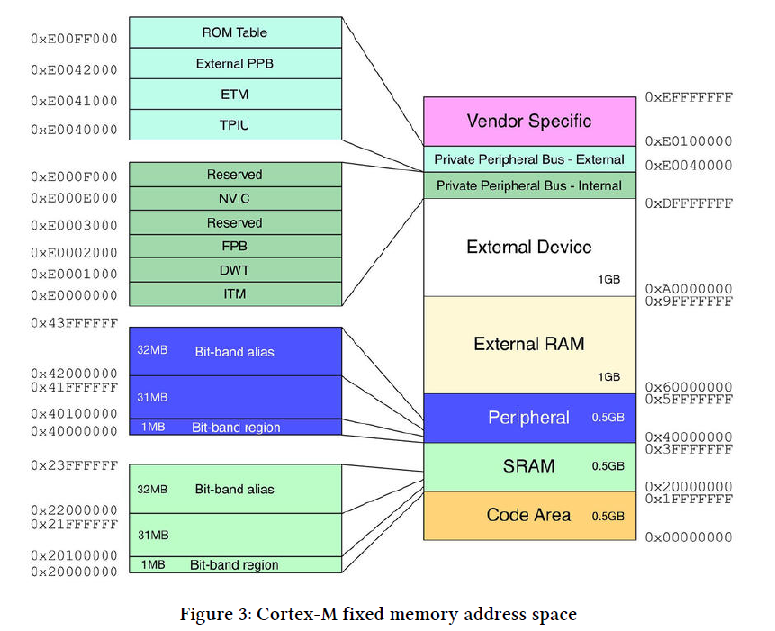

[书籍附带源码](http://github.com/cnoviello/mastering-stm32)

- c语言代码查看汇编
     That assembly code was generated compiling in thumb mode with any optimization disabled, invoking GCC in the following way: 
     ```shell
     $arm-none-eabi-gcc -mcpu=cortex-m4 -mthumb -fverbose-asm -save-temps -O0 -g -c file.c
     ```

- coretex-M内存布局

     

     对其中的code area(0.5G)中，FLASH固定是0x0800 0000开始，结束依据厂家而定，即不同行号的flash大小不一样。
     
     对其中的sram(0.5G)其中最关键的是bitband。采用bit-band访问的地址可以总结为下面的公式:
     ```
     This is the formula to compute the addresses for alias regions:
     bit_band_address = alias_region_base + (region_base_offset x 32) + (bit_number x 4)
     ```

     显然对peripheral:
     - alias_region_base == 0x42000000
     - region_base_offset == 地址（e.g. GPIOA） - - 0x40000000
     - 举例，对GPIOA PIN5采用bit-band访问的地址应该是
     ```
     alias_region_base = 0x42000000
     region_base_offset = 0x40020014 - 0x40000000 = 0x20014
     bit_band_address = 0x42000000 + 0x20014*32 + (0x5 x 0x4) = 0x42400294
     ```

    ```c
    //We can define two macros in C that allow to easily compute bit-band alias addresses:
    // Define base address of bit-band
    #define BITBAND_SRAM_BASE 0x20000000
    // Define base address of alias band
    #define ALIAS_SRAM_BASE 0x22000000
    // Convert SRAM address to alias region
    #define BITBAND_SRAM(a,b) ((ALIAS_SRAM_BASE + (uint32_t)&(a)-BITBAND_SRAM_BASE)*32 + (b*4)))
    
    // Define base address of peripheral bit-band
    #define BITBAND_PERI_BASE 0x40000000
    // Define base address of peripheral alias band
    #define ALIAS_PERI_BASE 0x42000000
    // Convert PERI address to alias region
    #define BITBAND_PERI(a,b) ((ALIAS_PERI_BASE + (uint32_t)a-BITBAND_PERI_BASE)*32 + (b*4)))
    ```

## 开源工具类

CooCox³ and System Workbench for STM32⁴ (shortened as SW4STM32) , Atollic trueStudio

[gnu arm工具](https://developer.arm.com/)

[ST新一代烧写工具 STM32CubeProgrammer]


# 7. Interrupts Management

## 7.2 Enabling Interrupts

mcu一旦启动，只有`Reset, NMI and Hard Fault exceptions`是使能的。其他的中断都需要通过`void HAL_NVIC_EnableIRQ(IRQn_Type IRQn);`开启中断。

对应的disable是`void HAL_NVIC_DisableIRQ(IRQn_Type IRQn);`

以GPIO EXTIXX中断为例， “7.2.2 Enabling Interrupts With CubeMX”章节介绍了可以自动生成哪些代码。

## 7.3 Interrupt Lifecycle

状态可以是：
- 1. either be disabled (default behavior) or enabled;• we enable/disable it calling the HAL_NVIC_EnableIRQ()/HAL_NVIC_DisableIRQ() function;
- 2. either be pending (a request is waiting to be served) or not pending;
- 3. either be in an active (being served) or inactive state.

## 7.5 Interrupt Re-Entrancy

in Cortex-M processors ,that is, an exception with a given
priority cannot be preempted by another one with same priority), exceptions and interrupts are not
re-entrant. So they cannot be called recursively¹⁷.


# 8. Universal Asynchronous Serial Communications

uart可以工作的模式：polling（blocking）, interrupt（no-blocking） and DMA mode.

在“8.3.1 Installing a Serial Console in Windows”章节介绍了在集成环境安装serial terminal工具，如果集成工具是stm32cubeide，有些特殊，请按照下面步骤按照
```
Go to menu Help -> Install New Software
Select Work with -> All available sites
In the search box type "terminal"
When search is finished select "TM Terminal" and "TM Terminal Serial Extensions" and install them.

Restart CubeIDE
From menu Window -> Show View -> Other select "Terminal"

Terminal window should appear in IDE.
Click Open Terminal icon (or Shift+Alt+Ctrl+T) and set up your connection parameters.
This is the result in my case:
....
```

如果是vscode环境， 如果我们按照了IoT link，则已经自动按照了serial terminal工具了。在任务栏可以看到。

## 8.4 UART Communication in Interrupt Mode

在该模式下，通过"`HAL_UART_Transmit_IT`, `HAL_UART_Receive_IT`"进行数据

The list of USART related interrupts：

- Transmit Data Register Empty ：TXE
- Clear To Send (CTS) flag ：CTS
- Transmission Complete ：TC
- Received Data Ready to be Read： RXNE
- Overrun Error Detected： ORE
- Idle Line Detected： IDLE
- Parity Error： PE
- Break Flag： LBD
- Noise Flag, Overrun error and Framing，Error in multi buffer communication ： NF or ORE or FE EIE


$(\frac{89}{2})^2 + 5^2 = $

## 11. Timers

###  时钟选择

中间信号TImFPn，分别是TI1FP1 与TI1FP2，TI2FP1 与TI2FP2，TI3FP3 与TI3FP4，TI4FP3 与TI4FP4，即每个输入通道可以生产1对信号。其中m代表滤波和边沿检测器前的输入通道号，n代表经过滤波和边沿检测器后将要接入或者说要映射到的捕捉通道号。 比如：TI1FP1，是来自于通道TI1，经过滤波器后将接到捕捉比较通道IC1；

根据datasheet，只有TI1FP1，TI2FP2可以作为外部时钟源


```c++
  /* @param  ClockSource This parameter can be one of the following values:
  *         @arg @ref LL_TIM_CLOCKSOURCE_INTERNAL
  *         @arg @ref LL_TIM_CLOCKSOURCE_EXT_MODE1
  *         @arg @ref LL_TIM_CLOCKSOURCE_EXT_MODE2
  * @retval None
  */
__STATIC_INLINE void LL_TIM_SetClockSource(TIM_TypeDef *TIMx, uint32_t ClockSource)
```

外部时钟源分为
   - Internal trigger input 0 to 3： 即ITR0, ITR1, ITR2 and ITR3 using another timer (master) as prescaler of this timer (slave)

   - • External source clock mode 1: by feeding the external clock signal into one of the timer channel inputs, TIx inputs.包括Pin 1: TI1FP1 or “TI1边沿检测器 (TI1F_ED)”，与Pin 2: “滤波后的定时器输入2 (TI2FP2)”

      When the external clock-source mode 1 is activated, any signal that can be routed into the TRGI internal timer signal can as well clock the timer counter. which are:
      - • The ETRF input signal: ETR signal after being prescaled, synchronized then filtered.
      - • The inter-timer peripherals synchronization signals (ITR inputs)
      - • The TI1FD signal which is the output of timer channel1 but which sensitive to both signal edges (each - transition of the timer input 1 generates a pulse)
      - • The TI1FP1 and TI2FP2 input signals that are the synchronized, filtered then the TI1 and TI2 prescaled timer inputs, respectively.

   - • External source clock mode 2: by feeding the external clock signal into the timer ETR input (if it is implemented and available).

The main advantage of using the external clock-source mode 2 compared to mode 1 is that the externally provided clock signal frequency can be equal or even higher than the frequency of the internal timer core clock (like on APB bus clock).

- 内部时钟源
- 外部时钟源模式1， 该模式是将TIMx配置为slave
  在模式1下，通过下面的指令选择不同的triggerInput， source包括：ITR0, ITR1, ITR2, ITR3, TI1FP1, TI2FP2 or ETR1 pin

   |从 TIM |ITR0 (TS = 000) |ITR1 (TS = 001) |ITR2 (TS = 010) |ITR3 (TS = 011)|
   |-------|----------------|----------------|----------------|---------------|
   |TIM2   |TIM1            |TIM8            |TIM3            |TIM4|
   |TIM3   |TIM1            |TIM2            |TIM5            |TIM4|
   |TIM4   |TIM1            |TIM2            |TIM3            |TIM8|
   |TIM5   |TIM2            |TIM3            |TIM4            |TIM8  |

- 外部时钟源模式2 ，该模式指示使用由“ETR2 pin”外部时钟源，通过`LL_TIM_EnableExternalClock()`使能外部时钟源模式2
   该模式下，计数器可在外部触发输入 ETR 出现上升沿或下降沿时计数. 通过下面的函数配置ETR
 
 
 对外部时钟源，通过下面两个API配置
   ```c++
   /* @param  TriggerInput This parameter can be one of the following values:
   *         @arg @ref LL_TIM_TS_ITR0
   *         @arg @ref LL_TIM_TS_ITR1
   *         @arg @ref LL_TIM_TS_ITR2
   *         @arg @ref LL_TIM_TS_ITR3
   *         @arg @ref LL_TIM_TS_TI1F_ED
   *         @arg @ref LL_TIM_TS_TI1FP1
   *         @arg @ref LL_TIM_TS_TI2FP2
   *         @arg @ref LL_TIM_TS_ETRF
   * @retval None
   */
   __STATIC_INLINE void LL_TIM_SetTriggerInput(TIM_TypeDef *TIMx, uint32_t TriggerInput)
   ```
   ```c++
     /* @brief  Configure the external trigger (ETR) input.
   */
   __STATIC_INLINE void LL_TIM_ConfigETR(TIM_TypeDef *TIMx, uint32_t ETRPolarity, uint32_t ETRPrescaler,
                                       uint32_t ETRFilter)
   ```


###

For basic timers, only the TIM_COUNTERMODE_UP is defined.

Counter Mode Description:

- TIM_COUNTERMODE_UP : The timer counts from zero up to the Period value (which cannot be higher than the timer resolution - 16/32-bit) and then generates an overflow event.
- TIM_COUNTERMODE_DOWN : The timer counts down from the Period value to zero and then generates an underflow event.

- TIM_COUNTERMODE_CENTERALIGNED1 : In center-aligned mode, the counter counts from 0 to the Period value – 1, generates an overflow event, then counts from the Period value down to 1 and generates a counter underflow event. Then it restarts counting from 0. The Output compare interrupt flag of channels
configured in output mode is set when the counter counts down.

- TIM_COUNTERMODE_CENTERALIGNED2 Same as TIM_COUNTERMODE_CENTERALIGNED1, but the Output compare interrupt flag of channels configured in output mode is set when the counter counts up.

- TIM_COUNTERMODE_CENTERALIGNED3 Same as TIM_COUNTERMODE_CENTERALIGNED1, but the Output compare interrupt flag of channels configured in output mode is set when the counter counts up and down.

Depending on the timer type, a timer can generate interrupts or DMA requests when the following
events occur:
- • Update events (UEV) :
   -  – Counter overflow/underflow
   -  – Counter initialized
   -  – Others
- • Trigger
   -  – Counter start/stop
   -  – Counter Initialize
   -  – Others
- • Input capture/Output compare

⁰The Update Event (UEV) is latched to the prescaler clock, and it is automatically cleared on the next clock edge. Don’t confuse the UEV with the Update Interrupt Flag (UIF), which must be cleared manually like every other IRQ. UIF is set only when the corresponding interrupt is enabled. As we will discover in Chapter 19, the UEV event, like all event flags set for other peripherals, allows to wake up the MCU when it entered a low-power mode using the WFE instruction.

- TIM_IT_Update:更新中断，计数器向上溢出/向下溢出，计数器初始化(通过软件或者内部/外部触发) 

- TIM_IT_CC1~4：都是捕获/比较中断，貌似都是平等的，即输入捕获，输出比较

- TIM_IT_Trigger：触发事件(计数器启动、停止、初始化或者由内部/外部触发计数)

### Software-triggerable events

以Update Event (UEV)为例，Update Event (UEV) 通过两种方式产生：
- 1. 自动方式，例如CNT>AAR时自动产生
- 2. manual方式， 通过设置 EGR->UG bit 来生成UEV， 注意一旦生成UEV，“EGR->UG bit”会被自动RESET。 `HAL_TIM_GenerateEvent(TIMx,TIM_EVENTSOURCE_UPDATE)/ LL_TIM_GenerateEvent_UPDATE(TIMx)`.  注意在此前，首先是要使能：`LL_TIM_EnableUpdateEvent(TIMx)`

发生更新事件时，将更新所有寄存器且将更新标志（TIMx_SR 寄存器中的 UIF 位）置 1（取 决于 URS 位）. 下面是在ISR中典型处理UEV的方式：
```C++
    if(__HAL_TIM_GET_IT_SOURCE(htim, TIM_IT_UPDATE) !=RESET)
    {
      __HAL_TIM_CLEAR_IT(htim, TIM_IT_UPDATE);
      ...
    }
  }
```


可以被software manual 触发的事件如下，
Software-triggerable events
|Event soure             |Description|
|------------------------|-----------|
|TIM_EVENTSOURCE_UPDATE  |Timer update Event source|
|TIM_EVENTSOURCE_CC1     |Timer Capture Compare 1 Event source|
|TIM_EVENTSOURCE_CC2     |Timer Capture Compare 2 Event source|
|TIM_EVENTSOURCE_CC3     |Timer Capture Compare 3 Event source|
|TIM_EVENTSOURCE_CC4     |Timer Capture Compare 4 Event source|
|TIM_EVENTSOURCE_COM     |Timer COM event source|
|TIM_EVENTSOURCE_TRIGGER |Timer Trigger Event source|
|TIM_EVENTSOURCE_BREAK   |Timer Break event source|

software manual 触发，该动作就是将对应的"EGR->xx bit" 置位。 一旦事件产生了，该对应BIT会被REST。

#### UEV

The TIM_EVENTSOURCE_UPDATE plays two important roles. The first one is related to the way
the Period register (that is the TIMx->ARR register) is updated when the timer is running. By
default, the content of the ARR register is transferred to the internal shadow register when the
TIM_EVENTSOURCE_UPDATE event is generated, unless the timer is differently configured. More about
this later.
The TIM_EVENTSOURCE_UPDATE event is also useful when the TRGO output of a timer configured as
master is set in TIM_TRGO_RESET mode: in this case, the slave timer will be triggered only if the
TIMx->EGR register is used to generate the TIM_EVENTSOURCE_UPDATE event (that is, the UG bit is set).