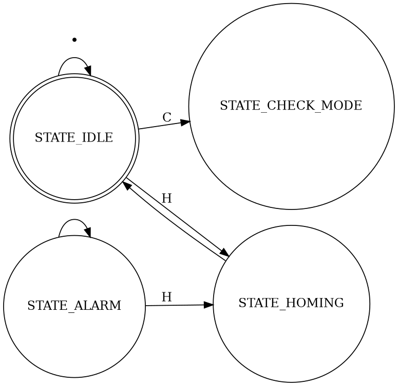

[STM32电机教程](https://blog.csdn.net/zhanglifu3601881/article/list/3), 以及其中的[STM32 电机教程 4 - 直流有刷电机闭环电流控制](https://blog.csdn.net/zhanglifu3601881/article/details/102769936)

[步进电机学习网站:](https://www.orientalmotor.com.cn/web_seminar/stkiso2-1-2/)

[ GRBL源码简单分析[源码+图片+xmind文档] ](https://www.amobbs.com/thread-5691704-1-1.html?_dsign=175d88f7)


步进电机驱动电路的任务，是安装顺序指令切换DC电压的电流流入步进电机的各相线圈。


- 左手电动，右手发电

步进电机的分辨率（一圈的步数，360°除以步距角）越高，位置精度越高。

- 视频（http://v.youku.com/v_show/id_XMzMxMzg2MjY4.html 用光驱改造的激光雕刻机）。顺藤摸瓜找到了原版的翻译文章（http://www.guokr.com/article/18616/ 激光雕刻机：废旧光驱的涅槃之路）。
- [废旧光驱DIY三轴数控雕刻机记录](http://blog.sina.com.cn/s/blog_4b860b8c0101b2d1.html)




# 步进电机理论

步进电机将电脉冲转变为角位移，即给一个脉冲，布进电机就转动一个角度。步进电机的角位移与输入脉冲数量严格成正比

步进电机有反应式 (VR)、永磁式(PM)、混合式(HB)三种类型。混合式步进电机将前两类步进电机的优点综合于一身。


## 双极性步进电机(Bipolar Stepper Motors)

双极步进电机是一种交流步进电机，使用电磁线圈，在命令下通电，来转动轴。使用该系统，轴可以在测量的运动中转动，也可以反转。与单极步进电机不同，双极性电机允许电流双向流动，从而减少完成任务所需的线圈数量

一般最常用到的是4线两相步进电机，它和驱动器的连接方式如下图


## 单极性步进电机（Unipolar Stepper Motors）

两相混合步进电机主要有4线和6线两种引出线形式，4线步进电机只能使用双极性驱动器，而6线步进电机可以使用单极性和双极性两种驱动器

6线步进电机如果把2和5抽头悬空，只接1，3,4,6其效果和4线电机相同。其特点是堵转力矩和效率会比较高，但高速性能比较差，低速大力矩应用应优先考虑这种方法。


以下是6线电机使用单极性驱动器的接线


## 2相四线绕组

下图是2相四线绕组的示意图。可以看到A，~A是联通的，B和~B是联通。那么，A和~A是一组a，B和~B是一组b


对于2相，对应的有：

- 四线：由于四线没有com公共抽线，所以，a和b组是绝对绝缘的，不连通的。所以，用万用表测，不连通的是一组。
- 五线：由于五线中，a和b组的公共端是连接在一起的。用万用表测，当发现有一根线和其他几根线的电阻是相当的，那么，这根线就是公共com端。对于驱动五线步进电机，公共com端不连接也是可以驱动步进电机的。
- 六线：a和b组的公共抽线com端是不连通的。同样，用万用表测电阻，发现其中一根线和其他两根线阻止是一样的，那么这根线是com端，另2根线就属于一组。对于驱动四相六线步进电机，两根公共com端不接先也可以驱动该步进电机的。

 ## 驱动

 典型驱动有
 - Miocrostep Driver驱动，Pul- Pul+：脉冲信号输入，Dir- Dir+：方向信号输入，A+A- B+B-：接二相混合式步进电机的2相；[见](https://blog.csdn.net/wxc971231/article/details/82086392)
- ULN2003驱动, [见](http://www.51hei.com/bbs/dpj-115944-1.html)

常见的八步驱动：


## S减速曲线（S-Curve）

[一文详解电机S曲线加减速控制](http://www.elecfans.com/d/1294097.html)

[一文教你快速搞懂速度曲线规划之S形曲线](https://www.cnblogs.com/unclemac/p/12783325.html)

[stm32F4 定时器中断 + 步进电机控制器 控制四线两相步进电机 （初级版本）](https://blog.csdn.net/weixin_41534481/article/details/89218360)

[AccelStepper](http://www.airspayce.com/mikem/arduino/AccelStepper/)

[实时生成步进电机速度曲线](https://blog.csdn.net/ben392797097/article/details/79927592),[原文]()

##  无刷直流 （Brushless Direct Current， BLDC）电机

无刷电机和有刷电机的定子刚好是反的， 无刷电机的定制是需要通电的。它需要根据转子所在位置决定定子中的通电方向，这个通过在定子中内置的霍尔传感器来感知。[霍尔效应原理](https://haokan.baidu.com/v?vid=18014947042976563332&pd=bjh&fr=bjhauthor&type=video)


直流无刷电机的6拍工作方式，线圈产生旋转磁场.合成磁场满足矢量合成的原则


# 

## 二、串口接收到的数据解析

 串口接收到的数据放在串口接收环形队列里，主程序里每次从接收队列里读出一个字节，以`'\r'`或`'\n'`为标志截取一行完整的指令，如果指令以`'$'`开始，说明是自定义的系统指令，其它的是G代码指令。如果是系统自定义指令，就调用`uint8_t system_execute_line(char *line)`函数，里面包含了一些读取软件版本信息、读取默认配置参数信息和把外部设置的参数信息写入eeprom里，轴归位操作等功能。如果是G代码指令，就调用`uint8_t gc_execute_line(char *line)`函数，里面包含了很多G代码的指令解析过程，由于重点放在研究直线插补算法上，没有对G代码解析源码深入分析，这里只关注里面的执行圆弧和直线插补的代码，即只需要关心下面两个函数即可
 ```c
    void mc_line(float *target, float feed_rate, uint8_t invert_feed_rate)
    void mc_arc(float *position, float *target, float *offset, float radius, float feed_rate,uint8_t invert_feed_rate, uint8_t axis_0, uint8_t axis_1, uint8_t axis_linear)
```

## 三、圆弧拆分成多线段

  GRBL中把圆弧拆分成多条逼近的直线段，然后对直线段进行插补，这种方法也就是俗称的把复杂曲线拆分成多条逼近的直线的插补方法。圆弧拆分成直线段的方法，在void mc_arc(float *position, float *target, float *offset, float radius, float feed_rate,uint8_t invert_feed_rate, uint8_t axis_0, uint8_t axis_1, uint8_t axis_linear)函数里实现，下面对该函数进行详细介绍：

    position，圆弧起始点位置坐标，为了后面解释方便，这里设为(x0,y0,z0)

    target，圆弧终点坐标，这里设为(x1,y1,z1)

    offset，圆心相对于起始点的偏移向量，这里设为(rx,ry,yz)，那么圆心坐标为(x0+rx,y0+ry,z0+rz)

    radius，圆弧半径长度

    feed_rate，轴的进给速率

    invert_feed_rate，进给速率含义标志位，这里默认为零，表示进给速率的单位是min/mm，即分钟/毫米

    axis_0，圆弧所在平面的第一个轴，可以是x/y/z中任意一个

    axis_1，圆弧所在平面的第二个轴，可以是x/y/z中任意一个

    axis_linear，除了圆弧平面之外的第三个轴，即与圆弧平面垂直的轴

    void mc_arc(float *position, float *target, float *offset, float radius, float feed_rate,

                         uint8_t invert_feed_rate, uint8_t axis_0, uint8_t axis_1, uint8_t axis_linear)

    {

        //圆弧所在平面的圆心坐标

        float center_axis0 = position[axis_0] + offset[axis_0];

        float center_axis1 = position[axis_1] + offset[axis_1];

        //圆心指向圆弧起始点的向量坐标
        float r_axis0 = -offset[axis_0];  

        float r_axis1 = -offset[axis_1];

        //圆心指向圆弧终点的向量坐标
        float rt_axis0 = target[axis_0] - center_axis0;

        float rt_axis1 = target[axis_1] - center_axis1;

        //计算圆心到圆弧起始点向量b(r_axis0 ,r_axis1)和圆心到圆弧终点向量c(rt_axis0 ,rt_axis1)的夹角的正切值，注意夹角a的方向是起始点向量b逆时针转向终点向量c的角，这个在后面判断角度值符号时会用到。根据向量夹角余弦公式，推出向量夹角正切公式，套入向量b和向量c的坐标，即可得出tana。下面公式中的atan2是反正切函数，a=atan2(y,x)，即角度a=y/x的正切值

        float angular_travel = atan2(r_axis0*rt_axis1-r_axis1*rt_axis0, r_axis0*rt_axis0+r_axis1*rt_axis1);

        if (gc_state.modal.motion == MOTION_MODE_CW_ARC) { 

            //如果圆弧顺时针移动，角度应该是负值，如果计算出的角度为正值，需要在计算出的角度基础上减去2*pi（pi为圆周率）
            if (angular_travel >= 0) { angular_travel -= 2*M_PI; }

        } else {

            //如果圆弧逆时针移动，角度应该是正值，如果计算出的角度为负值，需要在计算出的角度基础上加上2*pi（pi为圆周率）
            if (angular_travel <= 0) { angular_travel += 2*M_PI; }

        }

//计算起点到终点的圆弧可以划分多少条小线段，计算方法：总共的弧长/每条小线段的长度，angular_travel是圆弧的弧度，radius是圆弧的半径，那么它们的乘积angular_travel*radius就是圆弧的弧长，再乘以0.5就是弧长的一半。settings.arc_tolerance是圆弧上两点之间连接的小线段到这段圆弧的最大距离，即圆弧上的小线段到弧顶的最大距离，这里设为h，，有图可知，假设线段|AB|长度的一半为k，那么有勾股定理可知，r*r=k*k+(r-h)*(r-h)。知道了r和h，那么k*k=h*(2*r-h)。这样总共的小线段个数也就出来了，这就是下面这个公式的含义。

        uint16_t segments = floor(fabs(0.5*angular_travel*radius)/
                          sqrt(settings.arc_tolerance*(2*radius - settings.arc_tolerance)) );

    }

    ......

    //这里是计算圆心与每条小线段所夹的角T，即上图中角AOB的余弦值和正弦值，由于角度很小，这里采用了三角函数的泰勒级数展开公式计算cosT和sinT。cosT的二阶泰勒级数为1-T*T/2，sinT的三阶泰勒级数为T-T*T*T/6，为了计算方便，cos_T 被放大了两倍，后面又乘上了0.5复原了。有cosT和sinT的泰勒级数公式，cosT被放大了两倍，可以推出sinT=T*(4+cosT)/6，即下面计算sinT的公式的来源。

    float cos_T = 2.0 - theta_per_segment*theta_per_segment;
    float sin_T = theta_per_segment*0.16666667*(cos_T + 4.0);

    cos_T *= 0.5;

    //循环累加每一条小线段，圆的极坐标公式为x=r*cosa,y=r*sina，假设当前线段的起始坐标为(rcosa,rsina),下一条线段比当前线段移动的角度已知为T，那么下一条线段的起始坐标为(rcos(a+T),rsin(a+T)),运算得到rcos(a+T)=r*cosa*cosT-r*sina*sinT，rsin(a+T)=r*sina*cosT+r*cosa*sinT。由于我们知道当前线段的坐标为(r_axis0,r_axis1)，又知道sinT和cosT的值，下一条线段的起始坐标根据公式可立即求出。

    for (i = 1; i<segments; i++) { 
        if (count < N_ARC_CORRECTION) {
            //这就是用上述公式求下一条线段的起始坐标的具体计算。当累计计算线段数超过N_ARC_CORRECTION个数时，要调用N_ARC_CORRECTION个线段总共转动的角度来计算最终的坐标移动值，这样可以消除因每次使用sinT、cosT的近似泰勒值运算的累积误差
            r_axisi = r_axis0*sin_T + r_axis1*cos_T;
            r_axis0 = r_axis0*cos_T - r_axis1*sin_T;
            r_axis1 = r_axisi;
            count++;
      } else {      
            //调用N_ARC_CORRECTION个线段总共转动的角度来计算最终的坐标移动值
            cos_Ti = cos(i*theta_per_segment);
            sin_Ti = sin(i*theta_per_segment);
            r_axis0 = -offset[axis_0]*cos_Ti + offset[axis_1]*sin_Ti;
            r_axis1 = -offset[axis_0]*sin_Ti - offset[axis_1]*cos_Ti;
            count = 0;
      }
  
      // 计算出下一条线段的起始坐标，也就是当前线段的终点坐标，前面已知当前线段的起始坐标，这样就可以把线段的坐标传递给直线插补函数mc_line进行线段插补了
      position[axis_0] = center_axis0 + r_axis0;
      position[axis_1] = center_axis1 + r_axis1;
      position[axis_linear] += linear_per_segment;
      //线段插补
      mc_line(position, feed_rate, invert_feed_rate);
      ......
    }
  }
    //把圆弧终点作为最后一条线段的终点坐标进行直线插补，确保圆弧上所有的点包含进了直线里 
    mc_line(target, feed_rate, invert_feed_rate);
}

    四、多线段速度规划前瞻算法

    连续执行多条线段插补的时候，为了加快轴的移动速度，执行完一条直线指令后不能停下来，然后重新启动执行下一条直线指令。而是需要保持一定的速度去执行下一条直线插补，但是由于相邻两条直线之间有一定的夹角，导致转弯的时候，轴的速度不能过快，还要考虑两条直线执行的最大速度限制和直线头尾速度衔接等问题，这些问题的处理方法就是前瞻算法。

    GRBL中使用了环形队列的方式存储每一条直线段的信息，这个队列的名称是block_buffer[BLOCK_BUFFER_SIZE]，这个结构体数组里存放的是线段的初速度、最大初速度限制、最大转角速度限制、正常运行速度、加速度、线段长度信息。当G代码解析出一条线段指令或者圆弧拆分出线段后，调用void mc_line(float *target, float feed_rate, uint8_t invert_feed_rate)函数，把当前线段的信息存入block_buffer队列中，然后把当前线段和队列里前一条线段结合在一起，用前瞻算法修正队列里前一条线段的最大运行速度，以便保证在前一条线段执行结束时的速度与当前线段的初速度一致。另外，根据两条线段的夹角确定最大转角速度，用于修正前一条线段的结束速度和当前线段的初速度不能超过最大转角速度。下面对mc_line函数进行详细分析：

target，线段移动到的最终位置，单位是mm，也就是说当前线段移动的长度是target值减去之前的所有线段的移动长度；

feed_rate，线段的最大运行速度，梯形加减速值是提前设定好保存在eeprom里的；

invert_feed_rate，线段运行速度含义标志位，feed_rate有多种含义，这里我们只了解feed_rate的单位是min/mm即可；

void mc_line(float *target, float feed_rate, uint8_t invert_feed_rate)

{

    //如果限位使能，就检查target值是否超出了轴能到达的最远位置，如果超出了就告警限位错误，并复位系统

    if (bit_istrue(settings.flags,BITFLAG_SOFT_LIMIT_ENABLE)) { limits_soft_check(target); }

    ......

    do {

    //这个函数的功能很多，有很多地方都会调用它，这里调用的目的是判断有没有系统异常发生，比如系统告警或复位，如果有异常，这个函数里处理异常的代码就会执行，没有就退出函数，继续运行
    protocol_execute_runtime(); // Check for any run-time commands

    if (sys.abort) { return; } // Bail, if system abort.

    //检查block_buffer是否满，如果满就执行尝试打开线段插补执行使能开关。如果系统配置里开启了auto-cycle功能，就可以自动开始执行线段插补，block_buffer里的线段会被系统执行插补操作而空出一些空间，这样队列就不满了，也就退出下面的do-while循环继续执行代码
    if ( plan_check_full_buffer() ) { protocol_auto_cycle_start(); } // Auto-cycle start when buffer is full.
    else { break; }

  } while (1);

   //把当前线段的的信息添加到block_buffer队列里，这个函数里包含了前瞻算法的处理过程，在下面会详细介绍

   plan_buffer_line(target, feed_rate, invert_feed_rate);

    ......

}

void plan_buffer_line(float *target, float feed_rate, uint8_t invert_feed_rate) 

{

    ......

    for (idx=0; idx<N_AXIS; idx++) {

        //target是轴移动的距离，单位是毫米，系统设定了steps_per_mm值，也就是每毫米代表的轴移动步数，直接换算得到轴移动步数target_steps

        target_steps[idx] = lround(target[idx]*settings.steps_per_mm[idx]);
    //target表示轴从原点移动到终点的总距离，所以当前线段的移动步数需要用target减去之前所有线段移动的总步数

    block->steps[idx] = labs(target_steps[idx]-pl.position[idx]);

    //获得三个轴里移动距离最远的轴移动的距离，后面DDA直线插补时会用到这个值。关于DDA插补算法的方法后面会介绍
    block->step_event_count = max(block->step_event_count, block->steps[idx]);
    
    //根据步数换算出真实移动的距离，保存在unit_vec中，后面计算两条线段夹角时会用到
    delta_mm = (target_steps[idx] - pl.position[idx])/settings.steps_per_mm[idx];
    unit_vec[idx] = delta_mm; 
        
    // 这个值小于零，说明这个轴需要向与原来方向相反的方向移动
    if (delta_mm < 0 ) { block->direction_bits |= get_direction_pin_mask(idx); }
    
    //三个轴是正交的，知道了每个轴移动的距离，那么线段在空间里移动的真实距离是s*s=x*x+y*y+z*z，这个值在后面也会用到
    block->millimeters += delta_mm*delta_mm;

    }

    //开平方求出线段空间里移动的距离

    block->millimeters = sqrt(block->millimeters);

    ......

    for (idx=0; idx<N_AXIS; idx++) {

        if (unit_vec[idx] != 0) { 

            //这里是为计算两条线段的夹角做准备工作，为了便于理解，这里假设当前线段的坐标是向量c=(x2,y2,z2)，上一条线段的坐标向量d=(x1,y1,z1) ,它们的空间向量长度分别是s2和s1，那么有坐标正交可得，s2*s2=x2*x2+y2*y2+z2*z2，s1*s1=x1*x1+y1*y1+z1*z1，inverse_millimeters表示1/s，uint_vec[0/1/2]分别表示x/y/z，经过运算后uint_vec[0/1/2]表示的是x/s,y/s或者z/s，那么inverse_unit_vec_value 表示s/x，s/y或者s/z的绝对值
            unit_vec[idx] *= inverse_millimeters;  

            inverse_unit_vec_value = fabs(1.0/unit_vec[idx]); 

            //配置里的max_rate是表示线段向量每个分坐标的最大速度限制，feed_rate是线段向量合成后的速度，所以feed_rate要与每个轴分向量最大速度换算成合成后的最大速度比较，然后取最小值作为最终的线段运行最大速度，最大加速度也是用同样的方法进行比较
            feed_rate = min(feed_rate,settings.max_rate[idx]*inverse_unit_vec_value);
            block->acceleration = min(block->acceleration,settings.acceleration[idx]*inverse_unit_vec_value);
            //计算两条线段的夹角余弦值，夹角余弦公式cosa=(x1*x2+y1*y2+z1*z2)/(s1*s2)，因为两条线段是首尾相连，那么用两条线段的向量坐标计算出来的夹角其实是它的补角，夹角和它补角的余弦值刚好取负值即可，所以下面计算夹角余弦的方法里多了一个负号
            junction_cos_theta -= pl.previous_unit_vec[idx] * unit_vec[idx];
            }

       }

       //这个用半角公式sin(a/2)=sqrt((1-cosa)/2)直接运算

       float sin_theta_d2 = sqrt(0.5*(1.0-junction_cos_theta)); 

       // 计算转角最大速度v，有圆弧加速度公式可知，v*v=a*r,其中a是圆弧向心加速度，这里近似值为block->acceleration，r是圆弧的半径。settings.junction_deviation是两条线段内切圆弧到两条线段交点的距离，这里设为h，如下图所示，角EAD即为上面的a/2，内切圆的半径为r，那么AD的长度即为r+h，那么sin_theta_d2=r/(r+h)，已知h的值，那么r=h*sin_theta_d2/(1-sin_theta_d2)，那么套入v*v=a*r即可求得v*v，即block->max_junction_speed_sqr的值。
       block->max_junction_speed_sqr = max( MINIMUM_JUNCTION_SPEED*MINIMUM_JUNCTION_SPEED,

                                 (block->acceleration * settings.junction_deviation * sin_theta_d2)/(1.0-sin_theta_d2) );

        ......

       //对没有优化过的线段进行优化

       planner_recalculate();

}

static void planner_recalculate() 

{

    ......

    //如果所有的线段都已经优化过了，直接退出函数

    if (block_index == block_buffer_planned) { return; }

    ......

    //当前线段的起始速度取最大起始限制速度与末速度为零反推的最大起始速度的最小值

    current->entry_speed_sqr = min( current->max_entry_speed_sqr, 2*current->acceleration*current->millimeters);

    ......

    //这段代码的含义是从当前线段往前推，直到所有的线段都优化过退出循环，即每条线段的初速度不能超过线段设置的最大初速度的限制

    while (block_index != block_buffer_planned) { ......}

    ......

    //这段代码的含义是从第一个没有优化过的线段往前，直到到达当前线段时退出循环，即每条线段的末速度不能超过下一条线段的初速度，这样多条线段才能保持连续的速度运行

    while (block_index != block_buffer_head) {}

}

到这里多线段速度前瞻规划已经完成了，下面分析GRBL中怎么把带有加减速的线段转化成用定时器输出脉冲的过程。

五、线段转化成不同频率的输出脉冲

    第四节里block_buffer队列里存放的就是每条线段的详细信息，根据线段的初速度、末速度、加速度和线段距离信息，计算出这条线段运行时轴需要移动的总步数。假定把这条线段总的运行时间截取成多个微小的时间段DT，即可求出每个DT时间段内的平均速度，同时可以求出DT时间段内轴移动的步数n，这样就可以求出DT内每步需要的时间dt=DT/n，把dt设定为定时器定时间隔，直到中断计数次数到达n结束。由于线段总步数选取的是线段向量坐标(x,y,z)里的最大值，所以定时器中断里不能每次都输出脉冲，而是需要用DDA插补算法运算出每次中断哪个轴需要输出脉冲。

    这里介绍一下GRBL中用到的DDA算法的实现过程，假设线段向量坐标a(x,y,z)，选取x,y,z绝对值最大的作为累加溢出值c=|max(x,y,z)|，假定累加初值b=c/2，那么三个轴输出脉冲的DDA算法如下：

    m=l=k=b;

    for(i=0;i<c;i++)

    {

        m+=x;

        l+=y;

        k+=z;

        if(m>=c)

        {

            x轴输出一个脉冲；

            m-=c;

        }

        

        if(l>=c)

        {

            y轴输出一个脉冲；

            l-=c;

        }
        

        if(k>=c)

        {

            z轴输出一个脉冲；

            k-=c;

        }

    }

下面开始进行源码分析，第四节里对每个线段进行预处理之后，进入主循环里protocol_auto_cycle_start()函数和protocol_execute_runtime()函数，我们从protocol_auto_cycle_start()函数开始分析。

//当GRBL默认配置里使能了auto_start功能，就把系统执行标志sys.execute设置为EXEC_CYCLE_START，也就是系统可以自动执行线段输出脉冲，如果没有使能auto_start，在系统运行过程中可以用串口命令手动开启线段输出脉冲

void protocol_auto_cycle_start() { if (sys.auto_start) { bit_true_atomic(sys.execute, EXEC_CYCLE_START); } } 

void protocol_execute_runtime()

{

    //省略了一些系统告警标志位的处理

    ......

    //当系统没有使能线段输出脉冲功能时，只调用st_prep_buffer

    if (rt_exec & EXEC_FEED_HOLD) 

    {

        .....

        st_prep_buffer();

        ......

    }

    if (rt_exec & EXEC_CYCLE_START) 

    {

        ......

        //修改系统状态为STATE_CYCLE，这样启动定时器后下次循环就不会在进入这里重复启动定时器了

        sys.state = STATE_CYCLE;

        //把线段换算成定时器输出脉冲频率和脉冲个数

        st_prep_buffer(); 

        //启动定时器开始输出脉冲
        st_wake_up();

        ......

    } 

    ......

    //当定时器已经启动后，以后的循环就是不断的把线段换算成定时器输出脉冲

    if (sys.state & (STATE_CYCLE | STATE_HOLD | STATE_HOMING)) { st_prep_buffer(); }  

}

void st_prep_buffer()

{

    //线段拆分成多个DT时间片，每个时间片轴运行的总步数和每步需要的时间存放在segment_buffer队里中，while循环判断这个队列是否满，如果满了就退出循环，没满继续把线段拆分的时间片存入队列

    while (segment_buffer_tail != segment_next_head) {

        //判断当前线段拆分时间片是否完成，如果没有完成，pl_block不为空，if里的语句不会被执行。如果pl_block为空，说明当前线段时间片拆分完成，执行if里的语句，开始把下一条线段的信息读出来进行时间片拆分

        if (pl_block == NULL) {

            //从block_buffer队列中获取一条新的线段

            pl_block = plan_get_current_block();

            ......

            //开辟新的队列st_block_buffer存放新线段拆分时间片计算过程数据

            st_prep_block = &st_block_buffer[prep.st_block_index];

            //记录线段每个轴的运行方向

            st_prep_block->direction_bits = pl_block->direction_bits;

            //AMASS功能用于平滑脉冲频率太慢的线段，如果AMASS功能使能，线段步数放大MAX_AMASS_LEVEL倍，但是定时器定时间隔将会缩短，相当于定时器中断加快了，更多次的中断累积才输出一个脉冲，这样输出脉冲变得更平滑了
        #ifndef ADAPTIVE_MULTI_AXIS_STEP_SMOOTHING
            st_prep_block->steps[X_AXIS] = pl_block->steps[X_AXIS];
            st_prep_block->steps[Y_AXIS] = pl_block->steps[Y_AXIS];
            st_prep_block->steps[Z_AXIS] = pl_block->steps[Z_AXIS];
            st_prep_block->step_event_count = pl_block->step_event_count;
        #else
            st_prep_block->steps[X_AXIS] = pl_block->steps[X_AXIS] << MAX_AMASS_LEVEL;
            st_prep_block->steps[Y_AXIS] = pl_block->steps[Y_AXIS] << MAX_AMASS_LEVEL;
            st_prep_block->steps[Z_AXIS] = pl_block->steps[Z_AXIS] << MAX_AMASS_LEVEL;
            st_prep_block->step_event_count = pl_block->step_event_count << MAX_AMASS_LEVEL;

        #endif

            //inv_2_accel 是加速度a的过程值，inv_2_accel=1/2a

            float inv_2_accel = 0.5/pl_block->acceleration;

            if (sys.state == STATE_HOLD) {

                //STATE_HOLD就是线段没有开始输出脉冲，这样线段的末速度为零，整个线段都是减速过程，后面分析了线段输出脉冲的过程，再回头看这里就很简单了

                ......

            }

            else

            {

                ......

                //intersect_distance是线段加速和减速过程速度最大值交点离线段末尾的距离s2，如下图所示：

如图中所示，假设这条线段的长度s刚好只有加速和减速过程，最大速度为vm，已知线段的初速度为v0，线段的加速度为a，线段的末速度为vt，根据公式可求出当前假设条件下交点vm到线段末尾的距离s2，即intersect_distance

                float intersect_distance =

                0.5*(pl_block->millimeters+inv_2_accel*(pl_block->entry_speed_sqr-exit_speed_sqr));

                if (intersect_distance > 0.0) {

                    if (intersect_distance < pl_block->millimeters){

                        //计算线段最大限制速度减速到末速度需要的减速距离

                        prep.decelerate_after = inv_2_accel*(pl_block->nominal_speed_sqr-exit_speed_sqr);

                        if (prep.decelerate_after < intersect_distance) {

                            ......

                            //如果初速度等于最大限制速度，那么线段只有匀速和减速过程

                            if (pl_block->entry_speed_sqr == pl_block->nominal_speed_sqr) {

                            }

                            else

                            {

                                //线段有加速、匀速和减速过程

                                ......

                            }

                        else{

                            //减速距离大于交点距离，说明线段设置的最大限制速度大于交点处的最大速度，那么线段只有三角形状的加速和减速过程，没有匀速过程

                            ......

                        }

                    }

                    else{

                        //交点到末尾的距离大于线段总长度，说明只有线段只有减速过程

                        ......

                    }

                }

                else{

                    //交点到末尾的距离小于零，说明加减速没有交点，即线段只有加速过程

                    ......

                }

            }

        }

        ......

        //设定了时间片为DT_SEGMENT，上面我们已经知道了线段的加减速过程，通过下面的do-while循环，计算出每个时间片线段的平均速度和移动的步数，由于它们的值是根据线段的加减速计算得来的，所以里面隐含了脉冲发送频率的信息。注意：每个segment_buffer队列里的数据的时间粒度一般都是DT_SEGMENT，也就是说假设一个时间片内，加速移动的距离是s1，但是这时候加速完成了，而加速过程所用的时间dt小于DT_SEGMENT，那么时间片剩余的时间DT_SEGMENT-dt，必须用来计算线段在剩余时间里匀速或减速移动的距离s2，那么在DT_SEGMENT时间片内移动的总距离是s1+s2。另外，要注意由于脉冲频率太低，导致在时间片DT_SEGMENT内移动的距离可能为零，为了防止这种情况发生，倍数放大DT_SEGMENT的值，直到至少移动的距离大于一步为止。

        do {

            ......

        }while (mm_remaining > prep.mm_complete);

    }

    ......

    //计算出时间片内移动的步数

    prep_segment->n_step = last_n_steps_remaining-n_steps_remaining;

    ......

    //计算出每步需要的时间

    float inv_rate = dt/(last_n_steps_remaining - steps_remaining);

    ......

    //每步需要的时间设置为定时器的定时时间间隔

    uint32_t cycles = ceil( (TICKS_PER_MICROSECOND*1000000*60)*inv_rate );

    ......

    //如果使能AMASS，定时器周期缩短，移动步数放大

    cycles >>= prep_segment->amass_level; 
    prep_segment->n_step <<= prep_segment->amass_level;

    ......

}

调用void st_wake_up() 使能定时器1后，就会进入定时器1中断处理函数，在函数里使用DDA插补算法，输出脉冲

ISR(TIMER1_COMPA_vect)

{

    ......

    //使能定时器0，用于恢复脉冲输出管脚的电平。例如定时器1里面拉高了管脚，表示输出了一个脉冲，这时候需要定时器0把管脚复位为低，便于定时器1输出下一个脉冲

    TCNT0 = st.step_pulse_time; 

    TCCR0B = (1<<CS01); 

    ......

    //st.exec_segment 为空，表示从segment_buffer队列里取出的段已经输出脉冲完成，调用if里的语句获取segment_buffer队列里的下一个执行时间片，主要是获取该时间片里每个轴移动的步数、插补步数，然后重新设置定时器1的定时周期

    if (st.exec_segment == NULL) {......}

    ......

    //对x步数进行DDA累加溢出操作

    #ifdef ADAPTIVE_MULTI_AXIS_STEP_SMOOTHING
        st.counter_x += st.steps[X_AXIS];
      #else
        st.counter_x += st.exec_block->steps[X_AXIS];

      #endif  

      //如果溢出，管脚输出一个高电平，表示输出一个脉冲，没有溢出，管脚不输出电平
      if (st.counter_x > st.exec_block->step_event_count) {
            st.step_outbits |= (1<<X_STEP_BIT);
            st.counter_x -= st.exec_block->step_event_count;
            if (st.exec_block->direction_bits & (1<<X_DIRECTION_BIT)) { sys.position[X_AXIS]--; }
          else { sys.position[X_AXIS]++; }

      }

      ...... 

}

到这里第五节终于讲完了，最难的部分也已经过去，下面说说归为操作的过程。

六、轴归位操作

    轴归位操作就是轴以一定的速度进行最大距离的线段插补操作，插补过程中遇到限位信号的时候强行终止插补操作，反复多次进行这种插补后，轴就停在了限位点附近了。

    void mc_homing_cycle()

    {

        ......

        //归位操作

        limits_go_home(HOMING_CYCLE_0); 

        ......

    }

    void limits_go_home(uint8_t cycle_mask) 

    {

        ......

        //循环n_cycle次进行直线插补，直线距离设置为轴允许的最大移动距离，插补过程中遇到限位信号强行复位系统来终止插补操作，并记录每次轴移动到限位信号的实际距离，通过改变每次插补的速度，计算出最合理的实际距离

        do {

            ......

        } while (n_cycle-- > 0);

        ......

        //最后用最合理的插补距离和插补速度把轴移动到归位的位置

        plan_buffer_line(target, settings.homing_seek_rate, false);

        ......

    }

经过几天的奋战，终于写完了这篇博客，长舒一口气。
--------------------- 
作者：xufeixueren 
来源：CSDN 
原文：https://blog.csdn.net/xufeixueren/article/details/79663068 
版权声明：本文为博主原创文章，转载请附上博文链接！