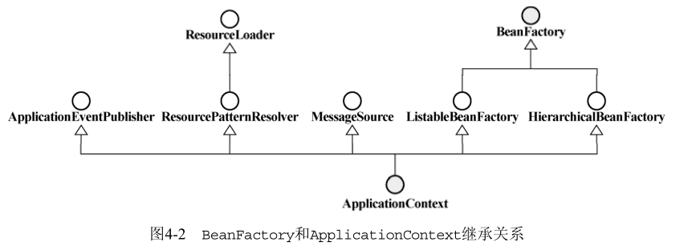

# ref

[用小说的形式讲解Spring（1） —— 为什么需要依赖注入](https://zhuanlan.zhihu.com/p/29426019)


# IoC （Inversion of Control，“控制反转”，“依赖注入”（Dependency Injection））
“Don’t call us, we will call you.”。恰如其分地表达了“反转”的意味。IoC就是从原来需要什么东西自己去拿，变为，需要什么东西就让别人送过来

对象之间的依赖关系，其实就是给对象上的属性赋值！因为对象上有其他对象的变量，因此存在了依赖…

Spring提供了好几种的方式来给属性赋值

    1) 通过构造函数
    2) 通过set方法给属性注入值
    3) p名称空间
    4)自动装配(了解)
    5) 注解

## 配置方式：xml配置方式自动装配
- 构造函数给属性赋值
  
  step1:
```java
    public UserService(UserDao userDao) {
        this.userDao = userDao;
        //看看有没有拿到userDao
        System.out.println(userDao);
    }
```
  step2:applicationContext.xml配置文件,使用了constructor-arg标签    
  
```xml
    <!--创建userDao对象-->
    <bean id="userDao" class="UserDao"/>

    <!--创建userService对象-->
    <bean id="userService" class="UserService">
        <!--要想在userService层中能够引用到userDao，就必须先创建userDao对象-->
        <constructor-arg index="0" name="userDao" type="UserDao" ref="userDao"></constructor-arg>
    </bean>
```

- 通过set方法给属性注入值
   
   step1: 增加set方法
```java
public class UserService {
    private UserDao userDao;
    // setter injection 
    public void setUserDao(UserDao userDao) {
        this.userDao = userDao;
        //看看有没有拿到userDao
        System.out.println(userDao);
    }
    public void save() {
        userDao.save();
    }
}
```  
     step2: applicationContext.xml配置文件：通过property节点来给属性赋值.引用类型使用ref属性,基本类型使用value属性
```xml
    <!--创建userDao对象-->
    <bean id="userDao" class="UserDao"/>
    <!--创建userService对象-->
    <bean id="userService" class="UserService">
        <property name="userDao" ref="userDao"/>
    </bean>
```
    我们刚才是先创建userDao对象，再由userService对userDao对象进行引用…我们还有另一种思维：先创建userService，发现userService需要userDao的属性，再创建userDao…我们来看看这种思维方式是怎么配置的：applicationContext.xml配置文件：property节点内置bean节点
```xml
    <!--
        1.创建userService，看到有userDao这个属性
        2.而userDao这个属性又是一个对象
        3.在property属性下又内置了一个bean
        4.创建userDao
    -->
    <bean id="userService" class="UserService">
        <property name="userDao">
            <bean id="userDao" class="UserDao"/>
        </property>
    </bean>
```    

- p名称空间注入

p名称控件这种方式其实就是set方法的一种优化，优化了配置而已…p名称空间这个内容需要在Spring3版本以上才能使用

applicationContext.xml配置文件：使用p名称空间
```xml
    <bean id="userDao" class="UserDao"/>
    <!--不用写property节点了，直接使用p名称空间-->
    <bean id="userService" class="UserService" p:userDao-ref="userDao"/>
```

- 使用注解来实现自动装配

@Autowired注解来实现自动装配：

    可以在构造器上修饰
    也可以在setter方法上修饰
    来自java的@Inject的和@AutoWired有相同的功能

applicationContext.xml 模拟

```java
ApplicationContext context = new ClassPathXmlApplicationContext("xxxx.xml"/*<beans>为根节点的xml文件*/);
T t = (T) context.getBean("T");
```

## 配置方式：注解方式自动装配


spring怎么知道把哪些Java类当初bean类处理？
这就需要使用annotation，spring使用一些特殊的annotation来标注bean类。

|注解|说明|
|--|--| 
| @Component: |标准一个普通的spring Bean类。|
| @Controller:|标注一个控制器组件类。|
| @Service:   |标注一个业务逻辑组件类。|
| @Repository:|标注一个DAO组件类。|

在spring未来的版本中，@Controller，@Service，@Repository会携带更多语义。尽量考虑使用@Controller，@Service，@Repository代替通用的@Component。

- step1：

    在某个类T加上@Component注解,表明这个类是一个组件类，告诉Spring要为这个class创建bean
```java
@Component
public class OrderDao implements IOrderDao{
    ......
}
```
- step2：

    接着新建了一个配置类，告诉Spring哪些包是需要进行扫描并自动装配，然后使用@ComponentScan指明哪些包需要扫描
```java
@Configuration
@ComponentScan(basePackageClasses={IOrderDao.class,PaymentActionMixed.class})
public class PaymentConfig {

}    
```    
- step3:

   最后需要使用@Autowired，把扫描到的OrderDao通过构造器注入的方式，注入到PaymentAction中：
```java
@Component
public class PaymentActionMixed {
    ......
	@Autowired
	public PaymentActionMixed(IOrderDao orderDao) {
		super();
		this.orderDao = orderDao;
	}
}
```
## 配置方式：Java Config自动装配

   使用Java Config，只需要创建一个配置类，在配置类中编写方法，返回要注入的对象，并给方法加上@Bean注解，告诉Spring为返回的对象创建实例：
```java
@Configuration
public class PaymentJavaConfig {
    @Bean
    public ILogger getIlogger() {
        return new ConsoleLogger();
    }
    @Bean
    public PaymentActionMixed getPaymentActionMixed(ILogger logger)     {
        return new PaymentActionMixed(logger);
    }
}
```

## BeanFactory 的XML说明
```xml
<?xml version="1.0" encoding="UTF-8"?>   
<beans >   
    <!-- 开启组件扫描 ,base-package 属性指定了需要扫描的类包，类包及其递归子包中所有的类都会被处理。 -->
    <context:component-scan base-package="com.persia"/>   
    
    <context:annotation-config>   
    <!--开启注解处理器-->   
    </context:annotation-config>   
    
    <!-- 使用注解,省去了propertity的xml配置，减少xml文件大小 -->   
    <bean id="personServiceAnno"></bean>   
    <bean id="personDaoBeanAnno"></bean>   
    <bean id="personDaoBeanAnno2"></bean>   
    
    <!-- 自动注解 -->   
    <bean id="personServiceAutoInject" autowire="byName"></bean>   
    <bean id="personService">   
    <!-- 由spring容器去创建和维护，我们只要获取就可以了 -->   
    </bean>   
    
    <bean id="personService2" factory-method="createInstance" lazy-init="true"  
    init-method="init"  destroy-method="destory">   
    <!-- 静态工厂获取bean -->   
    </bean>   
    
    <bean id="fac"></bean>   
    <bean id="personService3" factory-bean="fac" factory-method="createInstance" scope="prototype">   
    <!-- 实例工厂获取bean，先实例化工厂再实例化bean-->   
    </bean>   
        <!-- ref方式注入属性 -->   
        <bean id="personDao"></bean>   
        <bean id="personService4">   
        <property name="personDao" ref="personDao"></property>   
    </bean>   
    
    <!-- 内部bean方式注入 -->   
    <bean id="personService5">   
        <property name="personDao">   
        <bean></bean>   
        </property>   
        <property name="name" value="persia"></property>   
        <property name="age" value="21"></property>   
        
        <property name="sets">   
            <!-- 集合的注入 -->   
            <set>   
            <value>第一个</value>   
            <value>第二个</value>   
            <value>第三个</value>   
            </set>   
        </property>   
        
        <property name="lists">   
            <!-- 集合的注入 -->   
            <list>   
            <value>第一个l</value>   
            <value>第二个l</value>   
            <value>第三个l</value>   
            </list>       
        </property>   
        
        <property name="properties">   
            <props>   
                <prop key="key1">value1</prop>   
                <prop key="key2">value2</prop>   
                <prop key="key3">value3</prop>   
            </props>   
        </property>   
        
        <property name="map">   
            <map>   
                <entry key="key1" value="value-1"></entry>   
                <entry key="key2" value="value-2"></entry>   
                <entry key="key3" value="value-3"></entry>   
            </map>   
        </property>   
    </bean>   
    
    <bean id="personService6">   
        <constructor-arg index="0" value="构造注入的name" ></constructor-arg>   
        <!-- 基本类型可以不写type -->   
        <constructor-arg index="1" type="com.persia.IDaoBean" ref="personDao">   
        </constructor-arg>   
    </bean>   
</beans>


## IoC场景中的重要角色，即IoC Service Provider

IoC Service Provider的职责相对来说比较简单，主要有两个：业务对象的构建管理和业务对象间
的依赖绑定。

IoC Service Provider在这里是一个抽象出来的概念，它可以指代任何将IoC场景中的业务对象绑定到一起的实现方式。它可以是一段代码，也可以是一组相关的类，甚至可以是比较通用的IoC框架或者IoC容器实现。
我们可以认为下面这4行代码就是IoC Service Provider,因为它完成了任务----将IoC场景中的业务对象绑定到一起
```java
IFXNewsListener newsListener = new DowJonesNewsListener(); 
IFXNewsPersister newsPersister = new DowJonesNewsPersister(); 
FXNewsProvider newsProvider = new FXNewsProvider(newsListener,newsPersister); 
newsProvider.getAndPersistNews();  
```
应该说，IoC Service Provider只是为了简化概念而提出的一个一般性的概念. 下一章将介绍特定的IoC Service Provider实现产品，即Spring提供的IoC容器。



## 典型IoC Service Provider： spring BeanFactory 


## 典型IoC Service Provider： spring ApplicationContext


## 常用注解

- Spring的@Required注解

  该@Required注解适用于bean属性setter方法，并表示受影响的bean属性必须在XML配置文件在配置时进行填充。否则，容器会抛出一个BeanInitializationException异常。

- Setter方法中的@Autowired

  可以在setter方法上使用@Autowired注释来摆脱XML配置文件中的property元素。当Spring发现使用setter方法的@Autowired注释时，它会尝试在方法上执行autowire="byType"的自动连接。

- 构造函数中的@Autowired

  也可以将@Autowired应用于构造函数。构造函数@Autowired注解表示构造函数在创建bean时应该是自动连线的，即使在XML文件中配置bean时也不使用constructor-arg元素。

- 属性中的@Autowired

  也可以在属性上使用@Autowired注解来摆脱setter方法。当你使用property传递自动连线属性的值时，Spring将自动为传递的值或引用分配这些属性。


## spring POM

```xml
 <dependencies>
    <!-- Spring Core -->
    <!-- http://mvnrepository.com/artifact/org.springframework/spring-core -->
    <dependency>
        <groupId>org.springframework</groupId>
        <artifactId>spring-core</artifactId>
        <version>4.1.4.RELEASE</version>
    </dependency>
     
    <!-- Spring Context -->
    <!-- http://mvnrepository.com/artifact/org.springframework/spring-context -->
    <dependency>
        <groupId>org.springframework</groupId>
        <artifactId>spring-context</artifactId>
        <version>4.1.4.RELEASE</version>
    </dependency>
    
  </dependencies>  
```  