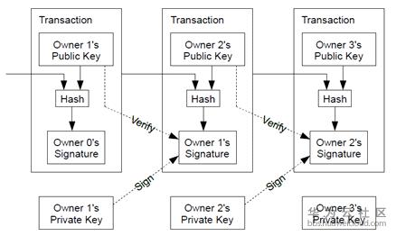
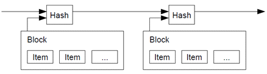
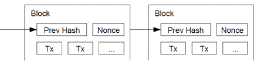
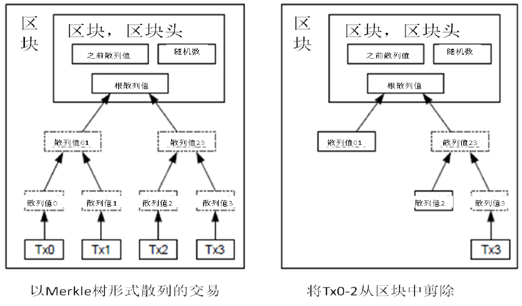
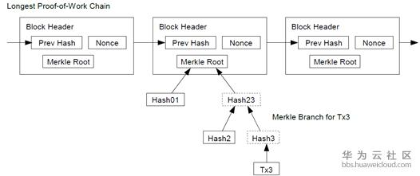
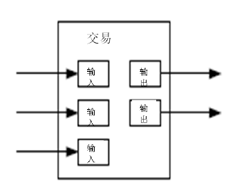
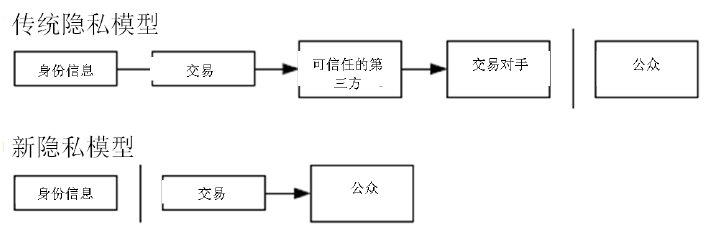
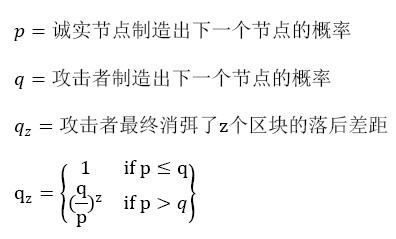

一种点对点的电子现金系统

白皮书链接：https://github.com/GammaGao/bitcoinwhitepaper/blob/master/bitcoin_en.pdf 

# 1. 简介
互联网上的贸易，几乎都需要借助金融机构作为可资信赖的第三方来处理电子支付信息。虽然这类系统在绝大多数情况下都运作良好，但是这类系统仍然内生性地受制于“基于信用的模式”(trust based model)的弱点。我们无法实现完全不可逆的交易，因为金融机构总是不可避免地会出面协调争端。而金融中介的存在，也会增加交易的成本，并且限制了实际可行的最小交易规模，也限制了日常的小额支付交易。并且潜在的损失还在于，很多商品和服务本身是无法退货的，如果缺乏不可逆的支付手段，互联网的贸易就大大受限。因为有潜在的退款的可能，就需要交易双方拥有信任。而商家也必须提防自己的客户，因此会向客户索取完全不必要的个人信息。而实际的商业行为中，一定比例的欺诈性客户也被认为是不可避免的，相关损失视作销售费用处理。而在使用物理现金的情况下，这些销售费用和支付问题上的不确定性却是可以避免的，因为此时没有第三方信用中介的存在。 所以，我们非常需要这样一种电子支付系统，它基于密码学原理而不基于信用，使得任何达成一致的双方，能够直接进行支付，从而不需要第三方中介的参与。杜绝回滚(reverse)支付交易的可能，这就可以保护特定的卖家免于欺诈；而对于想要保护买家的人来说，在此环境下设立通常的第三方担保机制也可谓轻松加愉快。在这篇论文中，我们(we)将提出一种通过点对点分布式的时间戳服务器来生成依照时间前后排列并加以记录的电子交易证明，从而解决双重支付问题。只要诚实的节点所控制的计算能力的总和，大于有合作关系的(cooperating)攻击者的计算能力的总和，该系统就是安全的。

## 解读：

    基于信任模型的交易：

    （1）传统金融中介增加成本

    （2）支付交易可逆，欺诈不可避免

    基于密码学原理：

    （1）点对点交易，不存在金融中介

    （2）不可回滚的支付交易，防止欺诈

    个人点评：本节强调的是目前传统的中心化金融模型有许多不可避免的问题，可以通过密码学保证的分布式账本解决


# 2. 交易(Transactions)
我们定义，一枚电子货币（an electronic coin）是这样的一串数字签名：每一位所有者通过对前一次交易和下一位拥有者的公钥(Public key) 签署一个随机散列的数字签名，并将这个签名附加在这枚电子货币的末尾，电子货币就发送给了下一位所有者。而收款人通过对签名进行检验，就能够验证该链条的所有者。 



该过程的问题在于，收款人将难以检验，之前的某位所有者，是否对这枚电子货币进行了双重支付。通常的解决方案，就是引入信得过的第三方权威，或者类似于造币厂(mint)的机构，来对每一笔交易进行检验，以防止双重支付。在每一笔交易结束后，这枚电子货币就要被造币厂回收，而造币厂将发行一枚新的电子货币；而只有造币厂直接发行的电子货币，才算作有效，这样就能够防止双重支付。可是该解决方案的问题在于，整个货币系统的命运完全依赖于运作造币厂的公司，因为每一笔交易都要经过该造币厂的确认，而该造币厂就好比是一家银行。 我们需要收款人有某种方法，能够确保之前的所有者没有对更早发生的交易实施签名。从逻辑上看，为了达到目的，实际上我们需要关注的只是于本交易之前发生的交易，而不需要关注这笔交易发生之后是否会有双重支付的尝试。为了确保某一次交易是不存在的，那么唯一的方法就是获悉之前发生过的所有交易。在造币厂模型里面，造币厂获悉所有的交易，并且决定了交易完成的先后顺序。如果想要在电子系统中排除第三方中介机构，那么交易信息就应当被公开宣布（publicly announced）[1] ，我们需要整个系统内的所有参与者，都有唯一公认的历史交易序列。收款人需要确保在交易期间绝大多数的节点都认同该交易是首次出现。 

## 解读

    每一位电子货币所有者通过对前一次交易和货币接受者的公钥（pubilc key）签署一个hash数字签名，然后发送给下一位所有者。

    （1）收款人使用付款人的公钥（public key）校验，是否是正确的付款人发送

    （2）由于交易中有收款人的公钥，所以只有收款人使用自己的私钥才能解锁并将该货币传递下去

    但以上过程仍然有问题，无法解决双重支付问题，即货币所有者将同一电子货币签名后发送给多个收款人。
    传统金融：通过中介机构判断并确认用户是否进行双重支付
    比特币：通过公开宣布货币的所有交易，形成唯一公认的历史交易序列，由系统内所有参与者认同交易

    个人点评：通过非对称加密的公私钥，可以解决虚拟货币的归属权问题，但是同一个货币可以由归属人付给多个人，也就是双重支付，仅使用加密在货币体系里是不够的。（这里其实隐含了货币体系必须要有人记账）


# 3. 时间戳服务器(Timestamp server)
本解决方案首先提出一个“时间戳服务器”。时间戳服务器通过对以区块(block)形式存在的一组数据实施随机散列而加上时间戳，并将该随机散列进行广播，就像在新闻或世界性新闻组网络（Usenet）的发帖一样[2][3][4][5] 。显然，该时间戳能够证实特定数据必然于某特定时间是的确存在的，因为只有在该时刻存在了才能获取相应的随机散列值。每个时间戳应当将前一个时间戳纳入其随机散列值中，每一个随后的时间戳都对之前的一个时间戳进行增强(reinforcing)，这样就形成了一个链条（Chain）。




## 解读

    对区块形式存在的一组数据实施随机散列（HASH)加上时间戳，将区块连成一个链条，形成区块链

    个人点评：本节实际上给出了比特币账本的雏形，也是区块链(Blockchain)名称的来源，每一个区块就是一页账本，他们的顺序是由时间戳来决定，由Hash函数保障账本的真实性。


# 4. 工作量证明（Proof-of-Work）
为了在点对点的基础上构建一组分散化的时间戳服务器，仅仅像报纸或世界性新闻网络组一样工作是不够的，我们还需要一个类似于亚当•柏克（Adam Back）提出的哈希现金（Hashcash）[6] 。在进行随机散列运算时，工作量证明机制引入了对某一个特定值的扫描工作，比方说SHA-256下，随机散列值以一个或多个0开始。那么随着0的数目的上升, 找到这个解所需要的工作量将呈指数增长，而对结果进行检验则仅需要一次随机散列运算。

我们在区块中补增一个随机数(Nonce)，这个随机数要使得该给定区块的随机散列值出现了所需的那么多个0。我们通过反复尝试来找到这个随机数，直到找到为止，这样我们就构建了一个工作量证明机制。只要该CPU耗费的工作量能够满足该工作量证明机制，那么除非重新完成相当的工作量，该区块的信息就不可更改。由于之后的区块是链接在该区块之后的，所以想要更改该区块中的信息，就还需要重新完成之后所有区块的全部工作量。



同时，该工作量证明机制还解决了在集体投票表决时，谁是大多数的问题。如果决定大多数的方式是基于IP地址的，一IP地址一票，那么如果有人拥有分配大量IP地址的权力，则该机制就被破坏了。而工作量证明机制的本质则是一CPU一票。“大多数”的决定表达为最长的链，因为最长的链包含了最大的工作量。如果大多数的CPU为诚实的节点控制，那么诚实的链条将以最快的速度延长，并超越其他的竞争链条。如果想要对业已出现的区块进行修改，攻击者必须重新完成该区块的工作量外加该区块之后所有区块的工作量，并最终赶上和超越诚实节点的工作量。我们将在后文证明，设想一个较慢的攻击者试图赶上随后的区块，那么其成功概率将呈指数化递减。 另一个问题是，硬件的运算速度在高速增长，而节点参与网络的程度则会有所起伏。为了解决这个问题，工作量证明的难度(the proof-of-work difficulty)将采用移动平均目标的方法来确定，即令难度指向令每小时生成区块的速度为某一个预定的平均数。如果区块生成的速度过快，那么难度就会提高。 

## 解读

   计算一个随机数(Nonce)，将随机数与区块头一起计算随机散列值（Hash），该散列值要满足以$N$个0开头（$N$为变量，可通过$N$来控制计算难度，$N$越大，难度越大），此即为“挖矿”的内部原理。

   工作量证明的用途：
    （1）保证区块链（Blockchain）的不可篡改性，由于区块形成了链条，如果要修改区块，必须重新完成之前所有的工作量，所以随着区块链高度越高，越旧的区块越难以篡改。
   （2）工作量证明的本质是一CPU一票（与传统的一IP一票不同，攻击者要获得更多的票数需要投入大量的成本），如果大多数的CPU为诚实节点，那么正确的链条将以最快的速度延长。

  个人点评：上一节的模型能保证账本的顺序和真实性，但是无法阻止人为的创造多个账本，而这些账本中只能有一个是被大家认可的，所以必须创造一种共识机制。比特币的共识机制即为工作量证明（POW），即工作量（Hash计算）最大的那个账本是大家公认的正确账本。

# 5. 网络
运行该网络的步骤如下：
 
  1) 新的交易向全网进行广播；
  2) 每一个节点都将收到的交易信息纳入一个区块中；
  3) 每个节点都尝试在自己的区块中找到一个具有足够难度的工作量证明；
  4) 当一个节点找到了一个工作量证明，它就向全网进行广播；
  5) 当且仅当包含在该区块中的所有交易都是有效的且之前未存在过的，其他节点才认同该区块的有效性；
  6) 其他节点表示他们接受该区块，而表示接受的方法，则是在跟随该区块的末尾，制造新的区块以延长该链条，而将被接受区块的随机散列值视为先于新区快的随机散列值。
  节点始终都将最长的链条视为正确的链条，并持续工作和延长它。如果有两个节点同时广播不同版本的新区块，那么其他节点在接收到该区块的时间上将存在先后差别。当此情形，他们将在率先收到的区块基础上进行工作，但也会保留另外一个链条，以防后者变成最长的链条。该僵局（tie）的打破要等到下一个工作量证明被发现，而其中的一条链条被证实为是较长的一条，那么在另一条分支链条上工作的节点将转换阵营，开始在较长的链条上工作。 所谓“新的交易要广播”，实际上不需要抵达全部的节点。只要交易信息能够抵达足够多的节点，那么他们将很快被整合进一个区块中。而区块的广播对被丢弃的信息是具有容错能力的。如果一个节点没有收到某特定区块，那么该节点将会发现自己缺失了某个区块，也就可以提出自己下载该区块的请求。 

## 解读

网络的运行步骤如下：

（1) 新的交易向全网进行广播；

（2) 每一个节点都将收到的交易信息纳入一个区块中；

（3) 每个节点都尝试在自己的区块中找到一个具有足够难度的工作量证明；

（4) 当一个节点找到了一个工作量证明，它就向全网进行广播；

（5) 当且仅当包含在该区块中的所有交易都是有效的且之前未存在过的，其他节点才认同该区块的有效性；

（6) 其他节点表示他们接受该区块，而表示接受的方法，则是在跟随该区块的末尾，制造新的区块以延长该链条，而将被接受区块的随机散列值视为先于新区快的随机散列值。

两个节点如果同时完成了工作量证明，并进行广播，由于网络传输的原因，可能出现两条一样长度（工作量）的链条，该情况要等下一个工作量证明被发现来判断哪一条最长。

个人点评：全网的节点（矿工），将通过努力完成工作量证明来争夺将新区块写入区块链的权利（记账），如果有人先完成并被确认有效，所有节点就会转向争夺下一个区块的写入权。

# 6. 激励
我们约定如此：每个区块的第一笔交易进行特殊化处理，该交易产生一枚由该区块创造者拥有的新的电子货币。这样就增加了节点支持该网络的激励，并在没有中央集权机构发行货币的情况下，提供了一种将电子货币分配到流通领域的一种方法。这种将一定数量新货币持续增添到货币系统中的方法，非常类似于耗费资源去挖掘金矿并将黄金注入到流通领域。此时，CPU的时间和电力消耗就是消耗的资源。 另外一个激励的来源则是交易费（transaction fees）。如果某笔交易的输出值小于输入值，那么差额就是交易费，该交易费将被增加到该区块的激励中。只要既定数量的电子货币已经进入流通，那么激励机制就可以逐渐转换为完全依靠交易费，那么本货币系统就能够免于通货膨胀。 激励系统也有助于鼓励节点保持诚实。如果有一个贪婪的攻击者能够调集比所有诚实节点加起来还要多的CPU计算力，那么他就面临一个选择：要么将其用于诚实工作产生新的电子货币，或者将其用于进行二次支付攻击。那么他就会发现，按照规则行事、诚实工作是更有利可图的。因为该等规则使得他能够拥有更多的电子货币，而不是破坏这个系统使得其自身财富的有效性受损。 

## 解读

（1）通过完成工作量证明，可以获得一定量新的电子货币作为激励

（2）另外一个激励为交易费，如果比特币（2100万枚）全部已进入流通，激励将完全依靠交易费，使货币免于通货膨胀

激励系统也有助于鼓励节点保持诚实，如果一个攻击者拥有大量的算力，他利用这些算力进行挖矿收益很可能高于攻击比特币网络。

个人点评：网络节点（矿工）争夺记账权相应的必须有一定的激励，否则没有人有动力去记账，这种激励就是记账人可以获得一定量的新比特币和交易费。（比特币的产出量为记录一个块50枚比特币，每4年减半，2018年已经经过两次减半，目前为12.5枚）

# 7. 回收硬盘空间
如果最近的交易已经被纳入了足够多的区块之中，那么就可以丢弃该交易之前的数据，以回收硬盘空间。为了同时确保不损害区块的随机散列值，交易信息被随机散列时，被构建成一种Merkle树（Merkle tree）[7] 的形态，使得只有根(root)被纳入了区块的随机散列值。通过将该树（tree）的分支拔除（stubbing）的方法，老区块就能被压缩。而内部的随机散列值是不必保存的。



不含交易信息的区块头（Block header）大小仅有80字节。如果我们设定区块生成的速率为每10分钟一个，那么每一年产生的数据位4.2MB。（80 bytes * 6 * 24 * 365 = 4.2MB）。2008年，PC系统通常的内存容量为2GB，按照摩尔定律的预言，即使将全部的区块头存储于内存之中都不是问题。 

## 解读 

交易信息构成Merkle树的形态，通过merkle树的原理可知，只需要根节点(root)与路径即可验证交易的正确性，使得用户只需要存储区块头（含有Merkle root），在需要时获取Merkle树路径即可校验一笔交易。

不含全部交易信息的区块头(Block header)仅80字节，区块生成速率约为10分钟一个，每一年只产生数据4.2MB

个人点评：比特币的区块头始终只有80字节，却可以包含交易相关信息，即是利用梅克尔树记录交易，在区块头放入梅克尔根（梅克尔树我们在后面章节会详细讨论）。

# 8. 简化的支付确认（Simplified Payment Verification）
在不运行完整网络节点的情况下，也能够对支付进行检验。一个用户需要保留最长的工作量证明链条的区块头的拷贝，它可以不断向网络发起询问，直到它确信自己拥有最长的链条，并能够通过merkle的分支通向它被加上时间戳并纳入区块的那次交易。节点想要自行检验该交易的有效性原本是不可能的，但通过追溯到链条的某个位置，它就能看到某个节点曾经接受过它，并且于其后追加的区块也进一步证明全网曾经接受了它。



当此情形，只要诚实的节点控制了网络，检验机制就是可靠的。但是，当全网被一个计算力占优的攻击者攻击时，将变得较为脆弱。因为网络节点能够自行确认交易的有效性，只要攻击者能够持续地保持计算力优势，简化的机制会被攻击者焊接的（fabricated）交易欺骗。那么一个可行的策略就是，只要他们发现了一个无效的区块，就立刻发出警报，收到警报的用户将立刻开始下载被警告有问题的区块或交易的完整信息，以便对信息的不一致进行判定。对于日常会发生大量收付的商业机构，可能仍会希望运行他们自己的完整节点，以保持较大的独立完全性和检验的快速性。
 


## 解读

 在不运行完整网络节点的情况下，也能够对支付进行校验。节点只需保留区块头，通过merkle的分支校验某次交易是否存在即可。

 个人点评：早期的比特币账本数据量较小，全网节点实际都是全节点（存储账本所有数据），但是中本聪在设计初已经预见到账本容量随着时间持续膨胀，全节点的负担将会越来越重。此时可以使用只保留区块头的方式，利用梅克尔树来验证交易，这样可以大大减少节点的存储占用空间。


# 9. 价值的组合与分割（Combining and Splitting Value）

虽然可以单个单个地对电子货币进行处理，但是对于每一枚电子货币单独发起一次交易将是一种笨拙的办法。为了使得价值易于组合与分割，交易被设计为可以纳入多个输入和输出。一般而言是某次价值较大的前次交易构成的单一输入，或者由某几个价值较小的前次交易共同构成的并行输入，但是输出最多只有两个：一个用于支付，另一个用于找零（如有）。 需要指出的是，当一笔交易依赖于之前的多笔交易时，这些交易又各自依赖于多笔交易，但这并不存在任何问题。因为这个工作机制并不需要展开检验之前发生的所有交易历史。 

## 解读

 每次发起一次交易，输入可以有多个，输出只有两个：一个用于支付，另一个用于找零

 个人点评：比特币作为货币，需要具备可灵活分割合并使用的特性，通过输入输出的分割与合并使交易变的非常灵活。

# 10. 隐私（Privacy）


传统的造币厂模型为交易的参与者提供了一定程度的隐私保护，因为试图向可信任的第三方索取交易信息是严格受限的。但是如果将交易信息向全网进行广播，就意味着这样的方法失效了。但是隐私依然可以得到保护：将公钥保持为匿名。公众得知的信息仅仅是有某个人将一定数量的货币发所给了另外一个人，但是难以将该交易同特定的人联系在一起，也就是说，公众难以确信，这些人究竟是谁。这同股票交易所发布的信息是类似的，股票交易发生的时间、交易量是记录在案且可供查询的，但是交易双方的身份信息却不予透露。 作为额外的预防措施，使用者可以让每次交易都生成一个新的地址，以确保这些交易不被追溯到一个共同的所有者。但是由于并行输入的存在，一定程度上的追溯还是不可避免的，因为并行输入表明这些货币都属于同一个所有者。此时的风险在于，如果某个人的某一个公钥被确认属于他，那么就可以追溯出此人的其它很多交易。 

## 解读

传统模型：金融中介提供一定的隐私保护

比特币：通过公钥生成的地址，交易虽然在全网广播，但公众能得到的信息仅为某人将一定数量的比特币发给了另外一个人，但无法确认这些人是谁。

个人点评：由于比特币的账本是全网公开的，所以隐私保护是一个重要课题，比特币利用公钥Hash作为交易地址来对外表现交易的输入输出过程，这里有两个好处：
（1）由于公私钥是随机生成的，仅知道公钥Hash并不能知道具体是谁做了交易
（2）某公钥地址的私钥持有人，能随意支配该地址上锁定的货币，但没有人知道谁是真实的私钥持有人

# 11. 计算
设想如下场景：一个攻击者试图比诚实节点产生链条更快地制造替代性区块链。即便它达到了这一目的，但是整个系统也并非就此完全受制于攻击者的独断意志了，比方说凭空创造价值，或者掠夺本不属于攻击者的货币。这是因为节点将不会接受无效的交易，而诚实的节点永远不会接受一个包含了无效信息的区块。一个攻击者能做的，最多是更改他自己的交易信息，并试图拿回他刚刚付给别人的钱。 诚实链条和攻击者链条之间的竞赛，可以用二叉树随机漫步（Binomial Random Walk)来描述。成功事件定义为诚实链条延长了一个区块，使其领先性+1，而失败事件则是攻击者的链条被延长了一个区块，使得差距-1。 攻击者成功填补某一既定差距的可能性，可以近似地看做赌徒破产问题（Gambler’s Ruin problem）。假定一个赌徒拥有无限的透支信用，然后开始进行潜在次数为无穷的赌博，试图填补上自己的亏空。那么我们可以计算他填补上亏空的概率，也就是该攻击者赶上诚实链条，如下所示[8] ：


假定p>q，那么攻击成功的概率就因为区块数的增长而呈现指数化下降。由于概率是攻击者的敌人，如果他不能幸运且快速地获得成功，那么他获得成功的机会随着时间的流逝就变得愈发渺茫。那么我们考虑一个收款人需要等待多长时间，才能足够确信付款人已经难以更改交易了。我们假设付款人是一个支付攻击者，希望让收款人在一段时间内相信他已经付过款了，然后立即将支付的款项重新支付给自己。虽然收款人届时会发现这一点，但为时已晚。 收款人生成了新的一对密钥组合，然后只预留一个较短的时间将公钥发送给付款人。这将可以防止以下情况：付款人预先准备好一个区块链然后持续地对此区块进行运算，直到运气让他的区块链超越了诚实链条，方才立即执行支付。当此情形，只要交易一旦发出，攻击者就开始秘密地准备一条包含了该交易替代版本的平行链条。 然后收款人将等待交易出现在首个区块中，然后在等到z个区块链接其后。此时，他仍然不能确切知道攻击者已经进展了多少个区块，但是假设诚实区块将耗费平均预期时间以产生一个区块，那么攻击者的潜在进展就是一个泊松分布，分布的期望值为：

$\lambda = z \frac{q}{p}$

当此情形，为了计算攻击者追赶上的概率，我们将攻击者取得进展区块数量的泊松分布的概率密度，乘以在该数量下攻击者依然能够追赶上的概率。
$$\sum_{k=0}^{\infty}  \frac{\lambda^k e^{-\lambda}}{k!} . \begin{Bmatrix} (\frac{q}{p})^{(z-k)} & if  k \leq z \\ 1 & if k > z \end{Bmatrix} $$

化为如下形式，避免对无限数列求和：

$$1 - \sum_{k=0}^{z}  \frac{\lambda^k e^{-\lambda}}{k!} . (1- (\frac{q}{p})^{(z-k)} ) $$

写为如下C语言代码：

```c
#include <math.h>
double AttackerSuccessProbability(double q, int z) { 
    double p = 1.0 - q; 
    double lambda = z * (q / p); 
    double sum = 1.0; 
    int i, k; 
    for (k = 0; k <= z; k++) { 
        double poisson = exp(-lambda); 
        for (i = 1; i <= k; i++) poisson *= lambda / i; 
        sum -= poisson * (1 - pow(q / p, z - k)); 
    } 
    return sum; 
} 
```

对其进行运算，我们可以得到如下的概率结果，发现概率对z值呈指数下降。

当q=0.1时 z=0 P=1.0000000 z=1 P=0.2045873 z=2 P=0.0509779 z=3 P=0.0131722 z=4 P=0.0034552 z=5 P=0.0009137 z=6 P=0.0002428 z=7 P=0.0000647 z=8 P=0.0000173 z=9 P=0.0000046 z=10 P=0.0000012

当q=0.3时 z=0 P=1.0000000 z=5 P=0.1773523 z=10 P=0.0416605 z=15 P=0.0101008 z=20 P=0.0024804 z=25 P=0.0006132 z=30 P=0.0001522 z=35 P=0.0000379 z=40 P=0.0000095 z=45 P=0.0000024 z=50 P=0.0000006

求解令P<0.1%的z值：
为使P<0.001，则 q=0.10 z=5 q=0.15 z=8 q=0.20 z=11 q=0.25 z=15 q=0.30 z=24 q=0.35 z=41 q=0.40 z=89 q=0.45 z=340 

## 解读

攻击者即使拥有了巨大的算力，也仅能更改他自己的交易信息，试图拿回他刚付给别人的钱（双重支付）或者拒绝别人的交易信息。无法凭空创造价值或掠夺别人的货币。

--后面内容涉及较多数学计算，不再详述，有兴趣的自行翻阅白皮书。

个人点评：工作量证明有一个风险，就是有人如果控制了全网大量的算力（如超过51%），实际上他可以控制大部分的记账权，对于比特币网络将产生风险。但是比特币的设计将这种风险产生的后果降到了较低的水平：

（1）由于仅有算力，没有私钥，无法随意掠夺别人的货币。

（2）虽然他可以拒绝别人的交易计入账本，但这种破坏实际并不会对别人造成货币的损失。

（3）他还可以试图进行双重支付，但如果在大额交易中对方进行多个块（如6个以上）确认来验证交易，仍然很难完成双重支付。并且这种攻击发生会很容易被察觉，比特币社区可以快速做出应对。

综上所述，进行51%算力攻击需要花费巨大的成本，但是获益其实并不大，如果能掌握51%算力，进行攻击的收益可能远不如成为一个诚实节点进行挖矿的收益。当然如果有人以破坏比特币网络为目的，并完成51%算力攻击，势必会对比特币产生影响，但并不可能杀死比特币。

# 12.结论
我们在此提出了一种不需要信用中介的电子支付系统。我们首先讨论了通常的电子货币的电子签名原理，虽然这种系统为所有权提供了强有力的控制，但是不足以防止双重支付。为了解决这个问题，我们提出了一种采用工作量证明机制的点对点网络来记录交易的公开信息，只要诚实的节点能够控制绝大多数的CPU计算能力，就能使得攻击者事实上难以改变交易记录。该网络的强健之处在于它结构上的简洁性。节点之间的工作大部分是彼此独立的，只需要很少的协同。每个节点都不需要明确自己的身份，由于交易信息的流动路径并无任何要求，所以只需要尽其最大努力传播即可。节点可以随时离开网络，而想重新加入网络也非常容易，因为只需要补充接收离开期间的工作量证明链条即可。节点通过自己的CPU计算力进行投票，表决他们对有效区块的确认，他们不断延长有效的区块链来表达自己的确认，并拒绝在无效的区块之后延长区块以表示拒绝。本框架包含了一个P2P电子货币系统所需要的全部规则和激励措施。