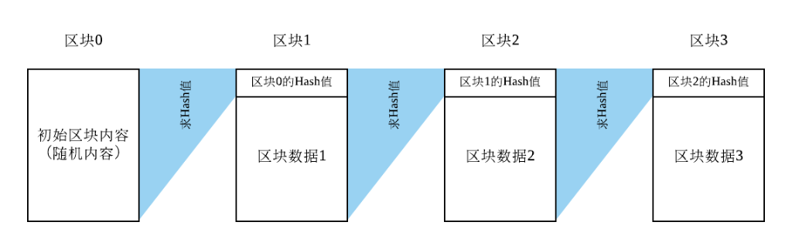

[从央行官方解读看数字货币](https://www.talkcc.net/thread/4438700)

最近区块链和央行数字货币又开始占领各大网站和论坛头条，于是决定写一篇整理性的文章，尽量用简单易懂的语言来从专业角度谈论区块链和央行数字货币。这篇文章主要分成两个部分：基本概念和央行官方解读。

为了节约部分读者的时间（如果想省去第一部分），我首先总结一下央行的实际态度，用一句话概括就是：

央妈：Libra，比特币都是垃圾，和数字人民币没关系。

以及我要强调的一点：

区块链和去中心化没有必然联系！两者从学术角度考虑实际上毫不相干。

开始正文

# 第一部分 基本概念

要理解国家关于区块链和央行数字货币的相关政策，必须要明确区块链和数字货币两个基本概念。不幸的是，网络上绝大部分文章都把两个混为一谈，鲜有专业性的解读。在这一部分，我将尽量用通俗的语言解释两个概念。

一.1 区块链 (Blockchain）

从计算机科学的专业角度上看，区块链实际上是一个数据结构。该数据结构的示意图如下：

区块链通常有一个初始区块（或者创世区块，英文为Genesis Block），这个区块的数据一般是一些随机数据，或者是区块链创造者自己想加入的数据。这个创世区块一般被标记为【区块0】。当这个区块被创造以后，我们会为这个区块的所有数据做一个求解Hash值（哈希值）的操作，并把这个Hash值放在下一个区块（即【区块1】）当中。

在这里，我要解释一下Hash值是怎么回事。我们可以把【求解Hash值】这个动作看作一个特殊的函数，这个特殊的函数通常能够将一坨无比复杂的数据转换成一个符合某种规则（比如固定长度、值域）的值。注意：根据函数的定义，某一个输入有且只能有一个输出，因而对于某一坨数据，只要这个数据没有被篡改过，那么Hash出来的值是唯一的。

在区块链中，大家通常采用一个叫SHA的Hash函数。SHA有好几种类型，这里我以SHA-256为例：这个函数能将任意数据转换成一个256位的二进制数。大家有兴趣可以上这个网站玩一玩SHA-256这个Hash函数:

https://xorbin.com/tools/sha256-hash-calculator

注意：网站给出的Hash值已经将二进制转换为16进制。

SHA-256这类Hash函数的优点在于一下三点：

1. 不可逆性。给你一个经过SHA-256计算出来的Hash值，除非你明确知道原始数据是啥，否则很难去构造另一个原始数据去得到同样的Hash值。

2. 固定长度。无论输入是啥，输出永远是256位二进制数。

3. 多变性。即使两个原始数据只有一个二进制位不同，计算出的两个Hash值却能差十万八千里。大家有兴趣可以用上面那个链接尝试一下，替换一句话的某一字母，计算出的Hash值就已经完全不一样了，无法找到规律。

现在我们回到区块链这个数据结构。我们之前已经说过，初始区块的数据会被求一个Hash值，然后放在【区块1】中。之后，我们就会把数据塞入【区块1】中，直到这个区块被塞满。接着，我们对整个【区块1】求一个Hash值，并把新的Hash值放到【区块2】中。这里要特别注意：除了初始区块，每次我们求Hash值的时候，是把整个当前区块的数据都求Hash值，这里Hash函数的原始数据不仅仅包含当前区块的存储数据，也包含前一个区块的Hash值。

大家就要问了，为毛区块链要这么安排啊？前面我们提到，SHA-256这类Hash函数的特点是：如果输入有一点扰动，输出就会变化很大。我们假设某一个黑客想修改这个区块链中【区块1】的某个数据，然后TA就发现：如果TA不去把【区块2】里面的那个【区块1的Hash值】给改掉，某一天数据库管理员计算了一下被修改的【区块1】的Hash值，然后和【区块2】里面的那个Hash值对比一下，就会发现两个Hash值是不同的，这样管理员马上就可以看出【区块1】的数据被篡改了。于是乎，这个黑客需要重新计算【被篡改的区块1】的Hash值，然后用这个新值去替换【区块2】里面对应的Hash值。然后呢，这个黑客就又悲催的发现：TA又必须要去篡改【区块3】里面的那个Hash值，因为后者是把【区块2】的存储数据和【原始区块1】的Hash值放在一起而求出来的值，而目前【区块2】里面的数据是变成了【区块2】的存储数据+【被篡改的区块1】的Hash值。这一点小小的扰动足够让SHA-256计算出一个完全不同的Hash值，于是某一天数据库管理员来查账的时候又会发现问题。就这样，这个黑客必须要把这个区块链中所有的【区块1】后面的区块数据都要改掉一遍，直到最后一个区块，这样才不会留下痕迹。

想必大家已经看出，如果是某一个区块链很大，而且存储很分散，没准还在不同的系统里面，那这个黑客的工作量是很大的，会留下大量的痕迹，很容易就暴露的自己的行踪。因而，仅仅一个原始的区块链，就可以提供比传统数据库高得多的安全性。另外，我们可以把区块链存储在【一次性写入存储器】（即【只读存储器】）里面，这样数据的可靠性将大大增强。

那么下一个问题来了，如何恢复数据呢？通常而言，数据库都会有好几个备份。同样的，一条区块链也会有好几个备份，一个坏掉了可以去找备份。而且由于Hash值的存在，定位被修改过的区块并不是难事（具体操作大家可以想想，不明白没关系，不影响下面阅读）。

故事还没结束。大家如果看过马特·达蒙的纪录片《监守自盗》，就知道一个系统如果内部人自己乱搞，外人是根本看不出来系统是如何造假的。那么问题来了：假如你在某个保险机构买了一个保险，然后保险机构说系统故障，把你的资本金从$100000变成了$10，你咋说理啊？这么大的利润，其实足够让保险机构有动力把自己家的数据库（包括备份）全改了一遍，反正又不花几个电费钱。有人说：我有合同。的确，目前这类问题是用合同来约束。但是，不是所有的交易都有一个合理、清晰、不需要监管和巨额律师费的合同，更何况很多情况是没法弄合同的，你会去为了一个页游的装备和游戏公司互撕吗，或者因为删帖和扎克伯格互撕（床破表示很喜欢）？

因此，基于区块链，并结合分布式系统里面的一些技术，大家发明出来了一个新的概念，叫分布式记账系统（Distributed Ledger）。在这个系统中，和某一坨数据有关的双方或者多方都会拥有某一条区块链的一个或者多个备份。这些备份里的数据被分为【有效部分】、【无效部分】和【待定部分】。整个系统的各路参与者会根据一个类似【民主投票】的算法来决定这些备份的哪一部分是有效、无效还是待定的。这种算法，被称作为共识算法（consensus protocol）。

共识算法不是新鲜玩意，这东西被学术界研究了半个多世纪，原先的主要目的是解决数据一致性的问题。比如说，一个火箭有4个温度传感器，其中某几个可能坏掉了，度数不准，那我们到底采集哪几个传感器的值作为真实值呢？要注意到，这类应用需要绝对保真的数据，而不是简单弄个平均数了事，因为某一个传感器的值可能与真实值差距过大，以至于平均值已经毫无意义了。共识算法在一开始设计的时候并没有考虑到大规模并发的问题，通常系统内只有不到100个节点，所以目前传统的共识算法效率都不是很高，没法应用到上亿个用户这一级别的系统中。这个问题直到现在都没有被学术界或者工业界解决。

这个问题直到现在都没有被学术界或者工业界解决！！！

这个问题直到现在都没有被学术界或者工业界解决！！！

这个问题直到现在都没有被学术界或者工业界解决！！！

到此为止，大家可能就很好奇了，目前主流的数字货币和以上的技术到底有啥关系呢？

一.2 数字货币

由于传统共识算法没法支持海量用户，比特币于是另辟蹊径，自己搞出来了一套共识算法。这里，有兴趣的读者可以去看看白皮书，即使你看不懂也无所谓，不影响下面的阅读，如果大家有兴趣请留言或者私信，我后面有时间可以给大家提供详细的算法思想。比特币的共识算法后来又被用到以太坊等这些所谓“数字货币”中。因而，大家可以看出，目前大部分数字货币本质上就是【区块链存储】+【类比特币的共识算法】这两个的结合体，是一个基于区块链的系统。对于这些“货币”系统，区块链不过是存储技术，其核心的技术其实是那个共识算法，这才是所有类似系统最最核心的技术所在。

共识算法是一个非常复杂的研究领域，其难点在于：系统内部总会有某些“邪恶"节点，这些节点会干出任何超出常人想象的事情，比如篡改数据，自身假崩溃，骗取管理节点信任，发送假消息等等。这些事情有些可能是因为黑客攻击，有些则纯粹是硬件或者软件bug，这类bug还非常难以消除。另外，太空中一个宇宙射线把某一个比特位从0打成了1，你上哪说理去？？？同样的，一个货币系统中必然有造假币、做假账、搞事情的节点，对这类节点的防范是数字货币系统必须要解决的问题。

那么下面的问题就来了，中国人民银行对待数字货币到底是怎么个态度？其政策导向究竟是啥？数字人民币究竟靠不靠谱？数字人民币和主流的数字货币系统到底是有啥关系？下面，就由我来给大家解读央行的官方态度。

# 第二部分 央行数字货币政策解读

央行的数字货币政策解读是9月4日首发的，由央行支付司副司长、数字货币研究所所长穆长春主讲。有意思的是，穆长春把这么重要的官方解读放到了一个付费知识平台里面，这令我百思不得其解。直到后来9月16日左右各路媒体开始报道，然后美国隔夜存款利率飙升到10%，我似乎感觉到了某街里那一丝丝的不安.......

言归正传，该讲座的标题是《科技金融前沿：Libra 与数字货币展望》。全文（疑似盗版）的链接是：

https://www.chainhoo.com/blockchain/101314/

该文很长，穆长春花了一个小时时间详细点评了Libra和央行数字货币，以及部分近期的金融货币政策。为了节省篇幅，在这片文章，我只点评穆长春讲座中最重要的两个点：Libra为何不可能成功，以及中国的数字人民币与之的根本区别在哪里。

二.1 Libra为何注定失败

Libra的架构究竟是啥？我们这里需要引入当前主流区块链系统的两个概念：公有链系统（permissionless blockchain）和私有链系统（permissioned blockchain）。注意：有别于主流文章，我在这里加上了“系统”两字，是因为我非常反感学术界和该圈子各种令人找不到北的名词，而问题的根子其实是英文社区故意这么取名，其手法和华尔街的CDO、CDS啥的没有本质区别。

之前我提到过，数字货币的本质是基于区块链的系统。主流区块链系统被分为好几类。为了不让大家糊涂，我这里就介绍最主要的两类：公有链系统（permissionless blockchain）和私有链系统（permissioned blockchain）。公有链系统的特点是随便一个节点就可以加入，没有任何权限控制，所有节点一律平等。这就是所谓的“去中心化”。

目前，只有公有链系统可以实现所谓的“全社会去中心化”！！！

目前，只有公有链系统可以实现所谓的“全社会去中心化”！！！

目前，只有公有链系统可以实现所谓的“全社会去中心化”！！！

可见，区块链这个数据结构，其实和去中心化没有半毛钱关系。所谓去中心化是由公有链系统的架构所决定的。目前，比特币、以太坊等数字货币都是典型的公有链系统。

另外，由于公有链系统不设门槛，所以链上的所有数据都是公开的，也就是说，根本不存在所谓的“隐私”。

当前，所有的公有链系统都没有隐私！！！

当前，所有的公有链系统都没有隐私！！！

当前，所有的公有链系统都没有隐私！！！

有人说账户可以匿名，但是要知道：数字货币发生交易，必然要和现实生活发生联系，无论是注册的email地址还是ip，结合大数据技术，很容易就可以追查到某一个匿名账户的真是身份。何况，数字货币提现的时候是走的传统银行账户，想不留痕迹根本是不可能的。穆长春就提到过：美国一家公司已经掌握了80%数字货币账户背后的真实身份，想逃过NSA的眼睛？呵呵。

那么私有链系统又是啥呢？私有链系统是有严格的准入制度的，只有符合条件的节点才能接入到系统中。比如说，如果几家金融机构想做内部清算系统，那他们就需要首先确定哪些节点是合法可接入的，而整个系统只能由这些节点进行操作，别人进不去也拿不到数据。

我们为啥需要私有链系统呢？其实根本原因还不是隐私的问题，而是一个目前各路主流区块链系统最大的痛点，就是性能。公有链系统目前的共识算法极为低效，比特币目前每秒只能处理6笔交易。是的，你没看错。

比特币目前每秒只能处理6笔交易，延迟1小时！！！

比特币目前每秒只能处理6笔交易，延迟1小时！！！

比特币目前每秒只能处理6笔交易，延迟1小时！！！

这里延迟的意思是：一笔交易从开始到最终安全确认，至少要花1小时等待。当然，系统在这期间也会确认别人的交易，但是你的交易就必须在系统里面等，直到1个小时以后才能被最终确认。

其他几个也好不到哪里去，即使性能翻倍，这个性能也惨不忍睹。要知道VISA日常1000笔，支付宝日常一万笔每秒，网联是9万笔，双十一高峰是22万笔，你这个6笔交易是来搞笑的吗？

显然，公有链系统共识算法有其固有的缺陷，而且目前学术界和工业界一直没有找到合适的方法去解决，将来也不太可能会有。尽管目前大家都在热炒新的共识算法，即所谓（proof of stake），但是其性能离国内的电子支付需求都差得老远，更别说国际了。

私有链系统则可以采取更加灵活高效的共识算法。目前比较常见的是PBFT和其各种变种。该算法在理想条件下支持一万笔每秒的性能要求还是可以达到的，当然，离着支付宝还是有很大的距离。

根据Libra的白皮书，这个系统采用的是混合架构。不管其如何含糊其辞，Libra还是承认了其基础架构是基于类似PBFT的共识算法。穆长春提到：当Libra的代码公开了以后，他们做了一个实验：在一个只有4个节点的局域网系统、每个节点8个核、256G内存下，Libra最高支持3万笔交易，同时还有好几十个bug。如果系统稍稍做扩展，性能就会降低到1000笔每秒左右，而这个是目前Libra基金会希望达到的性能指标。

说句实话，我非常钦佩穆长春没有用言辞去嘲笑这个1000笔每秒的性能指标。这个指标其实直接判处了Libra大规模流行的死刑，因为这个速度实在是太低了。要知道仅仅要满足中国现阶段的交易，性能就必须提至少1个数量级，更不要说全世界的交易了。Libra很鸡贼的说我们的重点是跨境汇款交易。那又来了，你Libra如何保证汇率稳定？要知道换汇这种活，你要有的换才行，而目前汇款大户主要是从美元区和欧元区汇往不发达国家，几百亿的单方向资金流会很快吸干Libra的货币篮子，各国央行的配合又有限。这方面穆长春有详细解读，我这里就不再赘述了。

可能有读者已经开始算了：这每秒10000笔交易，到底需要多少存储空间啊？哈哈，如果你想到这一点，那你就离【终极真相】不远了。根据目前所有了基于区块链的分布式记账系统架构来看，每发生一笔交易，就需要永久记录该交易的所有信息，包括：输出账户ID，输入账户ID，交易额，交易类型等等杂七杂八的信息。如果我们假设每笔交易需要100个Byte存储（比特币是250Btye），那么每天我们会生产:

10000 * 60 * 60 * 24 * 100 = 86.4G Btye的数据。

每天86.4GB，宽带用户一般每月才200GB左右，这么大的数据量，显然搞公有链系统是不可能的，因为公有链系统要求每一个节点都有完整的历史交易数据。而私有链系统即使有足够的硬盘存储，由于其共识算法要求节点之间时时刻刻都要进行大量的相互通信，整个系统的带宽要求是随着节点数量呈指数级上升，因而会显著拖慢系统的性能。再考虑到跨境通信的各种延迟，真要搞私有链系统，恐怕也要等美国自己的量子通信出来以后再做考虑了。

因而，我们可以断言，Libra目前选择的技术路线没有未来，是注定不可能成功的。央行显然也是知道的，而且通过抓主要矛盾去解决这些问题，这就是下一节我要阐述的问题。

二.2 央行数字货币的指导路线

看到这里，大家大概有个数了：目前所有的数字货币系统都是基于区块链的分布式记账系统，其性能受限于相应的共识算法。那么好了，数字货币系统，真的需要建立在记账系统上吗？？？

真的需要建立在记账系统上吗？？？

真的需要建立在记账系统上吗？？？

真的需要建立在记账系统上吗？？？

央行的答案其实很简单：不是的。中国的数字货币基础，就不是记账系统。在这里，我喜欢用Ledger-based来指代之前我们提到的主流的数字货币系统，而用Token-based来指代央行的数字货币系统。注意到：这里的Token是泛指，不是那些圈钱的Token。

穆长春提到：央行这次不预设技术路线，其根本思想其实很简单：就是用电子化的人民币来取代M0。用通俗的话来讲，就是原来现钞是纸币，现在的现钞是一坨代码。这坨代码，我这里叫它Token。这个Token是寄生在央行发布的数字钱包里面，任何能运行这个数字钱包的电子设备都是可以互相交易，而且是完全脱网交易。这里脱网的意思就是设备无需接入互联网，只要两个设备互相能通讯就好（比如一碰传）。这样的好处是：本地小额交易直接用一碰传这种类似P2P协议（不是P2P金融啊，不要想歪了，是类似原来电骡、BT下载类似的P2P通信协议）直接完成，完全不需要经过上面的银行网络。这种类型的交易，就和现金交易没有任何本质的不同，只不过现金由纸钞变成了Token，并且多了终端这个硬件需求。央行也明确了：Token的管理方式和纸钞相似，你大额取现和大额存现肯定是收到一定的限制和监管。另外，电子钱包虽然是匿名的，但是是可控匿名，换句话说只对普通交易者匿名，对央行是透明的。我个人猜测央行会在Token上打上离线交易的交易记录，这样每次这些Token被存入银行账户的时候，整个交易信息就会被央行收集，央行就可以通过大数据进行各种分析来打击洗钱等犯罪。Token的离线交易显然也要有额度限制，因为转发数字货币显然要比运1000万人民币纸钞要容易得多。另外，我猜钱包的大小也应该会有限制，这一点虽然穆长春没有明说，但是从常理推断应该是有上限的，否则不利于监管。

除此之外，有人可能会问：那我把所有的钱都放在钱包里，交易也尽量用离线钱包交易，只要这些Token没有被存进银行，那央行不就永远不知道这些交易到底是啥吗？我的观点是：单说现钞流通，你不去存，难道别人就不会去存吗？余额宝这种才几个利息，大家不还是踊跃去存？央行完全可以搞个人民宝之类的东西，忽悠大家把小额钱托管到各路金融系统里面，以便收集信息。另外，央行也完全可以说：手机丢了，或者坏了，你的钱就没了，等同于钱包被人偷了或者烧干净了。这么一搞就逼着大家去把钱存起来，监管难度陡然下降。

于是，通过Token-based的系统，央行就把零售这块锅直接甩给了钱包依附的交易终端上，并且Token-based系统不存在重复记账的问题，一笔交易只由对应的Token去记录，没有额外的通信成本，而不是像目前的主流数字货币体系，每一个节点都要去记录所有的交易记录，而且由于共识算法的局限性，他们还需要把新记录不停互相传输去“投票”，效率低得惊人。

至于上层架构，穆长春虽然没明确说，但其实隐含了一个事实，就是没有什么需要大改的。网联已经pass双11了，而这些个Token存进银行系统后就变成了纸钞存入银行一样，直接用现有系统监管就可，不需要进行太大的改进。当然，如果央行想玩一个大的，弄一个大统一监管体系，跟踪社会每一笔交易（包括机构和企业单位之间的交易）并进行各种分析，那我们可能需要把旧的系统进行重新设计。由于这部分主要牵扯大额交易，其产生的数据量实际上很小（相对于零售而言，无论用户数量还是交易频次），而且大部分都发生在银行系统内部，现有的某些私有链系统其实完全可以满足这方面的需求，因此我对这部分实现是有信心。

总结

通过这篇文章，我希望大家能够对目前的区块链和数字货币产业有一个比较直观的认识。同时，我个人认为央行这次准备很充分，直接抓住了主要矛盾，通过逆向思维（Token-based而不是Ledger-based），让现金也就是Token来完成交易记录和交易计算，由此大大降低的系统的存储和通信负载。而且，央行这次选择的时间点，恰逢东风17即将亮相的前面，你说这玩意不会国际化吗？

# 后续一（完结） 

非常感谢大家捧场！针对陈王的部分点评，我在这里对一些数字货币社区的最新概念做一下简要点评。

【1】关于公有链和私有链系统的分类：目前的公有链系统基本上都是以比特币的共识算法为基础，进行部分修改和扩展，代表作为比特币、比特币现金、莱特币、以太坊等等。这类公有链系统最最显著的特征是：它们都有一套挖矿”的手续。这个所谓的“挖矿”，其实是共识算法里面的一道必备的程序。由于公有链系统没有准入机制，因而为了限制某些“邪恶节点”的影响力，系统的共识算法故意将取得共识的难度加大，以至于很难出现一个节点或者组织能够“主导”系统。而Libra、Hyperledger等系统都是基于传统的(P)BFT共识算法，该类共识算法性能高但扩展性差，因而需要准入机制，所以它们都是私有链系统。

【2】目前公有链系统和私有链系统都有针对账本数据的压缩研究。但是目前两者系统最大的瓶颈其实还不在最终的存储策略上，而是运行共识算法的过程中的通信问题。公有链系统因为各个节点都需要拿到实时的新数据，因此网络传输的总数据量过大；而私有链系统的问题则是网络延迟过大：海底光缆一个来回就几百毫秒，整个共识算法需要数据传输好几个来回，这样总延迟就要超过1s，这就要求共识算法不能一次只处理一条交易，否则吞吐量实在过慢。然而这就又引出了下一个问题：

【3】交易是有先后逻辑顺序的。由于每笔交易都要把钱从一个账户转移到另一个账户，如果其中某个账户又进行了其他的交易，那么交易顺序必定会影响交易的成败。比如说，A账户有100元，B账户有0元，并且有以下两笔交易：A先给B转100元，B转50元给C。但是，如果第二笔交易发生在第一笔之前，而这时B账户并没有这么多钱，则这次交易必定失败。大家可能会奇怪：为啥会出现这种情况呢？因为网络延迟的问题，真实的交易信息到达分布式记账系统的时候往往是乱序的，可能B以为自己还有足够的钱，但是B可能有别的转账交易被系统提到了前面先执行了，结果造成余额不足。对于交易批处理问题，系统往往首先需要对这批交易的有效性做验证，剔除那些无法实现的交易，而这个过程本身就需要一个共识算法去解决，解决掉这个问题，系统才能对这个共识出来的结果再投一次票。你可以理解前者是人大某个委员会审查“草案”的过程；后者是人大全会针对这个“草案”再投票，把它变成“法律”的过程。两个共识算法一起折腾下来，系统的可扩展性就会变得更差了。这也是为啥Libra折腾了这么老半天还是没法提供10000笔每秒这一级别的交易吞吐量。

【4】上面的“草案”问题，其实可以通过一个中心化的序列化系统去解决。但是既然我们有了这么个系统，那再搞私有链系统的意义在哪里？？？这其实也是央行直接质疑Libra的一点，虽然穆长春并没有直接说，但是私有链系统的各种缺点在上亿用户这一级别的高并发的确是暴露无遗的。

【5】侧链是一种提高系统性能的“动议”。侧链的核心思想是：让大量侧链来收集用户的交易信息，当收集完毕后，再统一放到主链上。至于侧链的问题，我们就要开始讨论共识算法的一些基本理论了。(P)BFT（用于私有链系统）有一个经典理论，就是说一个存在恶意节点的系统中，如果假设我们有f个恶意或者错误节点，那么系统必须至少拥有3f+1个总节点才能得出正确的结果，或者说，一个系统的恶意节点的数量严格不能超过1/3。这个理论证明很复杂，我在这里就不在赘述了。这里大家要注意到：剩下的2f+1个节点是绝对不能出错的，即使过大的网络延迟也不行，否则就会被划入到错误节点里面去。这个理论说明了什么呢？如果在侧链里，节点数量过少，那么只需要有很少量的恶意或者错误节点就可以弄瘫这个侧链。进而，侧链提交的数据会变得不准确，而主链的没有义务查验侧链数据是否准确，主链关心的只是提交的数据会不会和主链上的数据产生逻辑矛盾，至于侧链干了啥坏事，主链一概不过问。对于公有链系统，那就更麻烦了：由于侧链的存在是为了降低延迟和提高交易吞吐，想做到这一点，根据目前的共识算法，唯一的可能性就是减少侧链的节点数量或降低侧链节点达成共识的难度，无论哪一点，都有机会对侧链的安全性造成毁灭性的打击，因为公有链系统没有准入机制，黑客想在侧链上搞事情要比在主链上容易多了。

这里我举一个干坏事的例子：假如某一个侧链被黑客绑架了，商家A卖了货给了商家B，B把钱给了A，在侧链上已经把交易写入了，A确认后把货发了，B收到货后马上联系黑客，把侧链上的交易抹去（实际操作是回滚交易）。要知道：如果该侧链被劫持，基于目前的共识算法，只要恶意节点的数量或者算力足够，此类操作是完全可行。这样，B又把钱拿回来了，而且还拿了货，B就可以把这笔钱花第二次去买别的东西。这个过程，就是著名的Double-spending。注意到：Double-spending在主链也可以发生，所谓比特币51%攻击指的就是这个，因为如果某一个组织掌握了51%的算力就可以抹去比特币区块链上任何的交易信息，这是由比特币的共识算法决定的。

然而，这个可怜的A陪了货，于是TA以后学聪明了，不在信任乱七八糟的侧链，只有数据写入主链并确认以后在发货。如果是这样，那交易的延迟就取决于主链的延迟了。试问：一个交易延迟长达一小时的公有链系统，如何去赢得市场？？？一个稍稍扩展就比1000笔每秒还慢的私有链系统，如何赢得市场？？？

【6】后来又有人提出“联盟拜占庭”的想法，是对PBFT算法的扩展，想法是大家先组成一堆小团体，小团体内部先投票，各个团体之间有一些节点是“脚踩两条船"，联盟拜占庭通过一定的算法把那些乱投票的恶意节点从系统里面剔除掉，这样“理论上”剩下的节点都是正常节点，这样小团体自己内部投票就可以决定要不要把数据放到区块链里面去了，而不用大家一起投票。至于联盟拜占庭的问题，其论文假设每一个团体都能够reach一个agreement，其原始论文明确提出：对于这个团体，f=1，即团体内部最多只有一个恶意或者错误节点，根据我上面提到的3f+1计算，4个节点就构成一个小团体来保证共识算法的正确性。我想问一下论文作者：你哪来的自信能够确定每一个团体只有一个恶意或者错误节点？不说别的，Raft这种应用在不存在恶意节点环境中的共识算法，一般都要假设至少一个错误节点（比如说突然崩溃了或者网络大延迟或者断线）。如果联邦拜占庭要放在公有链上，请问：如何来保证每个团体中f=1？要知道当时比特币为了让公有链系统成为现实，不得不另寻出路，连正常的(P)BFT都不敢用，就是因为你无法保证一个公开的系统中恶意节点的数量，尤其是系统首发的时候。更糟糕的是，如果整个系统绝大部分团体都是恶意团体把持，【民主投票】之后，这系统到底是谁的天下啊？？？

（ps：联邦拜占庭的结构和CDO很像......）

【7】最根本一点，这种涉及国家信息安全的数据系统，是永远不可能上公有链系统的，除非国家全部都消亡了，世界大同。

【总结】目前区块链的绝大部分改进论文，都是在2015年之前就已经发布了，整个社区、学术界和工业界其实研究了很长时间，但是目前最靠谱的还是：公有链系统-比特币类；私有链系统-(P)BFT类。绝大部分改进都无法提供真正严格的证明，来确保系统的可靠性和稳定性。但是，这并不意味着目前的探索一无是处，更不意味着比特币毫无价值（其实比特币的意义很大）。我会在后面对这一点再进行详细阐述。