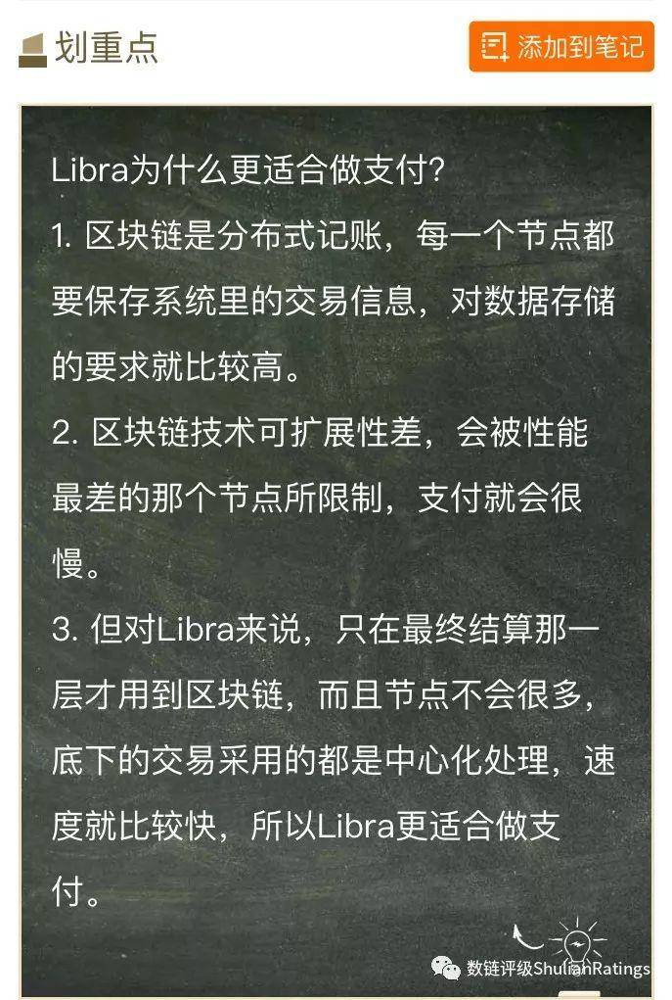
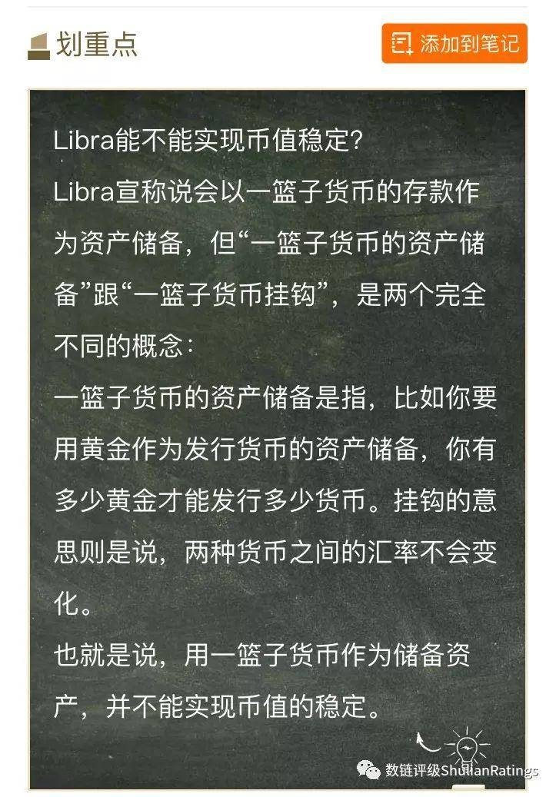
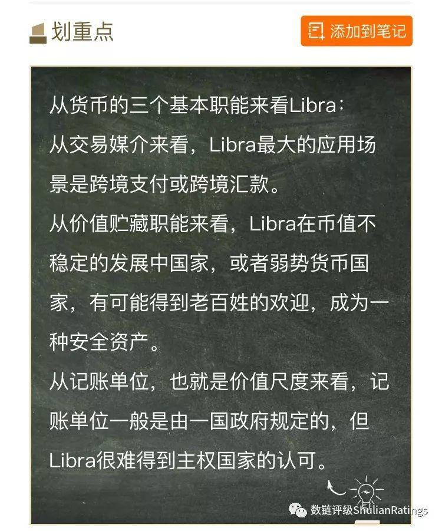
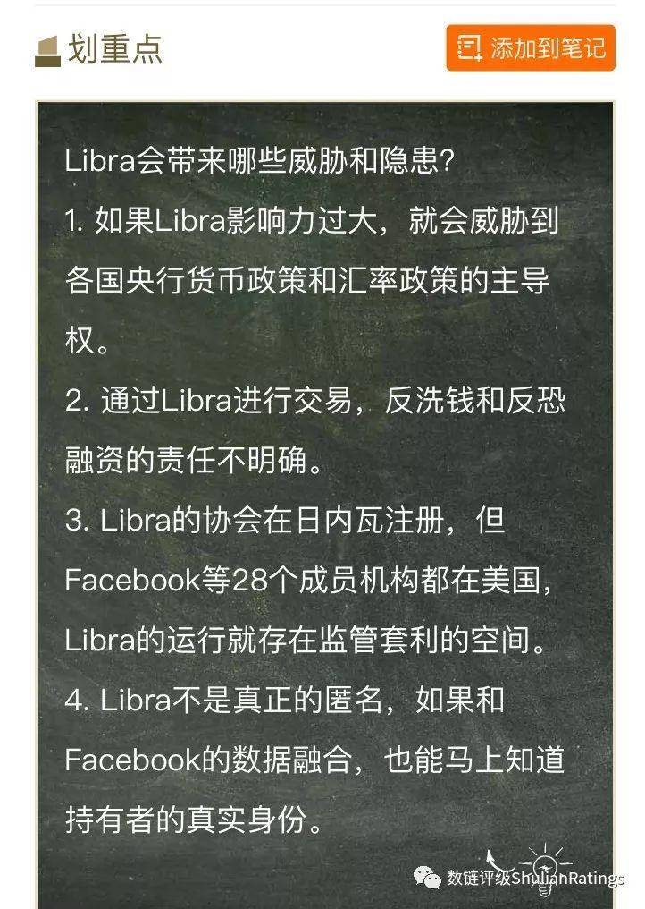
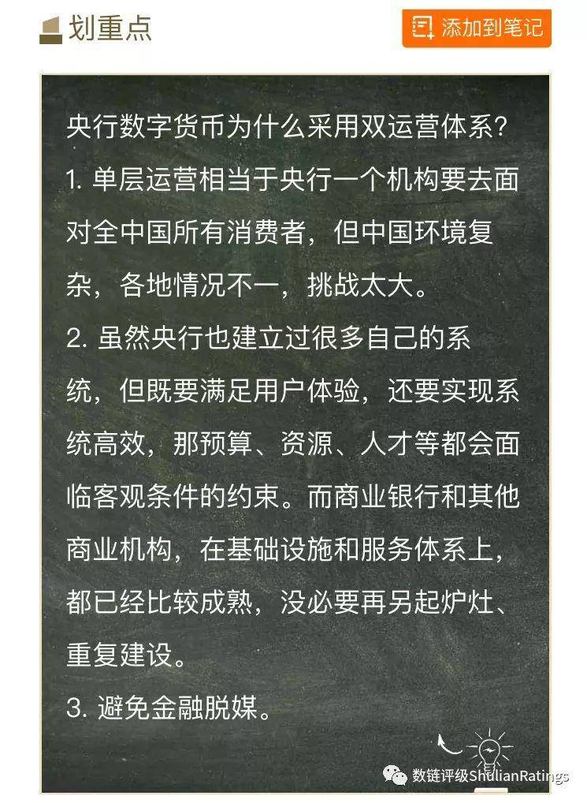
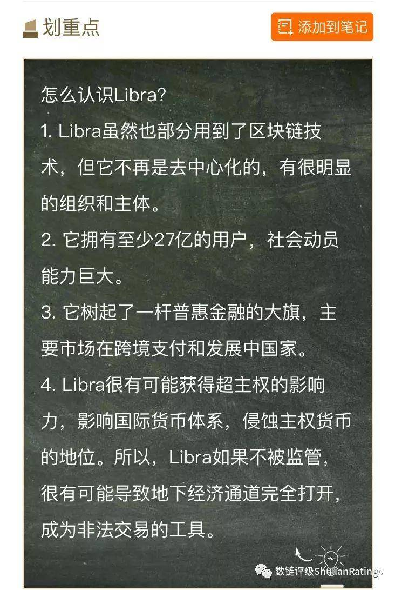

https://www.chainhoo.com/blockchain/101314/

央行穆长春讲Libra和数字货币全文
chainhoo • 2019-09-05 10:59:55 • 热点 • 阅读 5150

你好，我是穆长春，在人民银行任职。

在我录制这堂课的两个多月前，发生了一件震惊全世界央行的事情，也可能这件事以后会跟每个普通人都发生联系。那就是，在2019年6月18日，全世界最大的社交网站，Facebook，发布了一个叫做“Libra”的数字货币的白皮书。

所谓白皮书，就是类似商业计划书的东西，通常每种加密资产的发布都会有一个白皮书，Libra也不例外。

请注意，我这里用到的是加密资产，而不是数字货币，这是因为很多国际组织都已经将私人的数字货币定义为加密资产了。

全世界这些年对数字货币的关注，你可能隐约已经感觉到了，一开始的比特币、以太币，到最近，像摩根、高盛这样传统的大机构也开始布局自己的数字货币了。

但是，没有哪一种数字货币像Libra这样，能够引起整个货币和金融世界的紧张。

Libra的白皮书发布后，有人说它能成为全球流通的数字货币，也有人说它要跟支付宝和微信进行竞争。各国的监管机构和央行，有人旗帜鲜明地反对，也有人开始试图去研究它，包括法国、日本在内，还都成立了专门的工作组去研究该怎么应对这件事。

如果你已经感受到这种关注和紧张，那么我想说，你的感觉是对的，全世界对Libra的这种紧张，不是杞人忧天，是有它真实理由和背景的。

作为一个数字货币或者加密资产的研究者，同时作为一个央行职员，我也认为这个事情非常的重要。在Libra白皮书发布不久，我就和得到很快地决定，要推出讲Libra的这么一个课。

我先来向你介绍，所谓的Libra，到底是什么。

我们来看它的白皮书是怎么说的。

白皮书首先讲，Libra的使命，是要建立一套简单的、无国界的货币，和为数十亿人服务的金融基础设施。这套金融基础设施能够让人“无论居住在哪里，无论从事什么工作或收入怎样，在全球范围内转移资金的时候，应该像发短信或分享照片一样轻松、划算，甚至更安全。”

然后，这套金融基础设施，可以说是由三个体系共同搭建而成：

一是技术体系，按照白皮书的原话讲：“建立在安全的、可扩展的区块链基础上”。

也就是说，它的基础技术是区块链。区块链这个概念你一定不陌生，像比特币、以太币，都是建立在区块链技术上的加密资产。

二是价值体系，白皮书说：“以赋予其内在价值的资产储备作为后盾”。也就是你要兑换多少这种货币，要用相应的资产储备进行抵押，这些资产包括一篮子主权货币，也包括政府债券。

也就是说，它是有储备资产的，这跟比特币的发行机制就很不一样了。

三是它的治理体系：“它会建立一个独立的协会进行管理，这个协会由28家机构组成，这28家都是Libra的创始成员”。

包括哪些机构呢？除了Facebook自己，还包括eBay、Uber这些大的互联网公司，也包括Mastercard、Visa这样的银行卡清算组织，还包括PayPal这样的支付机构，还有电信公司、投资机构、非营利组织，等等等等。

总之，是一个由各个领域的头部企业，以及其他多边组织、学术机构、非营利组织组成的一个联合体。

听到这里，不知道你感觉到没有，Libra是一项非常有野心的计划，它树起了一杆普惠金融的大旗，还搞了一套治理机制。

有几点，尤其值得注意：

第一，先不说其他机构，光是Facebook，加上它旗下的WhatsApp，一共有27亿用户。这意味着它的用户基础、它的社会动员能力，都巨大无比。

第二，Libra有价值支撑，这意味着它跟以前作为投机工具的加密资产很不一样，它有潜力成为通常意义上的货币。

第三，它针对的不仅仅是美国本土，而是全球各个国家。

好，关于Libra的基本情况，我先介绍到这。关于Libra，它现在发布了一份白皮书，后来还到美国国会进行了几场听证会，Facebook的高管都参加了，白皮书和听证会，都可以作为了解Libra的重要参考。你在听完我这堂课之后，如果还有进一步的兴趣，可以再去找这些资料来看。

我们今天为什么这么关注Libra，是因为它的能量足够巨大，能够搅动整个国际货币体系。

这里插一句，关于Libra这个词，用Facebook自己的话来讲，在拉丁文中是“磅”的概念，取的是计量单位的意思，大概相当于12盎司。但Libra同时也有“秤”的意思，国内现在普遍都翻译成天平币或者天秤币，有人就从阴谋论的角度来说，天平也好、天秤也好，就是一个校准工具，引申一下也就是说Libra的野心是要来校准国际货币体系。

当然我们不是要去宣扬阴谋论，但是我认为，把Libra看作一个潜在的世界级的货币变革，并不过分，但这个变革如果没有处理好，很可能会是一个巨大的隐患。

为什么这么说？这就是我在接下来的几节课里会展开的。

我会分这么几部分来讲：

第一讲，我会先来回答：从技术的角度看，Libra的技术架构是什么，解决了什么问题，为什么说它跟比特币这种加密资产很不一样。

第二讲，我会来谈，Libra能否实现价值的稳定，所谓的一篮子货币的资产储备究竟意味着什么。

第三讲，我会带你来分析，Libra有没有可能成为一种强势的世界货币，它的路径最有可能是怎样的。

第四讲，我会来讲Libra会从哪些方面冲击原有的货币体系。

第五讲、第六讲，我会专门来讲一讲中国央行自己准备发行的数字货币，它的名字叫做DCEP。

最后一讲，我会来讲讲我对互联网金融创新的一些看法。

欢迎你，跟我一起进入下面的内容。

# Libra：比特币更接近支付工具的数字货币

你好，我是穆长春。欢迎来到我的得到课程。

这一讲，我们会来讲一个关键问题，那就是Libra的技术路线。

首先，在前面我们讲到，Libra自称自己的基础技术是区块链，但事实上，目前根据我们掌握的信息，可以作出下面这样的判断，那就是， Libra采用的不是纯粹的区块链技术，而是一个混合式的架构，所以它不能算严格意义上的区块链加密货币 。

但是，也正因为这样，它才有可能成为一个真正的支付工具。

我们先来讲，为什么区块链技术，不适合用来做支付。

区块链不适合用来做支付

Facebook在白皮书里号称，Libra现在的技术能支持每秒1000笔交易，每笔交易完成需要确认的等待时间是10秒钟。

这个数字听起来你可能觉得没什么，但是你可以对比一下：比特币完成一笔交易需要等待60分钟。

即便如此，Libra现在这个速度，做支付仍然不理想。

当然，每秒1000笔的交易，应该是Facebook设定的一个目标，其实我们央行的数字货币研究所在Libra的代码发布后，也下载了它的代码，搭建了同样的环境，去做了测试。

我们曾经做过一个区块链实验，就是把所有的节点都放在一个局域网之内，这样就去掉了带宽的限制，只有四个节点，节点之间不加载任何协议，我们用的服务器是八核的CPU，256G的内存。

但就是在这样好的环境下，我们也只能做到每秒3万笔的交易，而对目前的Libra来说，它的区块链还没有进行优化，用同样的配置，它的交易并发量一下子就下降到了60笔每秒。

不过，即使是在3万笔每秒的情况下，这个速度依然满足不了我们“双十一”那样的交易量，比如2018年“双十一”，网联并发量的峰值，是九万两千多笔每秒。

这也就是我要说的，区块链第一个最大的缺陷，就是可扩展性比较差。

可扩展性是什么意思呢？

举个简单的例子，一个人算十道数学题，每算出一道题一分钟，一共就要十分钟。如果两个人来算这十道题，假设算力相等，都能算对，就是五分钟。五个人来算呢？就是两分钟了。随着投入的算力越多，计算能力一定是一个线性增加的过程，这就叫可扩展性。也就是通过扩展资源，比如CPU、服务器，来实现算力的增长，实现效率和性能的增加。

但是区块链，它有另一个叫法，叫分布式账本，它的可扩展性就比较差，原因就是所谓的分布式造成的，每一笔交易，系统中所有节点，都要去记一次账，都要对数据进行全量的计算和存储。

这样一来，通过增加节点就不会线性地提高算力，这就有点像木桶理论，当然这个比喻不是特别准确，但也有相似之处，就是如果共识算法做得不太优化，性能低的节点就可能会拖累整个区块链的性能。

这意味着，如果我们用区块链技术去做支付的话，就可能会很慢。

打个比方，你去超市买一瓶水，付款的时候可能需要等个几分钟，才能确认你这笔交易完成。甚至说，你可能只需要等10秒钟，这个体验依然还是很不好的，因为如果每笔交易都要等10秒钟或者几分钟，那收银台排队也要排出好几里。

你可能问：我算力增加，CPU个数往上堆，内存往上堆，能不能在区块链领域实现摩尔定律呢？我们的结论是，目前来说难度很大，因为最终决定区块链性能的，不仅是算力，还有带宽。

你可能还会问了，那好，既然你说是带宽造成的问题，我们是不是解决了带宽问题，就能在区块链领域实现摩尔定律呢？还是很难，原因是我前面说过的木桶理论，也就是说，它可能被处理能力最低的那个节点所限制。

分布式账本同时也带来了存储的问题。前面我说了，因为每一个节点要保存系统里所有的交易信息，这就对数据存储量要求很高。

比如以太币，现在要求一个节点50个G。比特币就更大了，一个节点要100多个G。而且比特币和以太币毕竟还是少数人在用，交易量也不大，都已经到这个存储的级别了。那如果是Libra，你想象下，可能是27亿人在用，即使我们打个折，至少也有几亿人在用，这样的话，对数据存储量的要求就会非常高。

事实上前面我们说的可扩展性差的问题也好，存储的问题也好，都是分布式账本天然的缺陷，你可能说，那你怎么不说它的优势呢？

比如大家原来就觉得，区块链的安全性和隐私保护是最好的。但这一点上很多人的理解实际上也有偏差。

它的安全性是说改不了账本，你只要记上就不可篡改、是不可逆的。并不是说它对个人的信息和安全性保护得就很好，否则的话，也不会有哪个交易所被盗多少亿的资产了，历史上确实出现过好几次这样的事故。

这主要是因为，区块链并没有原生的一个加密机制，它还是要依靠传统的加密机制。

比如你把你的比特币存在一个热钱包里面，你还是要好好地保存好你的私钥，也就是说保存好你的密码，如果你的私钥被人攻破了，依然可以盗走你的比特币。

所谓的安全性，并不是指你私人资产的安全性，而指的是账本不被篡改的安全性。小偷偷了你的比特币，那个账也记在上面，也不能改，偷了就是偷了，你是追不回来的。

还有一个问题，就是常说的51%算力攻击。也就是当系统中有合作关系的、恶意节点控制的算力，如果超过一半，就可以对系统进行攻击。

51%算力是不是很难被突破呢？其实并不是，比如最高的时候，曾经90%以上挖矿的算力都集中在中国。

当时所谓的矿场，夏天的时候都放在贵州，是因为夏天贵州处于丰水期，水电便宜，山里面气温也低，不用投入太多制冷成本，就可以实现降温。冬天的时候去内蒙，因为冬天的时候，内蒙的风电便宜。

除了安全性，普通人最关心的还有隐私保护的问题。关于隐私保护，存在许可链和公有链的区别，比如比特币就是公有链，没有授权机制。许可链，就是要有授权才能加入，Libra就是许可链。

比特币这种公有链，它的节点信息是完全公开的，我只要变成其中一个节点，我就可以把所有其他节点的数据全都拷过来。那其实是没有任何隐私可言的。

你可能说：可我是匿名的，你不知道我是谁，你也不知道我用比特币买了什么。但是你别忘了，你在交易所上的交易，哪怕是在暗网上进行的交易，比如毒品交易、武器交易、贩卖人口交易，这个过程中你一定会在网络上留痕的，无论你留的是IP地址，还是MAC地址，还是Email地址，甚至其他所有大数据所能涉及到的所有痕迹，一定都可以通过数据挖掘来锁定你是谁。

在美国就有一家公司叫Chain Analysis，这个公司曾经协助FBI、CIA破获了几起暗网的非法交易事件。这家公司掌握了目前80%以上的比特币交易人员的真实身份，它就是靠大数据以及交易所数据，再加上节点数据，挖出了你在现实世界的真实身份。

所以从这个角度来说，公有链上没有秘密可言。

那许可链是不是就有隐私保障了呢？刚才说了，区块链没有原生的加密机制，所以理论上攻破也是不难的。

在支付领域，对区块链来讲，最致命的问题是结算最终性的问题。

什么是结算最终性呢？国际清算银行在《金融市场基础设施原则》里讲过一个原则，就是你要明确每一笔交易完成的时间点，这个时间点确定了，那就能确定这笔交易最终完成的那个时间点，这个点也是不可回退的一个点。

如果你没有这么一个明确的时间点，就会导致在法律上、经济上产生一系列的问题。

比如一家公司今天宣布破产了，根据一些国家破产法律规定，破产机构被宣布破产之前的零点起发生的交易是无效的，是要回退的。那如果你没有明确的时间点来确定一笔支付完成的时间点的话，就会出问题。

可是用区块链来做支付的话，从法律上来说很难确定究竟在哪个时间点上才算这笔交易最终完成。相关区块链节点投票更新完之前，严格意义上来讲，你就不能确定这个时间点到底在哪。所以区块链作为支付工具，不太合适。

区块链用于支付，还有其他问题，包括系统之间的交互性，以及业务连续性。这些我就不一一解释了。总之，区块链用来做支付，有太多的难题需要解决。

Libra：不完全是区块链，而是混合式架构

刚才我们讲了用区块链做支付的种种缺陷，那么回到Libra这个话题，它宣称自己是“可扩展的区块链”，是怎么回事呢？

前面我已经提到，Libra白皮书发布了以后，Facebook也在开发社区发布了Libra的代码，我们的数字货币研究所，当时就下载了这个代码，搭建了测试环境，也发现了很多问题，基本上是跑不通的。

同时，在代码发布的第一天，Libra的开发社区就提交了52个问题，后来明确其中bug有33项。

讲这个是为了说明，目前来看，Libra还处在很早期的阶段，代码质量也不是很稳定，包括有些技术它也没披露，比如说，它没说最后会不会用高速专用网络，节点怎么治理。目前也没有一个可行的方案，连时间表都没有。

但是我想提醒的是，它的进步一定会很快，它会充分利用全球所有码农的智力和热情，帮它优化系统，帮它写代码。

根据目前我们掌握的信息，我们基本上可以下这么一个结论：Libra规避了区块链的技术短板，采用的是一种混合架构。

Libra不可能是一个纯粹的区块链，或者说不是原教旨主义的那种区块链——它底层用的是中心化的架构，只有到最上面，就是最终结算那一层，它才用一下区块链。

因为要实现它号称的1000笔每秒，只有用这种架构才能办到，也就是说它有很多约束条件导致它只能采取这种技术架构，不太可能走别的路。

原因就是前面说的，纯粹的区块链技术根本支持不了零售级别的应用。即使以后它能达到1000笔每秒，那也只能用于国际汇兑或者是跨境汇款，因为只有在跨境汇款场景下，你才不会那么在意速度。

这个技术架构，如果用比较完整的表述，应该叫做“中心化的分布式处理架构和区块链技术相结合的分层混合技术路线”。

听起来有点拗口。但你只要知道，它是分层的，因为只有分层才能提高处理性能，底下的交易采用的都是中心化处理，因为中心化处理，速度会很快，到了最上层，也就是最终结算那一层，用的才是区块链，而且节点不会很多，因为节点越多速度越慢。

如果还想再提高速度，极端的情况下可以把节点集中在一个机房里面，那实现1000笔/秒就非常容易了。
本讲小结

这一讲我们说了，区块链并不适合用来做支付，Libra也并不是纯粹的区块链架构。

Libra对外宣称自己是区块链，可能更多是为了吸引眼球，利用区块链的招牌，表明自己善于利用新技术。而且它确实在一定程度上用到了区块链，你也不能说它一点都没用到。

好，理解了Libra的技术原理，下一讲，我们就来看看，Libra是根据什么定价的。

# Libra如何应对数字货币的币值稳定挑战

你好，我是穆长春。欢迎来到我的得到课程。

前面我们讲了，Libra的技术基础，不是纯粹的区块链，它是混合式的架构。这是从技术上来说，它跟比特币这样的加密资产不一样的地方。

除了不完全依靠区块链，Libra跟比特币这样的加密资产相比，最大的区别，就是它有了价值支撑。

什么意思呢？

前面我们讲到过，Libra采取的有点像百分之百的准备金制度，也就是我们要发行多少Libra，必须有同等价值的储备资产在。储备资产是由一篮子主权货币和政府债券所组成的。

为什么要有储备资产作为价值支撑？白皮书说得很明白，储备资产的目的就是为了保持币值不剧烈波动，建立人们对它价值的信任。

币值波动过大，一直是加密资产所面临的主要问题，把它们的影响力限制在了它们的小圈子里。Libra的意图很明显，它希望吸引更多人来使用它，而不仅仅是风险偏好高的投资者。

但是有一篮子货币的储备资产就能实现币值稳定吗？也没有这么简单。

一篮子货币做储备不等于币值稳定

这里我想首先澄清一个概念。Libra说自己会以一篮子货币的存款作为资产储备，但并没有说自己会和一篮子货币进行挂钩。

通常我们理解，从币值的稳定性上来说，跟一篮子货币挂钩，要比跟单一法币挂钩，稳定性会更好，这是因为它品种多，不同货币的波动性能够被对冲掉。所以很多人听到一篮子货币，就认为Libra会是一种非常稳定的货币。

但要注意，Libra并没有说自己要跟一篮子货币挂钩，“一篮子货币的资产储备”跟“一篮子货币挂钩”，是两个完全不同的概念。

一篮子货币的资产储备是指，比如你要是用黄金作为发行货币的资产储备，那么你有多少黄金才能发行多少货币。

挂钩的意思则是说，两种货币之间的汇率不会变化。如果你是用单一货币作为储备还好办，但要想跟一篮子货币实现挂钩，是非常难的，你必须保证一篮子货币的比重不变。

但是Libra现在根本没有一个机制来确保一篮子货币的比重不变，要是不能保证一篮子货币相互之间的比重是恒定的，随着Libra与不同法币之间的兑换，它的币值自然而然也在变化当中。

比如如果你拿一美元去买一个Libra，你这一块钱进去的同时，那一瞬间就改变了整个储备资产货币篮子的比重，一旦你改变货币篮子的比重，你就改变了Libra和这一篮子货币之间的兑换关系，也就是说，它的汇率就发生变化了。

可以想象得到，如果美国人买得特别多，比如90%以上都是美元储备的话，那Libra的汇率基本就会随着美元波动，如果说欧元国家买得多，那就和欧元挂钩挂得比较紧。

也就是说，所谓一篮子货币作为储备资产，并不能实现币值的稳定。它既会受储备资产币种之间汇率的变化影响，也会和任何其他资产一样，受市场对它的信心和预期的影响。

尽管今天你拿一个Libra，明天还是一个Libra，但你换成其他货币的时候，就会出现价格的波动。你要想管住这种汇率的波动，要求是非常高的。

未来如果Libra发行，很大的可能，要由协会来定汇率，也就是说由它的创始成员，来决定Libra和其它法币之间的汇率。如果要保证汇率稳定的话，就需要控制不同货币之间的比重和汇率关系。

而且可以想象，假如一些弱势货币国家为了兑换Libra，它们就会争相印钞来兑换，这样就会引起整个国际货币体系的紊乱。这个时候，就需要一个超主权的、有公信力的国际组织来治理，比如说像国际货币基金组织这样的机构。

刚才我们讲的是Libra跟其他货币之间的汇率能否稳定的问题。其实还有一个问题，就是Libra本身可能会产生派生存款和货币乘数。

我们假设，Libra在支付市场上得到广泛应用的话，那有些金融资产就会用Libra来定价，比如石油或者是大宗商品、期货。

而有金融资产用Libra定价以后，相应的也会有比如说赊销、贸易融资或者消费信贷等行为，就像支付宝的花呗、借呗也会用Libra来定价。这个时候，如果一旦有信贷产品，比如赊销或者消费信贷，来用Libra定价，这就相当于用Libra发放贷款。

一旦用Libra发放贷款，之后会产生什么？从货币银行学的角度来说，就会出现派生存款，有了派生存款，就会有货币乘数。也就是说，Libra就不再局限于M0了，它就会扩展到M1或者M2的领域。

现在，Facebook自己说要对Libra进行等值储备，但是这个等值储备实际上是对M0这个范畴进行的储备。但如果它进入信贷市场，扩展到了M1和M2的范畴，这部分就是没有储备的，也就意味着它没法满足百分之百的货币兑换保证和币值稳定，就可能发生通货膨胀。

这个时候就需要有一个中立机构精确测算和控制货币乘数，来确定等值的储备量。这种职能，也只有央行才能做得到。

也就是说，如果Libra推成功的话，Libra协会就要来做这些事，那么实质上它就成为了Libra的央行。

总而言之，Libra想要实现币值稳定，就必须有央行或者国际货币基金组织这样的机构，进行干预和监管。当然Libra协会也有野心来实现同样的职能，但它做不做得到，会怎么去做，就又是另一个问题了。

币值稳定和资产盈利要求是个悖论

刚才我们讨论Libra要实现币值稳定，需要一系列的安排。这里面还涉及另一个问题，就是Libra的储备资产要怎么管理。

我们说了，光Facebook就有27亿的用户，哪怕只有10%的转化率，也就是说有3亿人左右，能转化成Libra的用户，一个人买十块美金，也就有30亿美元了，每个人花一百块钱，那就是300亿，资产储备量是非常庞大的。这个资产一定会有资产收益，哪怕就是存活期存款也会有利息收入，更何况你还可以做资产运作。

那这些利息或者说这些资本收益会用来干什么呢？

根据Facebook自己的白皮书说，Libra的资产储备收益并不向用户付息，资产产生的收益，要用于系统运行、创始机构的分红和系统升级。

这一块成本其实是很高的，对一个清算机构来讲，它一年的运行成本，没有10个亿或者20几个亿的人民币是搞不定的。

Facebook专门为Libra设了一个运营机构，叫Calibra，它拿到的牌照叫货币服务牌照，但是美国货币服务牌照是不允许进行资产托管的，这样一来，它必须要把资产托管给其他传统的金融机构，这些其他金融机构就包含了央行，或者是商业银行等金融机构了。

如果由央行来托管的话，那利息肯定给得就比较少，不可能满足它拿资产收益来做系统升级、做系统维护，以及分红的需求。所以只能把这个钱托管给一个金融机构，由金融机构来进行运作。

这个金融机构在资金运作的过程中，肯定要强调稳定，不能出事，不能出现大幅上涨或者下跌，只能买低风险的、稳定性比较强的资产组合。

但是你想想目前这种资产组合都是什么？一般来说，满足要求的，只有主权债券，或者是一些3A级的企业债券。但是对于很多政府债券来讲，尤其是欧洲一些国家发行的主权债券，现在是什么收益状态呢？基本上都是负收益。

资产管理有两种形式，一种是主动型的，一种是被动型的。

被动型的，就是跟着大盘走，大盘什么表现，你就有什么表现。主动型的就是说你的目标是跑赢大盘。

如果Libra的储备资产对盈利性有这样高的要求，那就要采取主动型的资产管理模式，也就是说，要去找那些收益比较高的资产，但是收益高一定意味着风险高。这跟Libra稳定币的定位又是矛盾的。

也就是说，资产的盈利性和币值的稳定性，这两个目标之间天然是存在冲突的，目前也很难判断它到底会向哪边摆动。
本讲小结

这一讲我们探讨了Libra能不能实现币值稳定的问题，虽然我们对它提出了很多质疑，但是不管怎样，跟比特币这样的加密资产相比，Libra肯定会是更稳定的货币，否则就违背了发行Libra的初衷了。

但是Libra作为一种稳定币，要能推行成功的话，意味着Libra的创始协会，既要扮演Libra的中央银行的角色，同时也可能会演变成一个私营的国际货币基金组织，而且在私营部门里，它会比国际货币基金组织的影响力还要大。

这个问题我们后面还会谈到。如果你有对国际经济感兴趣的朋友，也可以把这一讲分享给他。

下一讲，我们来看看Libra的竞争力到底是什么。

# Libra能成为强势货币吗？

你好，我是穆长春。欢迎来到我的得到课程。

前面我们已经介绍了Libra的技术路线和价值体系，这一讲我们来说一个非常重要的问题：Libra作为货币的竞争力具体会体现在什么地方。

最近几年，区块链加密资产兴起之后，我们经常会遇到这样一个问题：加密资产到底是不是货币。

这个问题，涉及到货币的定义，那么我们就从货币的主流定义和基本职能来分析。

传统上，货币有三种基本职能：交易媒介、价值贮藏和记账单位。

交易媒介，也就是交易的中间媒介。很早以前人们用贝壳来进行交易，后来演变成贵金属，包括金、银、铜等，成为交易媒介不一定意味着价值有多高，关键是大家能取得共识。

价值贮藏，就是你能用它来保值增值，至少是能保值，也就是说，作为一个货币，它的价值必须是平稳的。

记账单位，也有人翻译成价值尺度，也就是各种商品到底值多少钱，如何进行交换，就要靠货币进行标价。

这也是为什么我们说，像比特币这样的加密资产，完全不具备货币的职能和属性——除了地下经济交易，几乎没有谁真正拿它去做支付、买东西；价值贮藏和价值尺度的功能更是没有，因为它的价值波动实在太大了。

但是Libra，它号称价值稳定，那么它有没有可能成为真正意义上的货币，甚至是世界的强势货币呢？

我们也从货币的这三个基本职能来分析。

Libra作为交易媒介的优势和劣势

作为交易媒介来讲，Libra最大的优势，是它的用户基础，27亿的用户基础，哪怕转换率是10%，也有将近3亿的用户。再加上我们说的赢者通吃的网络效应，它的用户群会非常庞大。

我们从互联网这些年的发展，已经能看得很清楚，网络效应会导致天然的垄断。所以Libra作为交易媒介来讲，有天然的优势。

但是作为交易媒介，也有很大的劣势。

一个是我们前面说的汇率波动，因为它的储备资产是一篮子货币，不是某种单一法币。这样的话，Libra跟一国的法币之间进行兑换的时候，肯定会出现汇率波动。

当然波动的方向可能并不明确，你有可能赚也有可能赔，但不管怎样，波动本身就意味着风险。这一点是Libra作为交易媒介的一个劣势。

除了汇率波动，还有一个经济学上的概念，叫作“标价成本”。

比如说，在单一法币国家，如果你采用了Libra作为交易媒介，那就意味着有两个标价的平行货币体系，同一件商品未来要有两个定价，两个标价牌。

想象一下，一个超市所有商品都会有两套价签，一个是法币的价签，一个是Libra的价签。因为有汇率的变化，还意味着超市每天都要更换Libra的价签。这对商家来说成本太高，包括人力成本，以及由此带来的其他成本。

汇率波动带来的成本，以及标价成本，在强势货币国家，会更加突出。因为强势货币本来就代表着，这个国家的法币是稳定的、受欢迎的，本国居民没有必要再用Libra进行交易。所以，像美国或者欧元国家，用Libra做交换媒介的空间相对就会比较狭窄。

跨境支付是Libra最大卖点

刚才说的是，Libra在一国范围内作为交易媒介可不可行的问题。但如果你看Libra的白皮书，你会看到，它非常明确地打出来一个普惠金融的旗号，也就是说它要解决全世界人民，尤其是发展中国家人民汇款的便利问题：

既然任何一个人都可以在自己国家享受另外一个国家提供的互联网服务，为什么不能享受Libra提供的支付服务呢？

比如说一个移民，或者说一个在国外打工的人，要汇钱回家，原来通过Swift或者其他的汇款方式，比如moneygram速汇金，或者是Western Union西联，它的手续费就非常高，时间周期也很长。

做过国际汇款的人都有这样的体验，比如说你出国留学，父母给你汇一笔钱，怎么着也得一两天才到。而且钱汇出去以后，整个过程没法追踪，也不知道去哪查，只有钱到账了，这块石头才落地。

再加上外汇管制的因素，比如说咱们中国每个人一年不能超过五万美元，而且你还要填外汇的用途。你要留学的话，还要提供学校的名字；你要旅行，还要填旅行社和酒店的名字，等等，这中间又增加了摩擦。这些都导致了传统的跨境汇款体验不好。

这样一来，Libra在跨境汇款和跨境支付上就非常有吸引力了。而且Facebook本身就是一个大的全球性平台，两个Facebook用户之间，一个可能在美国，一个可能在澳洲。

但对于Facebook来讲，就是一个平台，它的社交职能、社交属性和巨大的用户基础会导致产品一上线，起点就很高。所以跨境支付和跨境汇款就被认为是Libra最大的一个卖点。

Libra为什么要用一篮子货币作为储备资产？为什么不直接用美元作为储备资产？其实它就是为了做跨境支付，它就是要告诉你，任何人都可以用本国货币来兑换。

但是这里我想强调一点， 传统跨境支付的费用高、成本高，原因有很多方面，其中一部分就是监管所带来的监管成本。这部分不管你用什么新技术，都是避免不了的。

在Libra的听证会上，美联储、财政部和美国几个监管机构，还有国会都对它提出反对意见，特别强调的就是怕Libra被用来洗钱和恐怖主义融资，这方面的监管所带来的成本，并不会因为你采用了新技术而消失。

比如像美国财政部，或者货币监理署，或者各州的监管机关，他们会盯着银行，或者盯着汇款公司，看你符不符合所有反洗钱的规定。现在只是说监管对象发生变化了，但监管成本依然在。如果你完全不去监管，那一定会有问题。关于监管的问题，我们后面还会讨论。

弱势货币国家的货币替代？

讲到这里，就有一个假设，如果说跨境的交易取得比较大的突破，形成了网络效应，大家跨境汇款都会用Libra，会不会导致Libra从跨境这个场景拓展到本地场景、本地支付？

刚才我讲它在强势货币国家空间不大，但是会不会对一些发展中国家，尤其是弱势货币国家有吸引力？因为在弱势货币的国家，老百姓对Libra的信心，很可能要大大强于对本国货币的信心。

这个逻辑是成立的，但是这里边也比较复杂。

从货币发展史上来看，一直存在一个现象，叫劣币驱逐良币。

比如说，古代的时候，政府发行的铜钱，由于冶炼技术的发展，私人也可以进行铸造，但是私铸的钱往往都会缺斤短两，然后市面上流通越来越多的会是私铸的钱，也就是缺斤短两的钱，因为大家都会想把质量差的先花出去，好的留下来。就像是你现在收到一张假币的话，你天然的冲动就会想到一个小摊上，先把它花出去。

所以，如果大家觉得Libra很稳定、本国货币不稳定，比如说津巴布韦现在是扛一麻袋本币，可能只能买一小撮米回来，这样的话，市场上交易流通的会是哪种币？一定是津巴布韦的本币，他们会把本币先花出去，把Libra存起来。

也就是说在交易媒介这个功能上，有可能会发生劣币驱逐良币，但在价值贮藏这个功能上，是良币驱逐劣币，也就是在弱势货币的国家，大家都会愿意持有Libra。

而且通常来说，弱势货币的国家，往往也是金融市场不发达的发展中国家，它们本身也缺乏流动性和安全性比较高的资产，所以Libra可能在一些高通胀的国家、汇率不稳定的国家、有贬值预期的国家，成为当地居民一个安全性资产的选择，从而形成货币替代。

也就是老百姓不愿意再持有本国货币，而是愿意持有Libra。就好像现在一些国家，人们更愿意持有美元一样。

当然，这里面其实有一个悖论， Libra说自己是普惠金融，是为弱势货币国家群众服务的，但对弱势货币国家来讲，如果老百姓大量用本币兑换Libra，会把本币推向贬值。

而本国货币的贬值会导致那些本来收入就很低的人更穷，因为他们的资产都是以本币计价的，或者持有的都是本币的资产，比如你一个房子不可能移到国外去卖。这种资产会因为本币的贬值而大幅缩水，所以只会加剧只有本币资产的人的贫穷状况，反而没有达到他们所说的普惠金融的目的。

各国的负面态度可能也挡不住Libra

当然，Libra想要进入弱势货币的国家，一定会遇到这些国家政府不欢迎的问题。除了比较极端的例子，像津巴布韦这种国家，去年就已经宣布欢迎任何一种货币，等于把它自己的货币主权放弃了。

但是除了这种极端的情况之外，其他一些弱势货币的国家，比如说像泰国，或者越南，如果真的允许Libra进入，相当于就是把自己货币政策和汇率政策的主动权拱手让人，因为你控制不了这种货币，你只能控制本币。

所以在绝大多数国家，货币当局是不太可能欢迎Libra的。所以我们也能看到，Libra出来之后，实际上各个国家货币当局和监管机关基本上都是持负面的态度：要么说你必须纳入监管，不监管不行，要么说你肯定会对我产生负面影响，我就不让你进来。

当然也有些国家怕被人指摘说阻碍创新，那也顶多说我需要观察观察，但是谁也不会说我欢迎Libra到我这儿来。

但不是说监管不欢迎就能挡住Libra。

即便政府都说了我不允许你在本国使用，也就只能做到本国所有的支付机构和商业银行不为Libra提供兑换服务和支付服务。但是依然会有民众可以用其他的方式去国外买Libra，完全禁住是不太可能的。

即使是在中国也很难，尽管中国连Facebook本身都进不来，但是一旦Libra发行了，肯定会有一些人，通过一些辗转的方式去购买Libra。

看比特币就知道了，其实我们国家早就不允许比特币在中国运营，交易所也都屏蔽了，也通知所有的支付机构和商业银行不允许为比特币提供相应的兑换和支付服务，但依然会有一些渠道说“我帮你代购”或者说“我帮你买比特币”，你只要给他们人民币，然后他们就翻墙到国外交易所进行购买。

当然，也有一种情况，就是如果美国以法律的形式禁止Libra的话，它肯定就推进不下去了。

但只要没有法律禁止，哪怕就算是默许也好，或者进入一个正常的监管轨道也好，然后各国央行也都是睁只眼闭只眼的态度，Libra极有可能会变成一个强势货币，最终大行其道。

甚至完全有可能，它作为支付工具发展得很好的情况下，进一步脱离储备资产，变成一个信用货币。其实现代信用货币也是这么发展过来的，比如说英镑一开始，也是由一家私人银行，也就是英格兰银行发行的银行券，后来才变成了信用货币、变成了国家法币。

如果Libra被大家所接受，变成一个通行的支付工具，那么再过一段时间以后，发展成一个世界级的超主权货币，也是完全有可能的。
本讲小结

我们先是从货币的三个基本职能来分析Libra。

从交易媒介这个功能来讲，Libra最大的应用场景是跨境支付或跨境汇款，Libra针对的不仅仅是美国本土市场，也不仅仅是强势货币国家，比如欧元区，它还锚定了跨境支付这个市场；

从价值贮藏这个功能来讲，在币值不稳定的发展中国家，或者说弱势货币国家，它有可能得到老百姓的欢迎，成为一种安全资产；

而Libra要发挥记账单位的功能，障碍是最大的，最重要原因是，记账单位一般是由一国政府规定的，但Libra很难得到主权国家的认可。

但是不要忘了，因为Libra依托的是Facebook，它的创始机构拥有强大的社会动员能力，监管层的负面态度也不可能完全限制它的发展，Libra就有通过跨境支付成为世界级货币的可能性。

所以，跨境支付是Libra最大的卖点，下一讲，我们来看看Libra的风险。

# Libra能突破数字货币的通行风险吗

你好，我是穆长春。欢迎来到我的得到课程。

前面几讲里，我们已经讲到过一些Libra会带来的威胁和隐患。

我们先回顾一下在前面讲到的，Libra如果能成功的话，Libra的创始协会，既要扮演Libra中央银行的角色，同时也可能演变成一个私营部门的国际货币基金组织，而且因为它和私人经济、大众经济是捆绑在一起的，它影响力的深度、广度，在私人部门会远远超过国际货币基金组织。

如果一个机构，它有影响各国货币汇率安排的能力，但是又不承担相应的责任，那是非常可怕的。

对国际货币体系来说，安排和协调各国货币汇兑机制的机构，一定是一个具有公信力的、中立的组织，否则的话，它就会成为一个金融战争的工具了。

Libra的影响力，自然也会威胁到主权货币，威胁到各国央行的货币政策和汇率政策的主导权。

我们就拿中国来说，Libra一定会侵蚀人民币的地位。

想象一下，如果我们默许用人民币可以兑换Libra，那肯定会引发全面兑换Libra的现象，就会导致人民币贬值。因为人民币贬值了，就可能会吸引更多人去兑换Libra。越多的人去兑换Libra，越会增加人民币贬值的压力，变成一个恶性循环。

当然，Libra带来的问题还不止这些。

反洗钱和反恐融资责任不明确

其中，Libra带来的一个非常大的隐患就是，通过它进行的交易，反洗钱和反恐融资的责任是不明确的。

如果你看了Libra在美国国会的听证会，你会发现，美国财政部跟国会，最关心的其实就是资本流动的问题，也就是你这钱去哪了，是不是流到敌对国家去了，比如说流到伊朗去了？流到朝鲜去了？或者流到委内瑞拉去了？

还有就是关于洗钱、逃税、恐怖融资，这都是它最担心的问题，而恰恰Libra在这些方面是非常薄弱的。

事实上加密资产在跨境汇款里早就占不小的比重。一个叫Clovr的区块链公司，2018年就搞过一个调查，叫“汇钱回家”，他们发现使用比特币、以太币这样的加密资产进行跨境汇款，已经占到15%的市场份额。

那么咱们就可以合理地推断一下，在很多有资本管制的国家，15%的资本外逃就很有可能是通过加密资产来实现的。

更糟糕的是，现在好多暗网的交易、黑市的交易，涉及人口贩卖、毒品、武器交易，甚至更邪乎的，基本上都用的比特币和其他加密资产进行结算。

咱们国家就有个案子，武汉有个高校的副教授，跟《绝命毒师》电视剧里的绝命毒师一样，他也制毒品，他做的是“丧尸药”，叫“甲卡西酮”，专门向国外出售，当时他就是用比特币来进行收款的。

所以如果我们允许Libra运行的话，那很有可能也会导致这些地下经济通道完全打开。

这也是为什么从资本管理的角度，各国中央银行肯定不会愿意Libra进来。中国也一样，假设允许Libra运行，就意味着那五万美元的换汇额度会很轻松地被突破，外汇管制也很难奏效了。

2017年ICO和比特币比较热的时候，七部委联合打击ICO和比特币，当时的原因也是为了解决非法集资、金融诈骗和传销等问题，确实，这些问题也存在，但更深层次的原因是为了防范利用ICO和相关加密资产搞资本外逃和洗钱，以及为地下交易提供支付通道。

那么关于美国国会最关心的反洗钱和反恐融资，Facebook是怎么回应的呢？它把锅甩给了下面的参与机构和用户。

这里需要解释一下，还记不记得我们在一开始讲Libra技术架构的时候，说它是一种混合式的架构，下面是中心化的，只有最上面一层才可能用区块链。Libra的运营和技术一样，也是双层的安排：顶层是Libra协会加上验证节点，底下也有一种特殊的角色——经销商。

从运营上来说，Libra不是直接面向大众去销售，而是授权给这些特殊的角色，也就是经销商去进行销售：协会把Libra卖给经销商，经销商再把Libra卖给大众。

当然，这个顺序实际上是反着的，经销商先把钱收上来，再去买Libra，也就是经销商买Libra的这个动作，才发生了顶层的区块链节点的记账。这就是它的双层技术和运营体系。

Facebook就是用这种安排，把自己的反洗钱和反恐融资的责任都甩给了经销商和其他的机构，包括用户，也就是有什么问题你去找下面的经销商，因为用户信息不在我这。

同时，它还说了，五年内要从许可链过渡到公有链，我在前面也讲到过，公有链和许可链的区别就是，一个是完全公开的，一个是需要允许之后才能进来的。

一旦到了公有链之后，Libra就更没责任了，就可以完全不管了，出了洗钱的事跟Libra一点关系都没有，因为是公有链，我也不知道用户到底是谁，相当于把反洗钱和反恐融资的责任全都撇开了。

所以你看，表面上听证会上Facebook说，我会主动接受监管，但其实它用一些安排，把自己的责任早就甩给别人了。

Libra能保护用户隐私吗

除了反洗钱和反恐融资，在数据隐私保护上，Libra也有很多值得质疑的地方。

Libra的协会是注册在日内瓦的，受瑞士的法律约束，瑞士不是欧盟成员国，它是不受欧盟的法律约束的，也就是说，跟数据保护和隐私保护相关的欧盟法律——《通用数据保护条例》对它起的作用会比较小。而它的运营机构像Calibra和Facebook以及28个成员机构都在美国，也就是说，是受美国法律的管辖的。

这两个监管法律体系之间是存在差异的，那会出现什么情况呢？

比如说有件事放在美国干更容易，受到的监管标准更低，那我就放在美国，如果这件事放在瑞士干更方便，瑞士的监管更松，我就放在瑞士，这就变成了“孰低原则”和“孰松原则”进行机构摆布和业务摆布，也就是我们所说的“监管套利”。

说到数据隐私的保护，我们看看Libra是怎么说的。它说它采取的是假名机制，也就是说用同一个用户可以注册多个地址，你可以通过申请多个地址来实现一个假名机制，从而实现所谓的匿名。

通过这种假名机制是不是能够保护你的隐私安全了呢？我们来看一下，Libra的用户实际上会和哪些用户是重叠的呢？这包括Facebook和WhatsApp的用户，以及28家机构的用户，比如Uber的用户。

这些用户注册的时候，基本上是实名注册的，因为挂接了传统的支付工具，或者是注册了邮件地址或者住址，通过数据挖掘，基本上都能知道谁是谁。

当然Facebook说了，你不用担心，我不会从Libra获取数据的，我顶多也就是用个广告推送什么的。但是，它并没有说Facebook的数据不给Libra用，也就是说，Facebook可以把自己的数据交给Libra，如果它把Facebook的用户数据提供给Calibra的话，那意味着两个数据融合以后，进行对比，马上就能知道持有Libra人的真实身份。

所以，它这种所谓的假名机制根本就不是真正的匿名，而如果像它说的，它将从许可链过渡到公有链，链上信息就相当于完全公开了。

本讲小结

这一讲我们集中讲了Libra会带来的一系列问题，对国际货币体系的威胁、对国家货币主权的威胁，为洗钱、资本外逃、地下交易打开支付通道等等，还有数据隐私的问题。这些，都是摆在各国货币监管当局面前的问题。

到这里，关于Libra的情况我就讲得差不多了，Libra未来会怎样，会有哪些新的动作，我们肯定还会保持关注。

下一讲，我会来讲另一个可能也会马上出现在你我生活中的数字货币，也就是我们人民银行——央行所发行的数字货币。

# DCEP：中国自己的数字货币

你好，我是穆长春。欢迎来到我的得到课程。

前面我们讨论了Libra的革命性和局限性，接下来我想跟你聊一件重要的事，那就是人民银行正在研究的、我们中国自己的数字货币。

我做这个课程的时候是2019年的8月，离中国人民银行推出我们自己的数字货币也不是很远了。我们这个数字货币的项目叫作DCEP（Digital Currency Electronic Payment），也就是数字货币和电子支付工具。

它的设计逻辑，很多地方跟Libra很相似。但我要先澄清一下，不是我们模仿Libra，事实上，做中国自己的央行数字货币，早在2014年，当时的行长周小川就提出过这个想法了。

央行数字货币是纸钞替代

央行的数字货币是个什么样子呢？

它的功能和属性跟纸钞完全一样，只不过它的形态是数字化的。我们对它的定义翻译过来就是“具有价值特征的数字支付工具”。

什么叫具有“价值特征”呢？简单来说，就是“不需要账户就能够实现价值转移”。你想想纸钞就能理解了。你用纸钞进行支付的时候，是不需要账户的，DCEP也是这样。

你可以想象这样的场景：只要你我手机上都有DCEP的数字钱包，那连网络都不需要，只要手机有电，两个手机碰一碰，就能把一个人数字钱包里的数字货币，转给另一个人。

也就是说，你在支付的时候，是不需要绑定任何银行账户的。不像我们现在用微信也好、支付宝也好，都要绑定一张银行卡，但DCEP不需要。

当然了，除非你要往数字钱包充钱，或者你想从数字钱包里取钱出来去理财，除此之外，用户与用户之间的相互转账是不需要进行账户的绑定的。

这就意味着，DCEP能像纸钞一样流通。这也就是为什么说，你可以把它简单地理解成纸钞的数字化替代。

事实上，像比特币这样的加密资产，它最根本的一个优势，就是摆脱了传统的银行账户体系的控制，因为它只是一个加密字符串。从这一点上来说，DCEP也具有同样的优势。

那不一样的是什么呢？

不一样的是， 央行的数字货币属于法币，跟现金一样，央行的数字货币也具有无限法偿性，就是说你不能拒绝接受DCEP。

我们看到现在私营的支付机构或平台，会设置各种支付壁垒，用微信的地方不能用支付宝，用支付宝的地方不能用微信，但对央行数字货币来说，只要你能使用电子支付的地方，就必须接受央行的数字货币。

那DCEP，跟我们常用的支付宝、微信支付，具体还有什么区别呢？

首先从法权上，DCEP的效力和安全性是最好的。

你用的纸钞是央行货币，DCEP也是央行发行的，但是你用支付宝或微信做电子支付的时候，用的是支付宝的电子钱包、微信的电子钱包，它们的货币是从哪儿来的呢？它们不是用央行货币进行结算的，而是用商业银行存款货币进行结算的。当然，在备付金集中存管以后，情况有所变化。

也就是说，微信和支付宝在法律地位、安全性上，没有达到和纸钞同样的水平。

理论上讲，商业银行都可能会破产，所以这些年人民银行建立了存款保险制度；但假设微信破产了，微信钱包里的钱，它没有存款保险，你就只能参加它的破产清算，比如你之前有100块钱，现在只能还你1毛钱，你也只能接受，它是不受央行最后贷款人的保护的。当然，这种可能性很小，但你不能完全排除。

其次，我们还要考虑到一些极端情况，比如大的地震，通信都断了，电子支付当然也就不行了。

那个时候，只剩下两种可能性，一个是纸钞，一个就是央行的数字货币。它不需要网络就能支付，我们叫做 “双离线支付”，是指收支双方都离线，也能进行支付。只要你手机有电，哪怕整个网络都断了也可以实现支付。

我们也可以说一些不那么极端的、你能感知到的情况，比如说你到地下的超市去买东西，没有手机信号，微信、支付宝都用不了。

又或者，在飞机上，也没有信号，如果你坐的是廉价航空公司的航班，吃饭就需要花钱，这种场景下，原来你只能用信用卡支付，以后也可以用央行的数字货币支付。但这一点，像Libra这样的数字货币是做不到的。

当然，可能也有人会问，DCEP会对支付宝、微信的地位产生影响吗？我们的回答是：并不会。

因为目前支付宝、微信也是使用人民币支付，其实也就是用商业银行存款货币进行支付。央行数字货币推出后，只是换成了数字人民币，也就是用央行的存款货币，虽然支付工具变了，功能也增加了，但渠道和场景都没有变化。

但为什么在电子支付手段如此发达的今天，央行还要做这样一个数字货币呢？

首先，为了保护自己的货币主权和法币地位，我们需要未雨绸缪。

其次，现在的纸钞、硬币的发行，印制、回笼、贮藏各个环节成本都非常高，还要投入一些成本做防伪技术，流通体系的层级也比较多，携带又不方便，现在谁也不愿意带现金了。

除了犯罪分子不愿意让别人知道，或者你也可能有些消费不想让其他人知道，特意用现金之外，现在大部分人需要用现金的情况是越来越少了。

当然只要你不犯罪，你想进行一些不想让别人知道的消费，这种隐私我们还是要保护的。

这也就是说，公众其实是有匿名支付的需求的，但现在的支付工具，比如说互联网支付、银行卡支付都是跟传统银行账户体系紧紧绑定的，它满足不了匿名的需求，也就不可能完全取代现钞的支付，也就是纸钞支付。

所以，央行数字货币能够解决这些问题，它既能保持现钞的属性和主要的价值特征，又能满足便携和匿名的要求。

央行数字货币如何反洗钱

但便利老百姓的支付是一个方面，同时还得要保持一个平衡，就是不能便利犯罪。

推行DCEP，我们同样会遇到反洗钱的问题。用纸钞进行洗钱，虽然匿名的程度比较高，但还是有一定成本，比如要洗的钱比较多的话，还要用卡车拉，但数字货币这个成本就比较低。

那如果在推出DCEP后，我们怎么反洗钱呢？

我们进行反洗钱、反逃税、反恐怖融资这些工作，都可以用前面提到过的大数据的方式。也就是说，虽然普通的交易是匿名的，但是如果我们用大数据识别出一些行为特征的时候，还是可以锁定这个人真实身份的。

举个例子来讲，涉及到很多洗钱的交易，都是有行为特征的，比如说大量的赌博行为都发生在夜间12点以后，而且所有的赌博交易都没有零头，都是十的整数倍。一般来说，开头是用小额，越来越大，突然断崖没了，也就是没有交易了，那说明是输光了，这就符合一般赌博的特征。

电信诈骗也是如此，如果出现大量分散的钱集中到一个账户里面，突然又迅速地分散开，消失在很多个账户里面，这就符合明显的电诈的特征。

那我们把这些交易特征分析出来之后，再利用大数据和数据挖掘技术，进行身份比对，就能把后面那个人找出来。

所以说，出于反洗钱的考虑，我们对数字钱包也是有分级和限额安排的。比如说你就用一个手机号码注册一个钱包，那你这个钱包当然可以用，但是级别一定是最低的，只能满足日常小额支付需求；但如果你要能上传一下身份证，或者再上传一个银行卡，就可以获得更高级别的数字钱包，如果你还能到柜台去面签一下，那可能就没有限额了。
本讲小结

这一讲我向你介绍了央行的数字货币。

它的本质是现钞的替代，虽然在央行这一层，我们并没有采用区块链技术，但我们把区块链的内核拿了出来，也就是说，它是具有价值特征的数字支付工具，脱离账户也可以进行价值转移，能够满足可控匿名的支付需求。

同时，我们也讲了央行数字货币反洗钱的手段，任何一种支付工具，都需要在便利性和合法上进行平衡。

那下一讲，我们就来看看，DCEP到底是怎么运营的呢？

# DCEP的设计和发行逻辑有何创新

你好，我是穆长春。欢迎来到我的得到课程。

上一讲我们说到了人民银行想要推出自己的数字货币DCEP，那这一讲我们就来看看，DCEP是怎么样来进行运营的。

双层投放和双层运营

人民银行早在2014年就开始了数字货币的研发工作，2016年，当时的人民银行行长周小川还接受过财新的专访，讨论过关于数字货币的话题。现在网上也能找得到，如果你感兴趣的话，可以找来看一看。

2018年的1月25号，央行的范一飞副行长也发表了一篇文章——《关于央行数字货币的几点考虑》，现在在网上也能找到，从这篇文章你可以看出，那个时候，实际上就已经确立了央行数字货币的研发框架。

这个研发框架主要就是说，中国央行数字货币应采用双层运营体系，当时还叫作双层投放体系，现在改成了双层运营体系。

什么叫双层运营体系呢？就是上面一层是人民银行对商业银行，下面一层是商业银行或商业机构对老百姓。

我们为什么要采用双层的运营体系来进行DCEP的研发和兑换呢？简单说，就是要充分利用现有资源，调动和发挥社会力量。

人民银行发行数字货币实际上是一个非常复杂的工程，像中国这样大的国家，人口众多，各地的经济发展、资源禀赋和人口基数，差别都比较大，所以你在设计、发行和流通的整个环节，就要充分考虑所面临的多样性和复杂性。

如果我们采取单层投放、单层运营，相当于人民银行一个机构就要去面对全中国所有的消费者，环境复杂，考验非常严峻。

另一方面，虽然央行也建立了很多自己的系统，比如现有的大额支付系统、零售支付系统、超级网银、银联、网联等，都是在央行的主导下进行开发运营的，央行也积累了相关经验。但是这些系统面对的用户原来都是银行机构、金融机构，没有直接面对过老百姓。

如果人民银行要搞这么大一个直面老百姓的系统，既要满足用户的体验，还要实现系统的高效，人民银行自己的预算、资源、人才，都会面临客观的约束。

而商业银行和其他一些商业机构，在IT基础设施应用和服务体系上，都已经比较成熟了，在金融科技方面也积累了很多经验，人才储备也比较充分，完全没有必要抛开现有的商业银行IT基础设施，再去另起炉灶、重复建设。所以这也是为什么我们要选择双层的运营体系。

那么我们会使用什么样的技术路线呢？

我们的选择是，不预设技术路线。前面我们说了，Libra是个混合架构，虽然DCEP也是个混合架构，但是我们的混合架构就是不预设技术路线。

央行这个层面属于技术中性的，也就是说，央行不会干预商业机构的技术路线选择，商业机构对老百姓兑换数字货币的时候，用什么技术来兑换？是用区块链，还是用传统账户体系？是用电子支付工具，还是用移动支付工具？无论采取哪种技术路线，央行这个层面，都能适应。

只要商业机构能够达到我们对并发量的要求，和我们对于客户体验的要求，以及对于技术规范的要求，无论采取哪种技术路线都可以。

我们的出发点就是要充分调动市场力量，通过竞争选优来实现系统优化，共同开发，共同运营，有利于整合资源，也有利于促进创新。

避免金融脱媒

当然双层运营体系还有别的考虑。

一个是可以避免金融脱媒。

什么是金融脱媒？如果我们采用的是单层运营的话，人民银行直接对老百姓发行数字货币，那意味着人民银行会成为商业银行的竞争者。

因为老百姓一兑换数字货币，就会把商业银行的存款转移到人民银行来，在这种情况下，商业银行的融资成本就会升高，实体经济就会因此而受到损害。

而且，人民银行直接对老百姓发行货币，老百姓的所有信息在人民银行都有存储，那意味着什么？

意味着人民银行知道每个人、每个企业的信用状况，也知道你每个月挣多少钱、花多少钱，你资金来源是什么样的，这些数据人民银行全有。也就是说，人民银行可以替代商业银行做所有的金融业务。

如果你年纪比较大的话，可能就会记得1984年以前，中国就只有人民银行一家银行，金融脱媒说的就是这种情况。

那如果采用单层运营的话，意味着我们是不是可以不需要商业银行了？不需要金融中介了？人民银行直接放贷，把所有的金融业务全做了，直接省去中间的摩擦，这个效率会不会更高呢？

你会发现，这像什么？像计划经济。

有人说，在大数据时代，数据已经丰富到可以搞计划经济了，这一点我是非常不同意的。

计划经济做到极致，所有的经济学家、统计学家都坐下来，把世界上所有信息搜集来，这种情况下你做的资源配置，能做到的最好情况，也不过就是和用市场做资源配置的水平一样而已。

万一这里边有什么信息没有搜集齐，或者是数学模型不对，算错了，或者数学模型给了你一个结果，但是你决策作错了，都可能导致资源配置的失败。

我们反对计划经济，并不是说我们是市场原教旨主义者，而是经过一定研究后得出的结论，也是经过实践得出的结论，南斯拉夫当年就做过这样的尝试，得到的教训是很惨痛的。

所以，并不是说信息多了、数据多了，就能搞计划经济。因为计划经济没有竞争，没有激励机制，一旦出问题，就会是大问题。

我们采用双层运营体系，本身也是为了充分调动市场的积极性，用市场机制来实现资源配置，调动商业银行和商业机构的积极性。

你可以这么理解DCEP的投放过程：跟纸钞投放一样。纸钞是怎么投放的呢？人民银行印出来以后，商业银行给人民银行缴纳货币发行基金，然后把纸钞运走，运到网点，然后老百姓去网点兑换现钞，就是这么一个过程。

数字货币的兑换依然会保持这种结构：商业银行在中央银行开户，按照百分之百全额缴纳准备金，个人和企业通过商业银行或商业机构开立数字钱包。

而且我们要求是进行M0替代，也就是纸钞的替代，不能是M1和M2，这样也就意味着公众所持有的央行数字货币依然是中央银行负债，由中央银行进行信用担保，具有法偿性。

那么对于用户来说，你其实也不需要跑到商业银行去，只要下载一个App，注册一下，这个钱包就可以使用了，比如接收别人的付款，再比如你要兑换数字货币，那么只要用你的银行卡进行兑换就行了。

当然，跟取现金一样，我们也会按照现行的现金管理规定，设置一定的摩擦。

什么意思呢？

比如如果一旦有金融危机了，或者说某个银行有兑付问题了，可能所有人都去挤提，排队把存款从银行里面取出来。为了避免这种情况，银行可能会设置一些门槛，比如你兑换现钞，小额的直接取没问题，但你要是取大额的，比如50万，那你就需要提前预约，数字货币也是一样的安排。
本讲小结

这一讲我向你介绍了央行数字货币，它采用了双层运营体系，这是一个既符合中国国情，也能够调动市场机构积极性的设计。

下一讲，也就是最后一讲，可以算是我们整堂课的一个结语。我们会再回到Libra，来讲讲我认为，我们对Libra应该采取什么样的应对措施，以及我对互联网金融创新的一些看法。

# 结语 | 互联网创业思维，不适合金融领域

你好，我是穆长春。欢迎来到我的得到课程。

在最后一讲。我先带你做一个有关Libra的整体回顾。

首先，认识和理解Libra，有这么几个关键问题：

第一，Libra虽然也部分用到了区块链技术，但它不再是去中心化的，有很明显的组织和主体。它跟比特币这样的加密资产，已经非常不一样了。

第二，它拥有至少27亿的用户，这还只算Facebook和WhatsApp，社会动员能力巨大。

第三，它树起了一杆普惠金融的大旗，主要市场在跨境支付和发展中国家。

第四，Libra很有可能获得超主权的影响力，影响国际货币体系，侵蚀主权货币的地位。Libra如果不被监管，也很有可能导致地下经济通道完全打开，成为非法交易的工具。

那么，要应对第四点说的这些问题，我们在Libra刚出来的时候，就在倡议，各国央行和国际组织应该需要合作，将Libra纳入监管，而不是睁一只眼闭一只眼。

我被问到过一个问题：比如像Facebook这么大的公司，是不是也有能力和意愿去承担社会责任、关注金融的安全和稳定性呢？

我的理解是， 在金融这个领域，互联网创业者，哪怕是像Facebook这样大的互联网公司，也缺乏应有的风险意识。

这些年的互联网创新，不管是共享经济也好，互联网思维也好，其实都是奔着走独角兽的模式去的，要么做大，成为一个垄断企业，要么做死。这会给社会带来很大的成本，死了的话，不管是社会资本也好，风险资本也好，投资者融来的钱，实际上最后都损失了。

咱先不说独角兽这种模式是不是好，这是另外一个话题。但是如果说你用同样的思路来做金融的话，会产生非常大的影响，因为它的外部性特别强。

金融这个领域和其他的行业不一样，非金融领域的项目出现损失，会限制在一定范围内。当然，这里要排除像共享单车这样的情况，因为押金已经具有一定的金融属性了。除此之外，实业领域用所谓的共享经济也好，其他的经济也好，它的外部性没有那么强，它的损失都局限在一定程度内。

但是在金融领域，你是用别人的钱来做这件事，用公众的钱加了杠杆来做这件事，如果出险的话，就不是这几个人的问题，而是系统性的问题了。

这也是为什么任何一个传统上做金融的人，在做任何一件事情之前，上任何一个新业务之前，首先都会问一个问题：到底有没有风险。他首先不会问这能不能赚钱。所以你看所有的银行上新业务，上新项目，都比较慢。

可是做互联网的思维方式完全不一样。

比如你看，这些年互联网创新提倡的也都是精益创业、小步快跑，也就是做项目的时候，第一个首先要看这个东西做完了扔出去，让老百姓去试试，让市场先看看。管他有枣没枣，先打一竿子，看老百姓欢迎不欢迎。不欢迎大不了不做了，或者我再去改。

但做金融也这么去试，社会成本就会很大。当然如果你的产品闯出来、成功了还好，但是很多东西都失败了。

一个例子，就是P2P，在中国现在可以说是完全变成了这两年最大的一个金融风险，一直在治理。它给老百姓带来的损失，有的就是家破人亡。

再举个例子，支付宝的相互宝。相互宝从理念上来说，是非常先进的。但是跟《保险法》是违背的，《保险法》要求你必须先花钱买产品，然后对你进行保险保障。这样的话，有大数定律、有统计学来做精算，我就知道这个产品会不会赚钱。

但是相互宝不一样，它是说你先进来，出了险以后，大家再分摊费用。你不知道你以后会分多少，这个是违反《保险法》的，后来叫停了。叫停以后，它改了名字，变成了一个网络互助产品，后来又出现很多的纠纷。

互联网金融的创业者，有没有考虑风险？

我的答案是，很少考虑。他先想的是，这事我能不能赚钱，或者我这个理念好不好，能不能靠大家一块来实现。如果你要做的是一个大众金融产品，这种思维一定有问题。

要知道，对整个的互联网金融来说，还没有经过一个完整的金融周期，一个金融周期是长于经济周期的。在没有经过一个完整的金融周期的测试之前，很多互联网金融产品会有很大的风险。

比如像咱们现在很多互联网金融机构都说，你看我能实现“310”，也就是三分钟放款、一分钟到账、零个人审核，而且坏账率还非常低，零点几。

但是你要知道这些东西都是在一个流动性充足的环境下做的，它没有经过一个完整的金融周期的测试，一旦在流动性不好的情况下，就可能会出现大面积无法还款的情况，导致一个产品的失败，甚至把整个体系都拖垮。

我们还可以说回Libra。

前面我们说Libra的双层运营体系，也就是Libra协会授权别的机构去做，类似授权经销商去做，而这些经销商很可能也会扮演做市商的角色。

做市商是什么意思呢？

一方面，Libra买卖的时候中间会有价格波动，做市商可以通过买卖的价差来套利；但是当流动性不好的时候，理论上来说，做市商要平滑流动性。

但是，如果在真正流动性吃紧的情况下，按照市场的历史经验来讲，做市商一定会跑，他不会去管你。依靠这种第三方机构来做市场的安排，其实风险是很大的。

所以，这也是为什么，纳入监管框架，进入正常的监管轨道，对Libra非常必要。我们也需要做好Libra在国际货币体系中，成为一个重要角色的准备。

这堂课我就讲到这里，谢谢，再见。

