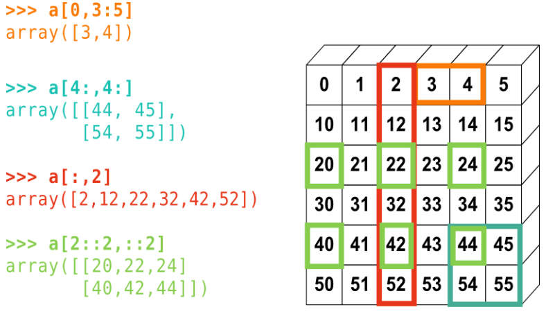

# 预准备

 [[Statistics package for Go]](https://github.com/gonum/stat#Correlation)

 ## python numpy


[SciPy Lecture Notes 中文版](https://wizardforcel.gitbooks.io/scipy-lecture-notes/content/)


[Numpy参考文档](http://docs.scipy.org/). 

交互帮助:

```shell
np.array?
String Form:<built-in function array>
Docstring:
array(object, dtype=None, copy=True, order=None, subok=False, ndmin=0, ...
查找东西：
In [6]:
np.lookfor('create array')
```

 ## golang gonum

 ## cplusplus eigen3
[Eigen中的基本函数](https://blog.csdn.net/u012541187/article/details/53420432)

[eigen Quick reference guide](http://eigen.tuxfamily.org/dox/group__QuickRefPage.html#title4)

[规约、范数的操作][https://blog.csdn.net/skank911/article/details/89279675]

[如何求解线性系统，计算几种分解，比如LU，QR，SVD等](https://blog.csdn.net/u012936940/article/details/79871941)

`sudo apt-get install libeigen3-dev`


# 2-基本操作

## 2.1-打开CSV文件

### golang代码：

```golang
// csvToDense read csv to matrix,if fail out is nil
func csvToDense(filename string, comment, comma rune) (outDense *mat.Dense, err error) {

	//r, c int, out []float64
	var file *os.File
	file, err = os.Open(filename)
	if err != nil {
		return nil, err
	}
	defer file.Close()

	reader := csv.NewReader(file)

	reader.Comment = comment // '#' //可以设置读入文件中的注释符
	reader.Comma = comma     // ','   //默认是逗号，也可以自己设置

	data := make([]string, 0)

	firstRecord, err := reader.Read()

	if err != nil {
		return nil, err
	}
	//shape column
	c := len(firstRecord)
	data = append(data, firstRecord...)

	// continue scan
	for {
		record, err := reader.Read()
		if err == io.EOF {
			break
		} else if err != nil {
			fmt.Println("Error:", err)
			//skip the err record
			continue
		}
		data = append(data, record...)
	}

	total, out := len(data), make([]float64, len(data))
	var value float64
	for i := 0; i < total; i++ {
		d := strings.TrimSpace(data[i])
		if value, err = strconv.ParseFloat(d, 64); err == nil {
			out[i] = value
		} else {
			return nil, err
		}
	}

	if total%c != 0 {
		return nil, errors.New("bad format")
	}
	//shape row
	r := total / c

	outDense = mat.NewDense(r, c, out)

	return outDense, nil

}
```

### cplusplus代码：

```c++
// csvToDense read csv to matrix, if fail return -1, otherwise return 0
int csvToDense(std::string filename,
          const char record_comment, 
		  const char record_comma, Eigen::MatrixXd* dense) {
	if(dense == nullptr) return -1;

    // constexpr int LENTH=256;
	// char pwd[LENTH];
	// getcwd(pwd,LENTH);

    std::string line;
    std::ifstream file(filename);  
    if (file.fail())  { return -1 ; } 

    std::regex comma_re(std::string(1,record_comma));
    //scan first line
    if (std::getline(file, line) && !file.good() ){
        return -1;
    }
    std::vector<std::string> firstRecord(std::sregex_token_iterator(line.begin(),line.end(),comma_re,-1),
           std::sregex_token_iterator());
    auto c = firstRecord.size();
	if(c<1) {return -1;}

	std::vector<std::string> data;
	std::copy(firstRecord.begin(),firstRecord.end(),std::back_inserter(data));

    //continue scan
    while(std::getline(file, line)  && file.good() )
    {
	   auto start = line.find_first_not_of(" \t\n\r\v\f");
	   if(start != std::string::npos) {
		   if(line[start] == record_comment) continue;
	   }
       //split
       std::vector<std::string> row(std::sregex_token_iterator(line.begin()+start,line.end(),comma_re,-1),
             std::sregex_token_iterator());

	   if(row.size() !=c) {return -1;}
	   std::copy(row.begin(),row.end(),std::back_inserter(data));
    }
    file.close();

    auto r = data.size() / c;

    dense->setZero(r,c);  //resize the dynamic matrix
    for(std::size_t i= 0; i<data.size();i++){
		auto row_i = i / c;
		auto col_i = i % c;
		trim(data[i]);
		auto value = std::atof(data[i].c_str());
		(*dense)(row_i,col_i)=value;
	}

    return 0;
}

```

## 2.2-矩阵连接

### golang代码
矩阵片段，golang使用`var x mat.Dense; x.Slice`;

```golang
//horizJoinDense join a and b with same row
//
func horizJoinDense(a mat.Matrix, bs ...mat.Matrix) (dest *mat.Dense) {
	ar, ac := a.Dims()

	for _, j := range bs {
		jr, _ := j.Dims()
		if ar != jr {
			panic("wrong row size")
		}
	}

	var x mat.Dense
	x.CloneFrom(a)

	//help function
	getColOfb := func(b mat.Matrix, j int) []float64 {
		out := mat.Col(nil, j, b)
		return out
	}

	var (
		poi *mat.Dense
		ok  bool
	)

	for _, bitem := range bs {
		_, bc := bitem.Dims()

		poi, ok = x.Grow(0, bc).(*mat.Dense)
		if ok != true {
			panic("type of a is wrong")
		}
		//append all coloums from bitem
		for j := 0; j < bc; j++ {
			poi.SetCol(ac, getColOfb(bitem, j))
			ac = ac + 1
		}
		x = *poi
	}

	return poi
}

```

### cplusplus代码

矩阵片段, c++使用`Eigen::MatrixXd x; x.block`

```c++
//horizJoinDense join a and b with same row
// if fail return -1, otherwise 0
int horizJoinDense( Eigen::MatrixXd  *a, std::initializer_list<Eigen::MatrixXd>   bs){

	for (auto && b : bs) {
		if( a->rows() != b.rows() ) {
			return -1;
		}
	}

	for (auto && b : bs) {
		int init_i = a->cols();
		a->conservativeResize(a->rows(), a->cols() + b.cols());
		for (int i = 0; i < b.cols(); i++)
		{
			a->col(i+init_i) = b.col(i);
		}		
	}
    return 0;
}
```


```c++
//Horizontally:
MatrixXd C(A.rows(), A.cols()+B.cols());
C << A, B;

//Vertically:
// eigen uses provided dimensions in declaration to determine
// concatenation direction
MatrixXd D(A.rows()+B.rows(), A.cols()); // <-- D(A.rows() + B.rows(), ...)
D << A, B; // <-- syntax is the same for vertical and horizontal concatenation

mat.conservativeResize(mat.rows(), mat.cols()+1);
mat.col(mat.cols()-1) = vec;
```

## 2.3-数组初始化矩阵

### golang代码

```golang
    total, out := len(data), make([]float64, len(data))
    // r x c == total
	outDense := mat.NewDense(r, c, out)
```

### cpluscplus代码
[Eigen::Matrix与array数据转换](https://www.cnblogs.com/VVingerfly/p/8037490.html)
```c++
    std::vector<double> otheta;
	...
    //注意下面的x与otheta是不同内存空间，而input_theta与otheta是相同的内存空间
	Eigen::Map<Eigen::VectorXd> input_theta(otheta.data(),otheta.size());
	Eigen::VectorXd x= Eigen::Map<Eigen::VectorXd> (otheta.data(),otheta.size());

    // std::vector to martix
	auto X = Eigen::Map<Eigen::MatrixXd>(otheta.data(), 3, 3);
```


## 2.4-矩阵打散顺序

置换（permutation），置换矩阵可以将某个矩阵的行与行之间进行互换。Permutation is the identity matrix with reordered rows.


### cpluscplus代码
```c++
void randomShuffle(const Eigen::MatrixXd &X)
{
	///////////////////////////////
	Eigen::PermutationMatrix<Eigen::Dynamic, Eigen::Dynamic> perm(X.rows());
	perm.setIdentity();
	std::random_shuffle(perm.indices().data(), perm.indices().data() + perm.indices().size());
	// auto A_perm = X * perm; // permute columns
	auto A_perm = perm * X; // permute rows
							///////////////////////////////
}
```

## 2.5-标准差

### golang代码

```golang
  import "gonum.org/v1/gonum/stat"
	m := stat.Mean(data, nil)
	s := stat.StdDev(data, nil)
```

### cplusplus代码

```c++
//standard deviation 标准差
//$$\sigma=\sqrt{ \frac{1}{N}\sum_{i=1}^{N}\left(x_{i}-\mu\right)^{2}  }$$
double stddev(const Eigen::VectorXd &x){ 
   double std_dev = std::sqrt((x.array() - x.array().mean()).square().sum()/(x.size()-1));
   return std_dev;
}
```

## 2.6-随机数据矩阵


### golang代码

```golang
	// Initialize biases/weights.
	randSource := rand.NewSource(time.Now().UnixNano())
	randGen := rand.New(randSource)
	// $W^{(l)} \in \mathbb{R}^{S_l \times S_{(l-1)}} $：表示$l − 1$ 层到第$l$ 层的权重矩阵；
	for i := 1; i < layerNum; i++ {
		curr, prev := &(nn.Layers[i]), &(nn.Layers[i-1])
		tr, tc := curr.n, prev.n+1
		curr.theta = mat.NewDense(tr, tc, nil)

		curr.theta.Apply(
			func(i, j int, v float64) float64 {
				return randGen.Float64()
			}, curr.theta)
	}
```

### cplusplus代码

```c++
    srand((unsigned)time(NULL));
    for (auto iter = nn->layers.begin() + 1; iter != nn->layers.end(); iter++)
    {
        auto curr = iter;
        auto prev = iter - 1;

        auto tr = curr->n;
        auto tc = prev->n + 1;

        curr->theta = Eigen::MatrixXd::Random(tr, tc);
    }
```

## 2.7-.MAT读写

### python代码

- covert ex3data1.mat mat file to csv

    ```python
    import numpy as np
    import pandas as pd
    from scipy.io import loadmat
    import matplotlib.pyplot as plt

    data = loadmat('ex3data1.mat')

    X=pd.DataFrame(data['X'])
    y=pd.DataFrame(data['y'])

    X.to_csv('Xex3data1.txt',header=False,index=False)
    y.to_csv('yex3data1.txt',header=False,index=False)
    ```

### cplusplus代码

使用方法参考：https://github.com/tbeu/matio/blob/master/test/test_mat.c

```shell
$sudo apt-get install libmatio-dev
$atmel@mail:~$ pkg-config --libs --cflags matio
```

```c++
//read_mat read mat file 
// if fail return -1, otherwise 0. the result store in data, dims
int read_mat(const std::string &filename,
               const std::string &varname,
               std::vector<double> &data,
               std::vector<int>   &dims)
{
    mat_t *mat = Mat_Open(filename.c_str(), MAT_ACC_RDONLY);
    if (mat == nullptr)    {
        return -1; // can not open file
    }

    matvar_t *matVar = 0;
    matVar = Mat_VarRead(mat, varname.c_str());
    if (matVar == nullptr)
    {
        return -1; //"Variable 'x' not found, or error "
    }

    unsigned xsize = matVar->nbytes / matVar->data_size;
    const double *xData = static_cast<const double *>(matVar->data);
    data.clear();
    std::copy(xData, xData + xsize, std::back_inserter(data));

    dims.clear();
    dims.resize(matVar->rank);
    for (int i = 0; i < matVar->rank; ++i)   {
        dims[i] = matVar->dims[i];
    }

    Mat_Close(mat);
}
```

