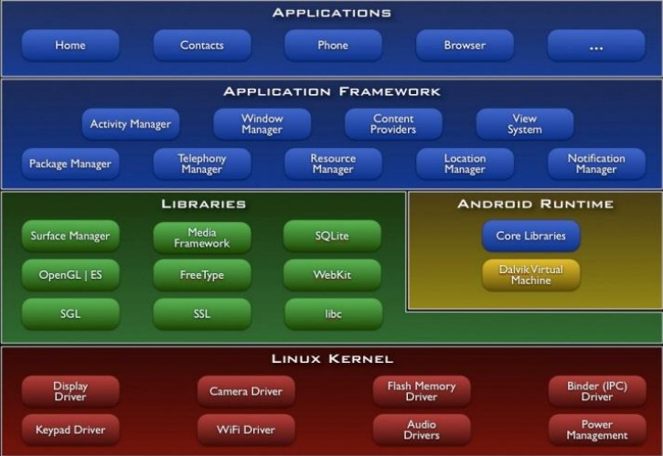
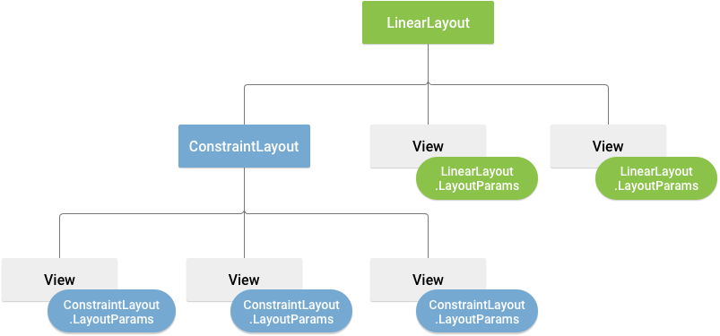
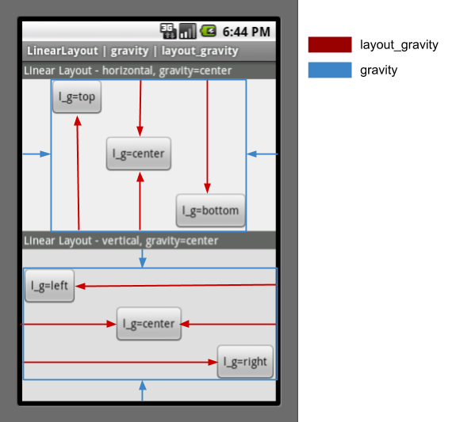

[Android 教程](https://www.runoob.com/android/android-tutorial.html)
[android studio developer](https://developer.android.google.cn/studio/command-line/logcat)

使用Android Studio模板节省开发时间， [参考](https://riggaroo.co.za/custom-file-templates-android-studio/)

- Live Templates ： “Android Studio -> settings -> Editor -> Live Templates”
- File and Code Templates ： 点击File -> New的时候，会在右侧显示一些快捷项，供我们快速的创建文件。“Android Studio -> settings -> Editor ->File and Code Templates”

[书籍附带sample源码](https://github.com/guolindev/booksource)

## Android的系统体系结构，



- Linux Kernel：我们知道Android其实就是一个操作系统，其底层是基于Linux Kernel的，这一层主要完成的是操作系统所具有的功能，比如这一层有许多的驱动程序，正是通过这些驱动程序来驱动我们设备上的硬件设备的。

- Android Runtime：Android的运行环境，我们学过java的都知道，java程序的运行需要java的核心包的支持，然后通过JVM虚拟机来运行我们的应用程序，这里Android Runtime里的Core Libraries就相当于java的JDK，是运行android应用程序所需要的核心库，Dalvik Virtual Machine就相当于JVM，这时Google专为Android开发的运行android应用程序所需的虚拟机。

- Liberaries：这里面都是Android的库文件，例如我们访问SQLite数据库的库文件等等。

- Application Framework：应用程序的框架，这个是非常的重要的，相信Framework这个词大家都应该非常的熟悉了，我们学习Android也主要学的就是这一层，我们通过这些各种各样的框架来实现我们的Application。

- Application：这个就是我们开发的Application了。

Android一共有四种常用的组件：Activity、Service、ContentProvider、BroadcastReceiver

- Activity：Activity就是我们应用程序的界面，主要用来跟我们的用户进行交互的，比如一个文本框，按钮这些就是显示在Activity上的，并且可以接收数据，传递数据到后台，然后再显示出来。

- Service：Service我们是看不见的，对于绝大部分的数据的处理，业务的处理都是通过Service来完成的。

- ContentProvider：ContentProvider类似于我们的档案馆，里面存放了我们的各种数据，例如通讯录中的信息等，这个组件就是运行程序对其进行访问，然后得到里面的数据。

- BroadcastReceiver：BroadcastReceiver组件是广播接收器，主要是用来监听系统的各个行为的，例如当电量不足的时候会给我们发送一条广播信息。

## autostudio studio记录

使用启用gradle wrapper模式，可以通过“file/settings/build,execution,deployment/gradle ” 进行设置

一个android项目，在项目目录下的local.properties 文件中记录的是SDK路径。当SDK位置变化时应更新该文件

当打开一个资源文件时，在右上角有“code, split , design” 几种选项来观察。

需要查看API函数的功能和参数，在把鼠标放上去会提示，在Android studio ，通过"file/settings/editor/general/ "选择show quick documentation on mouse move


## 

androidManifest.xml 文件中,通过`intent-filter`注册活动

```xml
<manifest ...  package=..>
    <application ...>
        <activity android:name=".SecondActivity"></activity>

        <activity
            <!-- 这个“.”写法是基于上面节点已经定义过package包 -->
            android:name=".MainActivity"
            android:label="@string/app_name"
            android:theme="@style/AppTheme.NoActionBar">
            <intent-filter>
                <!--MAIN决定应用的入口Activity，也就是我们启动应用时首先显示哪一个Activity-->
                <action android:name="android.intent.action.MAIN" />
                <!--LAUNCHER表示activity应该被列入系统的启动器(launcher)(允许用户启动它)。Launcher是安卓系统中的桌面启动器，是桌面UI的统称-->
                <category android:name="android.intent.category.LAUNCHER" />
            </intent-filter>
        </activity>
    </application>
</manifest>
```


## 日志logCat

在method外输入logt + TAB，会得到以当前类名自动生成的TAG，用于写log.i(..)等

```sh
$adb logcat --help

$ adb shell
# logcat
```

## 项目中资源

- 代码中访问资源： R.layout.activity_main
- XML中访问资源： @string/hello_word

## 活动activity

完全手动新增一个activity，涉及以下：

   - 创建类：在App对应的package下，通过"new/activity/empty activity"方式，不勾选generate layout file与launcher activity选项。生成activity class文件。
   - 创建布局：在“res/layout” 下面新增对应该activity的layout文件
   - 加载布局：比如在类的onCreate方法中新增`setContentView(R.layout.资源id);`
   - 注册：在“AndroidManifest.xml”里面新增activity注册类似<activity android:name="<class>"></activity>

### 在activity中使用Toast提醒

使用简单就是建立个对象，然后show

   ```java
    Toast.makeText(FirstActivity.this,
        "you click button", Toast.LENGTH_SHORT).show();
   ```

### 在activity中使用MENU

涉及如下：

  - 创建菜单资源： 在“res/menu”下面新增菜单资源，在这个资源中重点要建立菜单项item
  - 创建加载菜单：通过重写对应activity的onCreateOptionsMenu方法

    ```java
        @Override
        public boolean onCreateOptionsMenu(Menu menu) {
            getMenuInflater().inflate(R.menu.main,menu);
            return  true;
            //return super.onCreateOptionsMenu(menu);
        }
    ```

  - 使用菜单： 通过重新对应activity的onOptionsItemSelected

    ```java
        @Override
        public boolean onOptionsItemSelected(@NonNull MenuItem item) {
            switch (item.getItemId()) {
                case R.id.add_item:
                ...
            }
            return true;
            //return super.onOptionsItemSelected(item);
    }
    ```

### 在activity中使用button

涉及如下：

   - 在对应activity layout中添加button

   ```xml
    <LinearLayout ...>
        <Button
            android:id="@+id/start_normal_activity"
            android:layout_width="match_parent"
            android:layout_height="wrap_content"
            android:text="start normal activity"/>
    ...
    </LinearLayout>
   ```

   - 在activity中为button注册处理程序

   ```java
    @Override
    protected void onCreate(Bundle savedInstanceState) {
        super.onCreate(savedInstanceState);
        setContentView(R.layout.activity_main);

        Button startDialogActivity = (Button) findViewById(R.id.start_dialog_activity);
        startDialogActivity.setOnClickListener(new View.OnClickListener(){
            @Override
            public void onClick(View v) {
                Intent intent = new Intent(MainActivity.this, DialogActivity.class);
                startActivity(intent);
            }
        });

      }
    }
   ```


### activity生命周期


activity生命周期有四种状态:

- 1.运行状态: 当Activity位于栈顶时，此时正好处于屏幕最前方，此时处于运行状态；

- 2.暂停状态: 当Activity失去了焦点但仍然对用于可见（如栈顶的Activity是透明的或者栈顶Activity并不是铺满整个手机屏幕），此时处于暂停状态；

- 3.停止状态: 当Activity被其他Activity完全遮挡，此时此Activity对用户不可见，此时处于停止状态；

- 4.销毁状态: 当Activity由于人为或系统原因（如低内存等）被销毁，此时处于销毁状态；

### activity临时数据存放 

类似activity回收后再现场景，activity中临时数据与状态的存放获取。典型代码见下面。 另外，也有根据这个原理提供了[saveState annoation processor](https://github.com/PrototypeZ/SaveState)可以参考使用。

屏幕切换时原来的activity被系统回收了，又重新创建了一个新的activity，时机：
onPause -> onSaveInstanceState -> onStop -> onDestroy -> onCreate -> onStart -> onRestoreInstanceState -> onResume

按HOME键返回桌面，又马上点击应用图标回到原来页面时，activity生命周期如下：
onPause -> onSaveInstanceState -> onStop -> onRestart -> onStart -> onResume
因为activity没有被系统回收，因此onRestoreInstanceState没有被调用。


```java
static final String STATE_SCORE = "playerScore";
// ...
@Override
public void onSaveInstanceState(Bundle savedInstanceState) {
    // Save the user's current game state
    savedInstanceState.putInt(STATE_SCORE, mCurrentScore);
    ...
     // Always call the superclass so it can save the view hierarchy state
    super.onSaveInstanceState(savedInstanceState);
}
```

与

```java
public void onRestoreInstanceState(Bundle savedInstanceState) {
    // Always call the superclass so it can restore the view hierarchy
    super.onRestoreInstanceState(savedInstanceState);

    // Restore state members from saved instance
    mCurrentScore = savedInstanceState.getInt(STATE_SCORE);
    ...
}
```

### activity实践

- 一般activity是“AppCompatActivity”，可以考虑中间再插一层BaseActivity类，中新插的一层,从而增加运行时日志中的信息

    ```java
     @Override
     protected void onCreate(Bundle savedInstanceState) {
        super.onCreate(savedInstanceState);
        Log.d("BaseActivity",getClass().getSimpleName());
        ...
     }   
    ```

- 随时退出程序

    采用单独容器存放所有activity，在中间新插入的BaseActivity类，维护add/remove。

    最后在需要完全退出程序的地方，调用该容器的finishAll(//xx.finish();)

- 启动活动

涉及通过intent启动活动的场景（比如A 拉起B），建议统一由B实现个类似

```java
public static void actionStart(Context c, String data1, String data2) {
    Intent intent = new Intent(c, <B_CLASS>.class);
    c.startActivity(intent);
}    
```

## 碎片Fragment

Fragment是Android里面中一个非常灵巧的设计，它可以看做ui模块，由活动activity托管。

完全手动新增一个Fragment，涉及以下：

   - 创建fragment类：在App对应的package下，通过"new/Fragment/fragment(blank)"方式，不勾选create layout file。生成fragment class文件。如果勾选了，下面三步手动步骤就自动完成了。
   - 创建fragment布局：在“res/layout” 下面新增对应该fragment的layout文件。这里是采用FragmentLayout,还是LinearLayout viewgroup，看自己方便。
   - 加载布局：在类的onCreateView方法中新增`return inflater.inflate(R.layout.布局资源id, container, false);`
   - 注册：在“AndroidManifest.xml”里面通过`android:name`新增fragment注册类

    ```xml
    <LinearLayout xmlns:android="http://schemas.android.com/apk/res/android"
        android:layout_width="match_parent"
        android:layout_height="match_parent">


        <fragment
            android:id="@+id/left_fragment"
            <!--fragment类-->
            android:name="com.example.fragmenttest.LeftFragment"
            android:layout_width="0dp"
            android:layout_height="match_parent"
            android:layout_weight="1" />

        <!--下面这个是动态注册用的，所以不用通过`android:name`注册-->
        <FrameLayout
            android:id="@+id/right_layout"

            android:layout_width="0dp"
            android:layout_height="wrap_content"
            android:layout_weight="1" />
    </LinearLayout>
    ```

### 在Fragment中使用MENU

我们都知道在活动中添加menu只用编写好menu，在onCreateOptionsMenu中加载，并在onOptionsItemSelected中处理点击事件就可以了

要在fragment添加menu需要以下步骤：

- 在fragment的onCreate中添加一句 setHasOptionsMenu(true)；
- 如果用的是活动的标题栏，只需在onCreateOptionsMenu中加载menu；如果用Fragment自己的toolbar需要先用活动初始化toolbar，然后再onCreateOptionsMenu
- 在活动中重写onOptionsItemSelected，讲需要在fragment中处理的menu item直接返回false，再在fragment的onOptionsItemSelected中处理

[Fragment中添加menu](https://www.jianshu.com/p/1b5b4b7724bc)

[How to add Options Menu to Fragment in Android](https://stackoverflow.com/questions/8308695/how-to-add-options-menu-to-fragment-in-android)


### 动态添加fragment

比如在activity中的right_layout Fragment是用于动态占位的
```xml
<LinearLayout xmlns:android="http://schemas.android.com/apk/res/android"
    android:layout_width="match_parent"
    android:layout_height="match_parent">


    <fragment
        android:id="@+id/left_fragment"
        android:name="com.example.fragmenttest.LeftFragment"
        android:layout_width="0dp"
        android:layout_height="match_parent"
        android:layout_weight="1" />

    <FrameLayout
        android:id="@+id/right_layout"

        android:layout_width="0dp"
        android:layout_height="wrap_content"
        android:layout_weight="1" />
</LinearLayout>
```
使用下面方式进行动态占位
```java
    //对layout中占位(比如R.id.right_layout)，关联class
    private void replaceFragment(@IdRes int containerViewId, @NonNull Fragment fragment) {
        FragmentManager fragmentManager = getSupportFragmentManager();
        FragmentTransaction transaction = fragmentManager.beginTransaction();
        transaction.replace(containerViewId, fragment);
        //按下ba键，回到上一个fragment
        transaction.addToBackStack(null);
        transaction.commit();
    }
```

### 动态添加view

来自[Android LayoutInflater原理分析，带你一步步深入了解View(一)](https://blog.csdn.net/guolin_blog/article/details/12921889)

MainActivity对应的布局文件叫做activity_main.xml，代码如下所示：
```xml
<LinearLayout xmlns:android="http://schemas.android.com/apk/res/android"
    android:id="@+id/main_layout"
    android:layout_width="match_parent"
    android:layout_height="match_parent" >
 
</LinearLayout>
```

接下来我们再定义一个布局文件，给它取名为button_layout.xml，代码如下所示：
```java
<Button xmlns:android="http://schemas.android.com/apk/res/android"
    android:layout_width="wrap_content"
    android:layout_height="wrap_content"
    android:text="Button" >
 
</Button>
```

下面代码先是获取到了LayoutInflater的实例，然后调用它的inflate()方法来加载button_layout这个布局，最后调用LinearLayout的addView()方法将它添加到LinearLayout中。
```java
public class MainActivity extends Activity {
 
	private LinearLayout mainLayout;
 
	@Override
	protected void onCreate(Bundle savedInstanceState) {
		super.onCreate(savedInstanceState);
		setContentView(R.layout.activity_main);
		mainLayout = (LinearLayout) findViewById(R.id.main_layout);
		LayoutInflater layoutInflater = LayoutInflater.from(this);
		View buttonLayout = layoutInflater.inflate(R.layout.button_layout, null);
		mainLayout.addView(buttonLayout);
	}
 
}
```


## intent

每个intent只能指定一个action，但可以指定多个category

使用方式1：使用显示intent

```java
   Intent intent = new Intent(FirstActivity.this,SecondActivity.class);
   startActivity(intent);
```

使用方式2，使用隐式intent

这种隐式方式是通过指定抽象的category与action，然后交由系统去分析该intent，并找出合适的activity去启动

如：
   - 注册activity可以响应的action与category

    ```xml
    <activity android:name=".SecondActivity">
        <intent-filter>
            <action android:name="xx.ACTION_START" />
            <category android:name="android.intent.category.DEFAULT" />
        </intent-filter>
    </activity>
    ```
   - 调用
    ```java
    Intent intent = new Intent("xx.ACTION_START");
    startActivity(intent);
    ```

## broadcast 广播

android中的广播有两种类型

- normal broadcast：标准广播
- ordered broadcast：有序广播。这种广播是先到优先级高的，再到优先级低的广播接收器。其中广播接收器可以控制广播是否继续往下传

### 动态注册广播接收

缺点是要程序启动后才能接收广播

- 步骤1: 注册广播
- 步骤2: 定制收到广播的处理
- 步骤3: 取消注册广播

```java

public class MainActivity extends AppCompatActivity {
    private  NetworkChangeReceiver receiver;

    @Override
    protected void onCreate(Bundle savedInstanceState) {
        super.onCreate(savedInstanceState);
        setContentView(R.layout.activity_main);
        // 步骤1
        IntentFilter filter = new IntentFilter();
        filter.addAction("android.net.conn.CONNECTIVITY_CHANGE");
        registerReceiver(receiver,filter);
    }

    @Override
    protected void onDestroy() {
        super.onDestroy();
        //步骤3
        unregisterReceiver(receiver);
    }

    private class NetworkChangeReceiver extends BroadcastReceiver {
        //步骤2
        @Override
        public void onReceive(Context context, Intent intent) {
            Toast.makeText(context,"network change",Toast.LENGTH_SHORT)
                    .show();
        }
    }
}

```

###  静态注册广播接收

实现开机启动

快捷方式: 在package右击然后"new/other/broadcast receiver" 创建. 与下面手工方式等效

- 实现一个BroadcastReceiver的子类

```JAVA

public class MyReceiver extends BroadcastReceiver {
    @Override
    public void onReceive(Context context, Intent intent) {
        // TODO: This method is called when the BroadcastReceiver is receiving
        // an Intent broadcast.
        throw new UnsupportedOperationException("Not yet implemented");
    }
}
```

- 在AndroidManifest.xml中添加`<receiver/>`

```XML
<manifest ... >
    <application  ...>
        <receiver
            android:name=".MyReceiver"
            
            <!--是否启用该广告播接收器--> 
            android:enabled="true"
            <!--是否允许该接收器接收本程序以外的广播-->
            android:exported="true">
            <intent-filter>
               <action android:name="android.intent.action.BOOT_COMPLETED" />
            </intent-filter>    
        </receiver>

        <activity ....>
    </application>

</manifest>
```

### 发送广播

- 发送标准广播

```JAVA
Intent  intent= new Intent("com.example.xxxx.MY_BROADCAST");
sendBroadcast(intent);
```

- 发送有序广播

```JAVA
Intent  intent= new Intent("com.example.xxxx.MY_BROADCAST");
sendOrderedBroadcast(intent,null/*权限相关*/);
```

对接收到有序广播的广播接收器，可以通过call  `abortBroadcast()`终止广播继续向下传递，即截断广播。


## 数据持久化

android提供了几种数据持久化：文件存储，sharedPreference存储，数据库存储，保存在SD卡

### 存储到文件

context类中提供的openFileOutput(filename, Context.MODE_PRIVATE|MODE_APPEND|)方法，存储路径是`data/data/<packagename>/files/`

- 写入

```java
    public void save(String inputText) {
        FileOutputStream out = null;
        BufferedWriter writer = null;
        try {
            out = openFileOutput("data", Context.MODE_PRIVATE);
            writer = new BufferedWriter(new OutputStreamWriter(out));
            writer.write(inputText);
        } catch (IOException e) {
            e.printStackTrace();
        } finally {
            try {
                if (writer != null) {
                    writer.close();
                }
            } catch (IOException e) {
                e.printStackTrace();
            }
        }
    }
```

- 读出

```JAVA

    public String load() {
        FileInputStream in = null;
        BufferedReader reader = null;
        StringBuilder content = new StringBuilder();
        try {
            in = openFileInput("data");
            reader = new BufferedReader(new InputStreamReader(in));
            String line = "";
            while ((line = reader.readLine()) != null) {
                content.append(line);
            }
        } catch (IOException e) {
            e.printStackTrace();
        } finally {
            if (reader != null) {
                try {
                    reader.close();
                } catch (IOException e) {
                    e.printStackTrace();
                }
            }
        }
        return content.toString();
    }
```

### sharedPreference存储

sharedPreference使用key/value存储数据。存储路径是`data/data/<packagename>/shared_prefs/`

- 写入

```JAVA
        Button saveData = (Button) findViewById(R.id.save_data);
        saveData.setOnClickListener(new View.OnClickListener() {
            @Override
            public void onClick(View v) {
                SharedPreferences.Editor editor = getSharedPreferences("data", MODE_PRIVATE).edit();
                editor.putString("name", "Tom");
                editor.putInt("age", 28);
                editor.putBoolean("married", false);
                editor.apply();
            }
        });
```        

- 读出

```java
        Button restoreData = (Button) findViewById(R.id.restore_data);
        restoreData.setOnClickListener(new View.OnClickListener() {
            @Override
            public void onClick(View v) {
                SharedPreferences pref = getSharedPreferences("data", MODE_PRIVATE);
                String name = pref.getString("name", "");
                int age = pref.getInt("age", 0);
                boolean married = pref.getBoolean("married", false);
                Log.d("MainActivity", "name is " + name);
                Log.d("MainActivity", "age is " + age);
                Log.d("MainActivity", "married is " + married);
            }
        });
```

### 数据库存储  TODO

通过内置sqlLite支持，SQLite支持的数据类型包括：real, integer, text,blob.

存储路径是`data/data/<packagename>/databases/`


## 内容提供器－跨程序共享

数据存储路径通过`内容uri`来指示，它由两部分组成authority与path。例如"content://com.example.databasetest.provider/book"。 程序包名是“com.example.databasetest”，authority就是“com.example.databasetest.provider”。表名table就是book。

Content Provider主要用在不同应用程序间共享数据。它可以选择只对哪一部分数据进行共享，这个需要运行时权限的支持。完整andoid权限列表见 [ANDOID权限列表](https://developer.android.com/reference/android/Manifest.permission)

[Android - 内容提供者(Content Provider)](https://www.runoob.com/android/android-content-providers.html)

### 运行时权限

运行时权限的核心是在程序运行过程中由用户授权去执行。 下面是一个例子

- 步骤1：通过`ContextCompat.checkSelfPermission`判断是否已经有授权。[请求应用权限例子](https://developer.android.com/training/permissions/requesting?hl=zh-cn)
- 步骤2：如果上一步判断没有权限通过`ActivityCompat.requestPermissions`申请权限
- 步骤3：上一步的申请结果会被`onRequestPermissionsResult`中返回

### 访问其他程序的内提供器

要访问内容提供器中共享的数据，需要使用ContentResolver类。

- 添加数据

```java
        Button addData = (Button) findViewById(R.id.add_data);
        addData.setOnClickListener(new View.OnClickListener() {
            @Override
            public void onClick(View v) {
                // 添加数据
                Uri uri = Uri.parse("content://com.example.databasetest.provider/book");
                ContentValues values = new ContentValues();
                values.put("name", "A Clash of Kings");
                values.put("author", "George Martin");
                values.put("pages", 1040);
                values.put("price", 55.55);
                Uri newUri = getContentResolver().insert(uri, values);
                newId = newUri.getPathSegments().get(1);
            }
        });
```

- 查询数据

```java
        Button queryData = (Button) findViewById(R.id.query_data);
        queryData.setOnClickListener(new View.OnClickListener() {
            @Override
            public void onClick(View v) {
                // 查询数据
                Uri uri = Uri.parse("content://com.example.databasetest.provider/book");
                Cursor cursor = getContentResolver().query(uri, null, null, null, null);
                if (cursor != null) {
                    while (cursor.moveToNext()) {
                        String name = cursor.getString(cursor. getColumnIndex("name"));
                        String author = cursor.getString(cursor. getColumnIndex("author"));
                        int pages = cursor.getInt(cursor.getColumnIndex ("pages"));
                        double price = cursor.getDouble(cursor. getColumnIndex("price"));
                        Log.d("MainActivity", "book name is " + name);
                        Log.d("MainActivity", "book author is " + author);
                        Log.d("MainActivity", "book pages is " + pages);
                        Log.d("MainActivity", "book price is " + price);
                    }
                    cursor.close();
                }
            }
        });
```

- 更新数据

```java
        Button updateData = (Button) findViewById(R.id.update_data);
        updateData.setOnClickListener(new View.OnClickListener() {
            @Override
            public void onClick(View v) {
                // 更新数据
                Uri uri = Uri.parse("content://com.example.databasetest.provider/book/" + newId);
                ContentValues values = new ContentValues();
                values.put("name", "A Storm of Swords");
                values.put("pages", 1216);
                values.put("price", 24.05);
                getContentResolver().update(uri, values, null, null);
            }
        });
        Button deleteData = (Button) findViewById(R.id.delete_data);
        deleteData.setOnClickListener(new View.OnClickListener() {
            @Override
            public void onClick(View v) {
                // 删除数据
                Uri uri = Uri.parse("content://com.example.databasetest.provider/book/" + newId);
                getContentResolver().delete(uri, null, null);
            }
        });
```

```xml
<manifest package="com.example.broadcasttest">

    <uses-permission android:name="android.permission.ACCEPT_HANDOVER"/>
    <uses-permission android:name="android.permission.RECEIVE_BOOT_COMPLETED"/>

    <application...>
        <receiver ...>
              <intent-filter>...</intent-filter>
        </receiver>

        <activity android:name=".MainActivity">
            ...
        </activity>
    </application>

</manifest>
```

### 创建内容提供器

快捷方式: 在package右击然后"new/other/content provider" 创建. 与下面的手工方式创建content provider等效。

- 在AndroidManifest.xml中添加`<provider/>`

```XML
<manifest ... >
    <application  ...>
        <provider
            android:name=".MyContentProvider"
            android:authorities="com.example.app.provider"
            android:enabled="true"
            android:exported="true"></provider>

        <activity ....>
    </application>

</manifest>
```

- 新建继承自ContentProvider的子类来创建自己的内提供器。其中有几个抽象方法必须要重写。

```java
public class MyContentProvider extends ContentProvider {
    public MyContentProvider() {
    }

    @Override
    public int delete(Uri uri, String selection, String[] selectionArgs) {
        // Implement this to handle requests to delete one or more rows.
        throw new UnsupportedOperationException("Not yet implemented");
    }

    //MIME组成是：<vnd.><andoid.cursor.>[dir|item]</><vnd.><${authority}>.<${path}>
    @Override
    public String getType(Uri uri) {
        // TODO: Implement this to handle requests for the MIME type of the data
        // at the given URI.
        throw new UnsupportedOperationException("Not yet implemented");
    }

    @Override
    public Uri insert(Uri uri, ContentValues values) {
        // TODO: Implement this to handle requests to insert a new row.
        throw new UnsupportedOperationException("Not yet implemented");
    }
    //初始化内容提供器时被调用，通常在这里完成对数据库的创建与升级，返回true代表初始化成功，注意只有在contentResolver尝试访问我们程序中的数据时，内容提供器才会被初始化
    @Override
    public boolean onCreate() {
        // TODO: Implement this to initialize your content provider on startup.
        return false;
    }

    @Override
    public Cursor query(Uri uri/*哪张表*/, String[] projection/*哪些列*/, String selection/*哪些行*/,
                        String[] selectionArgs/*哪些行*/, String sortOrder) {
        // TODO: Implement this to handle query requests from clients.
        throw new UnsupportedOperationException("Not yet implemented");
    }

    @Override
    public int update(Uri uri, ContentValues values, String selection,
                      String[] selectionArgs) {
        // TODO: Implement this to handle requests to update one or more rows.
        throw new UnsupportedOperationException("Not yet implemented");
    }
}
```


# android UI


## 常用控件

TextView, EditText, ImageView, ProgressBar, ProgressDialog

### Button

- 首先在资源文件中需要定义

    ```xml
    <LinearLayout ...>

        <Button
            android:id="@+id/start_normal_activity"
            android:layout_width="match_parent"
            android:layout_height="wrap_content"
            android:text="start normal activity"/>
        ....
    </LinearLayout>
    ```

- 然后在需要使用的地方

    ```java
    Button startDialogActivity = (Button) findViewById(R.id.start_dialog_activity);
    startDialogActivity.setOnClickListener(new View.OnClickListener(){
        ...
    }
    ```

### AlterDialog

这个不需要资源文件，直接是类似下面的方式

```java
AlterDialog .Builder dialog = new AlterDialog .Builder(MainActivity.this);
dialog.setTitle("this is dialog");
...
dialog.show();
```

## 重要控件之：ListView控件(被RecyclerView替代)

在其中有个挺重要的知识点“适配器Adapter”，[android中Adapter适配器的讲解](https://www.cnblogs.com/Jeely/p/11059336.html)

BaseAdapter，ArrayAdapter，SimpleAdapter是几个常用的适配器

### ListView简单使用方式：

- 在activity layout中添加"<ListView .../>"
- 在对应activity 的onCreate()中, 为该listView 设置Adapter（即建立数据与listview之间的关系），如下面代码

   ```java
    private String[] data = {"apple","banana","grape"};

        ListView listView = (ListView)findViewById(R.id.list_view);
        ArrayAdapter<String>  adapter = new ArrayAdapter<String>(MainActivity.this,
                //系统ITEM样式：单独的一行文本框
                android.R.layout.simple_list_item_1,data);

        listView.setAdapter(adapter);
   ```

### Listview定制使用方式:

举例是每行文字+图片

- 新建个每行文字加图片的自定义布局fruit_layout，里面包括`<ImageView/>与<TextView/>`
- 新建一个自定义的适配器`class FruitAdapter extends ArrayAdapter<Fruit>`, 其中Fruit是一个有name/image属性的结构体。这个适配体需要实现构造函数，以及`View getView(...)`。其中在getView中需要将数据通过layoutInflater将当前项实例加载进对应布局中去,例如

   ```java
    public View getView(int position, @Nullable View convertView, @NonNull ViewGroup parent) {
        Fruit fruit=getItem(position);
        View view =LayoutInflater.from( getContext())
                .inflate(resourceId, parent, false);

        ImageView fruitImage = (ImageView) view.findViewById(R.id.fruit_image);
        TextView  fruitName  = (TextView)  view.findViewById(R.id.fruit_name);

        fruitImage.setImageResource(fruit.getImageId());
        fruitName.setText(fruit.getName());

        return  view;
    }
   ```
- 最后，在对应activity 的onCreate()中, 为该listView 设置自定义的Adapter（即建立数据与listview之间的关系, listView.setAdapter(...)）

### 点击

   ```java
    protected void onCreate(Bundle savedInstanceState) {
        ...
        listView.setOnItemClickListener(new AdapterView.OnItemClickListener() {
            @Override
            public void onItemClick(AdapterView<?> parent, View view, int position, long id) {
                Fruit fruit = fruitList.get(position);
            }
        });
   ```

## TODO重要控件之：RecyclerView控件

[RecyclerView 官方指导](https://developer.android.com/guide/topics/ui/layout/recyclerview)

[RecyclerView 示例应用](https://github.com/android/views-widgets-samples/tree/master/RecyclerView)

[android-recyclerview-tutorial](https://github.com/DeveloperLx/Android-Development-Tutorials-translation/blob/master/Android%20RecyclerView%20Tutorial%20with%20Kotlin.md)

[RecyclerView常用方法总结](https://juejin.im/post/5d4b9552e51d4561cc25efe4)

[RecyclerView通过GridLayoutManager实现多样式布局的示例](https://www.cnblogs.com/aademeng/articles/9820693.html)

这个控件目标是取代ListView. 它在support库中。因此首先在gradle.build中需要添加

```groovy
dependencies {
    ...
    //legacy
    //implementation 'com.android.support:recyclerview-v7:24.2.1'
    
    implementation "androidx.recyclerview:recyclerview:1.2.0-alpha01"
    // For control over item selection of both touch and mouse driven selection
    implementation "androidx.recyclerview:recyclerview-selection:1.1.0-rc01"
```

- 先在对应的main activity layout中增加RecyclerView控件`<RecyclerView/>`. 
   
   ```xml
    <?xml version="1.0" encoding="utf-8"?>
    <LinearLayout xmlns:android="http://schemas.android.com/apk/res/android"
        android:layout_width="match_parent"
        android:layout_height="match_parent">

        <androidx.recyclerview.widget.RecyclerView
            android:id="@+id/recycler_view"
            android:layout_width="match_parent"
            android:layout_height="match_parent"

    </LinearLayout>
   ```

- 新建FruitAdapter`class FruitAdapter extends RecyclerView.Adapter<FruitAdapter.ViewHolder>`

待续

RecyclerViewTest

## 布局layouts

[Android四种基本布局（LinearLayout \ RelativeLayout \ FrameLayout \ TableLayout）](https://www.cnblogs.com/woider/p/5118742.html)

布局可定义应用中的界面结构（例如 Activity 的界面结构）. 包含View与ViewGroup




android中由四种基本布局：LinearLayout， RelativeLayout， 

声明布局有两种方式：

- 定义layout xml文件，通过`setContentView(R.layout.activity_main)`类似代码引入运行时。
- 运行时实例化布局,通过`android.widget.AdapterView extends android.view.ViewGroup` 来动态创建布局

所有控件都有下面两个属性：

- match_parent：表示让当前控件的大小和父布局的大小一样，也就是由父布局来决定当前控件的大小

- wrap_content：表示让当前的控件大小能够刚好包含里面的内容，也就是由控件内容决定当前控件的大小

在“android:layout_width”与“android:layout_weight”同时并存情况下，由weight控制。

android:layout_weight：系统先将xxx的所有控件的该属性值相加得到一个总值。然后每个控件所在比例的大小就是该控件layout_weight值与总值的比例。

### What is the difference between setContentView and LayoutInflater?

```java
// Inflate the layout for this fragment
return inflater.inflate(R.layout.another_fragment, container, false);

setContentView(R.layout.activity_main);
```

[What is the difference between setContentView and LayoutInflater?](https://stackoverflow.com/questions/17808177/what-is-the-difference-between-setcontentview-and-layoutinflater)

```java
    //对layout中占位R.id.right_layout，关联class
    //@IdRes int containerViewId, @NonNull Fragment fragment
    private void replaceFragment(Fragment fragment) {        
        FragmentManager fragmentManager = getSupportFragmentManager();
        FragmentTransaction transaction = fragmentManager.beginTransaction();
        transaction.replace(R.id.right_layout, fragment);
        //按下back键，回到上一个fragment
        transaction.addToBackStack(null);
        transaction.commit();
    }
```

setContentView and LayoutInflater都是

- setContentView ： 是Activity方法，比如Fragments是没有这个方法的。
- 
In Android ,each Activity has one ViewRoot and usually one Window ,attached to it. However, a SurfaceView has its own window. So, if an Activity has a SurfaceView it will have more than one Window.

This activity is used for screen display occupying the entire Window. Views are attached to this Window. Every Window has a Surface and Surface uses Canvas to draw on the surface.The window the view is attached to owns the surface.

Basically ViewRoot is responsible for for collecting and dispatching the input and View is responsible for managing focus/key events, Canvas is only responsible for "drawing" operation using onDraw().

setContentView(View) is a method exclusively available for Activity. Internally it calls the setContentView(View) of Window. This method sets the activity content to an explicit view. This view is placed directly into the activity's view hierarchy. Calling this function "locks in" various characteristics of the window that can not, from this point forward, be changed. Hence it is called only once.

LayoutInflater is used to instantiate layout XML file into its corresponding View objects. Basically the purpose is to create view objects at runtime depending on the requirement. Best example is the AdapterViews like ListView, Spinner etc, where a single view object corresponding to single record is created at run time depending on the number of records.

In case of Toast, LayoutInflater is used if the child view is going to be altered dynamically eg. changing the image at run time. If no changes to child views are to be made then simplly setView(View) of toast is enough to set the layout view for toast.

Same as Toast is with the AlertDialog if you observe carefully.

### gravity and layout_gravity属性解释
[LinearLayout gravity and layout_gravity explained ](http://sandipchitale.blogspot.com/2010/05/linearlayout-gravity-and-layoutgravity.html)，根据该解释

- android:gravity：sets the gravity of the contents (i.e. its subviews) of the View it's used on. in other world, arranges the content inside the view.

- android:layout_gravity： sets the gravity of the View or Layout relative to its parent. in other world,arranges the view's position outside of itself.

```xml
<?xml version="1.0" encoding="utf-8"?>
<LinearLayout xmlns:android="http://schemas.android.com/apk/res/android"
    android:layout_width="fill_parent" android:layout_height="fill_parent"
    android:orientation="vertical" android:background="#666666">
    <TextView android:layout_width="fill_parent"
        android:layout_height="wrap_content" android:text="Linear Layout - horizontal, gravity=center"
        android:textColor="#FFFFFF" android:padding="2dip" />
    <LinearLayout xmlns:android="http://schemas.android.com/apk/res/android"
        android:layout_width="fill_parent" android:orientation="horizontal"
        android:layout_height="0dip" android:layout_weight="1"
        android:gravity="center" android:background="#EEEEEE">

        <Button android:id="@+id/Button01" android:layout_width="wrap_content"
            android:layout_height="wrap_content" android:layout_gravity="top"
            android:text="top"></Button>
        <Button android:id="@+id/Button02" android:layout_width="wrap_content"
            android:layout_height="wrap_content" android:layout_gravity="center"
            android:text="center"></Button>
        <Button android:id="@+id/Button03" android:layout_width="wrap_content"
            android:layout_height="wrap_content" android:text="bottom"
            android:layout_gravity="bottom"></Button>
    </LinearLayout>

    <TextView android:layout_width="fill_parent"
        android:layout_height="wrap_content" android:text="Linear Layout - vertical, gravity=center"
        android:textColor="#FFFFFF" android:padding="2dip" />
    <LinearLayout xmlns:android="http://schemas.android.com/apk/res/android"
        android:layout_width="fill_parent" android:orientation="vertical"
        android:layout_height="0dip" android:layout_weight="1"
        android:gravity="center" android:background="#DDDDDD">

        <Button android:id="@+id/Button04" android:layout_width="wrap_content"
            android:layout_height="wrap_content" android:layout_gravity="left"
            android:text="left"></Button>
        <Button android:id="@+id/Button05" android:layout_width="wrap_content"
            android:layout_height="wrap_content" android:layout_gravity="center"
            android:text="center"></Button>
        <Button android:id="@+id/Button06" android:layout_height="wrap_content"
            android:text="right" android:layout_gravity="right"
            android:layout_width="wrap_content"></Button>
    </LinearLayout>
</LinearLayout>
```




### LinearLayout

```java
public class LinearLayout extends ViewGroup {
    ...
```


### RelativeLayout

- 相对父布局定位，e.g

```xml
<RelativeLayout > 
    <Button
        android:id="@+id/button1"
        android:layout_width="wrap_content"
        android:layout_height="wrap_content"
        android:layout_alignParentLeft="true"
        android:layout_alignParentTop="true"
        android:text="button 1" />
    <Button
        android:id="@+id/button2"
        android:layout_width="wrap_content"
        android:layout_height="wrap_content"
        android:layout_alignParentRight="true"
        android:layout_alignParentTop="true"
        android:text="button 2" />
    <Button
        android:id="@+id/button3"
        android:layout_width="wrap_content"
        android:layout_height="wrap_content"
        android:layout_alignParentLeft="true"
        android:layout_alignParentBottom="true"
        android:text="button 3" />
    <Button
        android:id="@+id/button4"
        android:layout_width="wrap_content"
        android:layout_height="wrap_content"
        android:layout_alignParentRight="true"
        android:layout_alignParentBottom="true"
        android:text="button 4" />

    <Button
        android:id="@+id/button5"
        android:layout_width="wrap_content"
        android:layout_height="wrap_content"
        android:layout_centerInParent="true"
        android:text="button 5" />

```

- 相对控件定位

```xml
<RelativeLayout ...>
    <Button
        android:id="@+id/button5"
        android:layout_width="wrap_content"
        android:layout_height="wrap_content"
        android:layout_centerInParent="true"
        android:text="button 5" />


    <Button
        android:id="@+id/button1"
        android:layout_width="wrap_content"
        android:layout_height="wrap_content"

        android:layout_above="@id/button5"
        android:layout_toLeftOf="@id/button5"

        android:text="button 1" />
    <Button
        android:id="@+id/button2"
        android:layout_width="wrap_content"
        android:layout_height="wrap_content"
        android:layout_above="@id/button5"
        android:layout_toRightOf="@id/button5"
        android:text="button 2" />
    <Button
        android:id="@+id/button3"
        android:layout_width="wrap_content"
        android:layout_height="wrap_content"
        android:layout_below="@id/button5"
        android:layout_toRightOf="@id/button5"
        android:text="button 3" />
    <Button
        android:id="@+id/button4"
        android:layout_width="wrap_content"
        android:layout_height="wrap_content"
        android:layout_below="@id/button5"
        android:layout_toLeftOf="@id/button5"
        android:text="button 4" />

```

### FrameLayout

这种布局没有方便的定位方式，所有的控件默认放在布局的左上角。只有“android:layout_gravity=”这一个布局能力

### 百分比布局

只有LinearLayout支持layout_weight属性来实现按比例指定控件大小功能。 其他布局是不支持的。

为此android引入了PercentFrameLayout，与PercentRelativeLayout。这个放在support库中。
```groovy
dependencies {
  compile 'com.android.support:percent:24.2.1'
}
```

### ConstraintLayout

[使用 ConstraintLayout 构建自适应界面](https://developer.android.com/training/constraint-layout)

约束布局ConstraintLayout 是一个ViewGroup，可以在Api9以上的Android系统使用它，它的出现主要是为了解决布局嵌套过多的问题，以灵活的方式定位和调整小部件。从 Android Studio 2.3 起，官方的模板默认使用 ConstraintLayout。 依赖：
```groovy
//build.gradle
    dependencies {
        implementation 'com.android.support.constraint:constraint-layout:1.1.2'
    }
```

[GitHub 上的约束布局示例项目](https://github.com/android/views-widgets-samples/tree/master/ConstraintLayoutExamples)

强调：

- 要在 ConstraintLayout 中定义某个视图的位置，您必须为该视图添加至少一个水平约束条件和一个垂直约束条件。
- 

### AbsoluteLayout

### TableLayout

# 多媒体

## 通知

使用场景是程序不在前台运行，但希望向用户发出提示信息显示在状态栏。通知常常在广播接收器或服务中创建。

创建通知的步骤：

- step0: 创建点击通知时触发的pendingIntent
- step1: 通过Context getSystemService()获取NotificationManager
- step2: 创建Notification对象
- step3: 使用manage发送notification

范例

```java

        Button button = findViewById(R.id.send_notify);
        button.setOnClickListener(new OnClickListener() {
            @Override
            public void onClick(View v) {
                //step0
                Intent intent = new Intent(this, NotificationActivity.class);
                PendingIntent pi = PendingIntent.getActivity(this, 0, intent, 0);
                //step1
                NotificationManager manager = (NotificationManager) getSystemService(NOTIFICATION_SERVICE);
                //step2 
                //高版本需要渠道
                if (android.os.Build.VERSION.SDK_INT >= android.os.Build.VERSION_CODES.O) {
                    //只在Android O之上需要渠道
                    NotificationChannel notificationChannel = new NotificationChannel("channelid1", "channelname", NotificationManager.IMPORTANCE_HIGH);
                    //如果这里用IMPORTANCE_NOENE就需要在系统的设置里面开启渠道，通知才能正常弹出
                    manager.createNotificationChannel(notificationChannel);
                }
                //第二个参数channelid1需要与前面渠道保持一样
                NotificationCompat.Builder builder = new NotificationCompat.Builder(MainActivity.this, "channelid1");
                Notification notification = builder.setSmallIcon(R.mipmap.ic_launcher)
                        .setContentTitle("通知标题")
                        .setContentText("通知内容")
                        .setAutoCancel(true)
                        .setContentIntent(pi)
                        .build();
                //step3        
                //发送通知
                manager.notify(0x12, notification);
            }
        });
```  

## 调用摄像头

调用摄像头步骤：

- 启动系统的相机,这里采用startActivityForResult，指示东西放在imageUri

```java
    // 启动相机程序
    Intent intent = new Intent("android.media.action.IMAGE_CAPTURE");
    //指定图片输出地址
    intent.putExtra(MediaStore.EXTRA_OUTPUT, imageUri);
    startActivityForResult(intent, TAKE_PHOTO);
```

- 在本体的onActivityResult中处理，此时表明拍照已经完成了。

- 由于程序使用了FileProvider，因此需要在androidManifest中填写对应的`<provider>`,以及在res新增一个对应的资源meta-data，具体处理见链接[Android FileProvider详细解析和踩坑指南](https://blog.csdn.net/wxz1179503422/article/details/84874171)

例子：

```java

public class MainActivity extends AppCompatActivity implements View.OnClickListener {
    private ImageView picture;

    @Override
    protected void onCreate(Bundle savedInstanceState) {
        super.onCreate(savedInstanceState);
        setContentView(R.layout.activity_main);

        picture = (ImageView) findViewById(R.id.picture);
        Button takePhoto = (Button) findViewById(R.id.take_photo);
        Button chooseFromAlbum = (Button) findViewById(R.id.choose_from_album);
        takePhoto.setOnClickListener(this);
        chooseFromAlbum.setOnClickListener(this);
    }

    private Uri imageUri;
    public static final int TAKE_PHOTO = 1;
    public static final int CHOOSE_PHOTO = 2;

    @Override
    public void onClick(View v) {
        int from = v.getId();

        switch (from) {
            case R.id.take_photo:
                // 创建File对象，用于存储拍照后的图片
                File outputImage = new File(getExternalCacheDir(), "output_image.jpg");
                try {
                    if (outputImage.exists()) {
                        outputImage.delete();
                    }
                    outputImage.createNewFile();
                } catch (IOException e) {
                    e.printStackTrace();
                }
                if (android.os.Build.VERSION.SDK_INT < 24) {
                    imageUri = Uri.fromFile(outputImage);
                } else {
                    imageUri = FileProvider.getUriForFile(MainActivity.this, /*任意唯一字符串*/"com.example.cameraalbumtest.fileprovider", outputImage);
                }
                // 启动相机程序
                Intent intent = new Intent("android.media.action.IMAGE_CAPTURE");
                //指定图片输出地址
                intent.putExtra(MediaStore.EXTRA_OUTPUT, imageUri);
                startActivityForResult(intent, TAKE_PHOTO);
                break;
            case R.id.choose_from_album:
                break;
        }

    }

    @Override
    protected void onActivityResult(int requestCode, int resultCode, @Nullable Intent data) {
        super.onActivityResult(requestCode, resultCode, data);
        switch (requestCode) {
            case TAKE_PHOTO:
                if (resultCode == RESULT_OK) {
                    try {
                        // 将拍摄的照片显示出来
                        //通过decodeStream将图片转换为bitmap
                        Bitmap bitmap = BitmapFactory.decodeStream(getContentResolver().openInputStream(imageUri));
                        //设置到ImageView，从而显示
                        picture.setImageBitmap(bitmap);
                    } catch (Exception e) {
                        e.printStackTrace();
                    }
                }
                break;
//            case CHOOSE_PHOTO:
//                if (resultCode == RESULT_OK) {
//                    // 判断手机系统版本号
//                    if (Build.VERSION.SDK_INT >= 19) {
//                        // 4.4及以上系统使用这个方法处理图片
//                        handleImageOnKitKat(data);
//                    } else {
//                        // 4.4以下系统使用这个方法处理图片
//                        handleImageBeforeKitKat(data);
//                    }
//                }
//                break;
            default:
                break;
        }

    }


}
```

andoid Manifest修改
```xml
        <provider
            android:name="androidx.core.content.FileProvider"
            android:authorities="com.example.cameraalbumtest.fileprovider"
            android:exported="false"
            android:grantUriPermissions="true">
            <meta-data
                android:name="android.support.FILE_PROVIDER_PATHS"
                android:resource="@xml/file_paths" />
        </provider>
        <!--为了兼容老版本，新增加下面的权限-->
        <uses-permission android:name="android.permission.WRITE_EXTERNAL_STORAGE" />

```

新建“res\xml\file_paths.xml”
```xml
<?xml version="1.0" encoding="utf-8"?>
<paths xmlns:android="http://schemas.android.com/apk/res/android">
    <external-path name="my_images" path="" />
</paths>
```

## 调用相册  todo

- step1: 处理运行时权限
- step2: 

```java
    ...
    @Override
    public void onClick(View v) {
        int from = v.getId();

        switch (from) {
            case R.id.take_photo:
                ...
            case R.id.choose_from_album:
                //step1：处理运行时权限
                if (ContextCompat.checkSelfPermission(MainActivity.this, Manifest.permission.WRITE_EXTERNAL_STORAGE) != PackageManager.PERMISSION_GRANTED) {
                    ActivityCompat.requestPermissions(MainActivity.this, new String[]{ Manifest.permission. WRITE_EXTERNAL_STORAGE }, 1);
                } else {
                    //step2
                    openAlbum();
                }            
                break;
        }

    }
```

## 播放多媒体  TODO

# android 网络技术  todo


# sdk tools

## device monitor

“Android\Sdk\tools\monitor.bat”， 比如使用其中的file  explorer


## adb

1. 设置环境变量: ANDROID，变量值：C:\prog\Android\sdk\platform-tools(sdk路径)
2. 在Path末尾添加;%ANDROID%

为了使用真正的手机硬件进行调试，以下是几个需要的预备动作。

- 在手机上开启usb debug调试模式。
- 在android studio,通过“settings/system settings/android sdk/sdk tools”中选择“google usb driver”进行安装。
- 对android studio所在pc机，通过设备管理器，对已经连在pc机上的手机进行驱动更新。驱动是上一步下载得到，路径在“xxx\Android\sdk\extras\google\usb_driver”. 。如果是在win7，需要通过“浏览计算机以查找驱动程序软件”/从计算机的设备驱动程序列表中选择”/“显示所有设备”/“从磁盘安装”/选择第三项“Android Composite ADB Inter”

以上预备动作作为后，通过下面的命令查看是否正确了。后面在android studio上执行run，选择对应的手机硬件

```sh
$adb devices -l
List of devices attached
022AUM7N38080574       device product:P6-C00 model:HUAWEI_P6_C00 device:hwp6-c00 transport_id:2
``` 


# JetPack 

[JetPack ](https://developer.android.google.cn/jetpack/docs/getting-started)不是一个库。更多的是Google的一个态度

