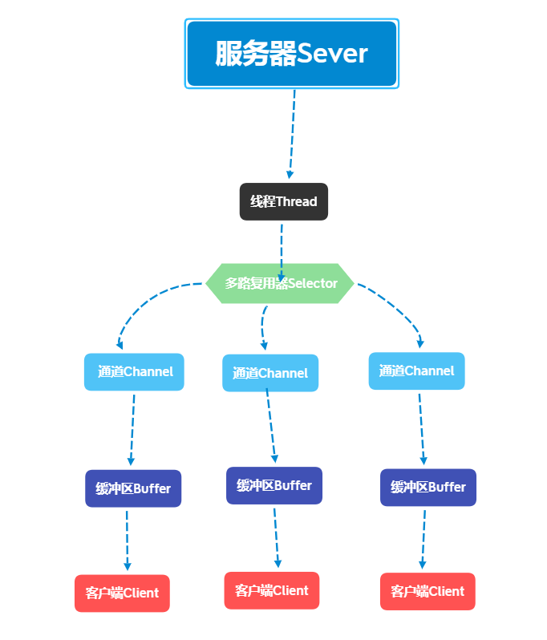

### Java 流(Stream)、文件(File)和IO

在java.io包中操作文件内容的主要有两大类：字节流（InputStream，OutputStream）、字符流（Reader，Writer），两类都分为输入和输出操作。

## 基本概念

Java IO方式有哪些?

- 传统java.io包：对文件进行了抽象、通过输入流输出流进行IO

    - 基于stream模型实现。提供了常见的IO功能: File抽象、输入输出流
    - 交互方式：BIO（同步、阻塞）的方式
    - 在读写动作完成前，线程会一直阻塞在那里，它们之间的调用是可靠的线性顺序。
    - 缺点：IO效率、扩展性存在局限性，会成为应用性能的瓶颈

- java.net包: 网络通信同样是IO行为

    - java.net下的网络API：Socket、ServerSocket、HttpURLConnection
    - 这些也都属于BIO（同步、阻塞）类库

- java.nio包：Java1.4中引入了NIO框架。提供了 Channel、Selector、Buffer 等新的抽象

    - 这些也都属于NIO（同步、非阻塞）类库

- java7的NIO2：引入了异步非阻塞IO方式


## java网络NIO

[Java网络编程（4）NIO的理解与NIO的三个组件](https://blog.csdn.net/key_768/article/details/104577022)

NIO 包含三个重要组件:

- 通道Channel与
- 缓冲区Buffer、
- 多复用选择器Selector



在Java NIO中，通道Channel是在实体和字节缓冲区Buffer之间有效传输数据的媒介. 有两种类型的通道：文件通道（file）和套接字通道（socket）.

选择器Selector用于使用单个线程处理多个通道，它会轮询注册在其上的通道，确定哪个通道准备好通信，通过SelectionKey获得就绪Channel的集合，然后进行IO操作

所有缓冲区类型继承抽象类Buffer，大部分缓冲区类型的操作都类似，仅学习一下最常用的ByteBuffer的操作（能与channel交互的只有ByteBuffer）

### 缓冲区与通道：分散、聚集

ScatteringByteChannel是一个接口，对应的File流、TCP、UDP及管道有四个实现，FileChannel、DatagramChannel、SocketChannel及PipeSourceChannel，分别在不同场景使用。
- 注意ScatteringByteChannel,GatheringByteChannel

   - Scatter(分散) 在读取操作上下文中，通道的内容是分散的(填充)顺序写入多个缓冲区,每个缓冲区都被填满到其limit，直到通道为空或直到使用了全部缓冲区空间
   - Gather(聚集) 在写操作的上下文中，几个缓冲区的内容被依次收集(排干)，然后写入通道,这些缓冲区不需要具有相同的容量

```java
FileChannel fileChannel = FileChannel.open(Paths.get(fileUrl), StandardOpenOption.READ);
ScatteringByteChannel scatterChannel =  fileChannel;
scatterChannel.read(new ByteBuffer[]{byteBuffer1,byteBuffer2});

GatheringByteChannel gatherChannel = ...
gatherChannel.write(new ByteBuffer[]{byteBuffer1,byteBuffer2});

```

[java.nio.ByteBuffer中的flip()、rewind()、compact()等方法的使用和区别](https://www.cnblogs.com/chdf/p/11466522.html)

### selector

- Selector是一个选择器，用于处理非阻塞的通道，即一个线程设置一个选择器，可以处理多个通道
- Selector用于处理网络通道，常用的有ServerSocketChannel、SocketChannel，需要这些通道注册在Selector上才可以管理
- Selector有许多方法，其中select（）方法监控所有通道，当有通道发生事件时，会将该通道的 SelectionKey对象保存到集合
- SelectionKey是对象是一个标识对象，里面保存着许多属性


SelectionKey: 表示SelectableChannel在Selector中注册的标识.每个Channel向Selector注册时,都将会创建一个selectionKey

服务端

```java
public class NIOServer {
    public static void main(String[] args) throws Exception {
        //打开ServerSocketChannel等待连接
        ServerSocketChannel serverSocketChannel = ServerSocketChannel.open();
        //设置非阻塞
        serverSocketChannel.configureBlocking(false);
        //绑定端口号6666
        serverSocketChannel.socket().bind(new InetSocketAddress(6666));
        //打开选择器
        Selector selector = Selector.open();
        //注册,监听连接事件
        serverSocketChannel.register(selector, SelectionKey.OP_ACCEPT);

        while (true){
            //循环监听
            //select是阻塞方法
/*            if ( selector.select(5000)==0){
                System.out.println("没有客户端连接");
                continue;
            }*/
            selector.select();
            //获得存在事件的SelectionKey
            Set<SelectionKey> selectionKeys = selector.selectedKeys();
            //迭代Set集合
            Iterator<SelectionKey> keyIterator = selectionKeys.iterator();
            while (keyIterator.hasNext()){

                SelectionKey key = keyIterator.next();
                if (key.isAcceptable()){
                    System.out.println("得到客户端连接");
                    //accept得到SocketChannel
                    SocketChannel socketChannel = serverSocketChannel.accept();
                    //设置非阻塞
                    socketChannel.configureBlocking(false);
                    //注册,socketChannel监听读事件
                    //关联一个bytebuffer
                    //socketChannel.register(selector, SelectionKey.OP_READ, ByteBuffer.allocate(1024));
                    socketChannel.register(selector, SelectionKey.OP_READ);
                }
                if (key.isReadable()){
                    //SelectionKey的channel方法得到SocketChannel
                    SocketChannel socketChannel = (SocketChannel) key.channel();
                    //获得buffer
                    //ByteBuffer byteBuffer = (ByteBuffer) key.attachment();
                    ByteBuffer byteBuffer = ByteBuffer.allocate(1024);
                    //从通道读出数据
                    socketChannel.read(byteBuffer);
                    byteBuffer.clear();

                    System.out.println(new String(byteBuffer.array()));
                }
                keyIterator.remove();
            }

        }
    }

}

```

客户端

```java
public class NIOClient {
    public static void main(String[] args) throws Exception{
        //打开通道
        SocketChannel socketChannel = SocketChannel.open();
        //设置为非阻塞
        socketChannel.configureBlocking(false);
        //绑定
        InetSocketAddress inetSocketAddress = new InetSocketAddress("127.0.0.1", 6666);
        if(!socketChannel.connect(inetSocketAddress)){
            while (!socketChannel.finishConnect()){
                System.out.println("连接失败");
            }
        }
        while (true) {
            Scanner scanner = new Scanner(System.in);
            String str = scanner.nextLine();
            System.out.println(str);

            ByteBuffer byteBuffer = ByteBuffer.wrap(str.getBytes());

            socketChannel.write(byteBuffer);

        }
    }
}

```

