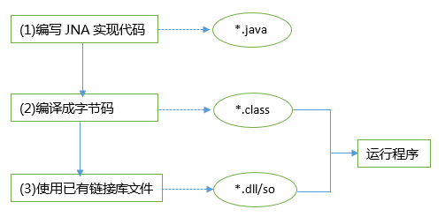

# java 调用native动态库

加载文件和动态链接库主要对native 方法有用，对于一些特殊的功能（如访问操作系统底层硬件设备等） Java 程序元法实现，必须借助C 语言来完成，此时需要使用C 语言为Java 方法提供实现。其实现步骤如下：


如果采用JNI方式， 参考 [JNI广泛文档](http://docs.oracle.com/javase/7/docs/technotes/guides/jni/spec/functions.html)


## JDK 9前 JNI方式

- Java 程序中声明native 修饰的方法， 类似于abstract 方法，只有方法签名，没有实现．编译该Java 程序，生成一个class 文件．

```sh
$javac HelloWorld.java  
```

- 用javah 编译第1 步生成的class 文件，将产生一个h 文件。

```sh
#得到HelloWorld.h文件
$javah -jni HelloWorld  
```

- 写一个.cpp 文件实现native 方法，这一步需要包含第2 步产生的. h 文件（这个.h文件中又包含了JDK 带的jni.h 文件），

```sh
$vi HelloWorldImpl.cpp
```

- 将第3 步的.cpp 文件编译成动态链接库文件。

```sh
#得到HelloWorldImpl.dll
$cl/LD D:\JNI\HelloWorldImpl.cpp 
```

- 在Java中用System 类的loadLibrary..()方法或Runtime 类的loadLibrary..()方法加载
- 第4 步产生的动态链接库文件， Java 程序中就可以调用这个native 方法了。

附1： HelloWorld.java 文件

```java
public class HelloWorld {  
    public native void displayHelloWorld();// java native方法申明  
  
    static {  
        System.loadLibrary("HelloWorldImpl");// 装入动态链接库，"HelloWorldImpl"是要装入的动态链接库名称。  
    }  
  
    public static void main(String[] args) {  
        // TODO Auto-generated method stub  
        HelloWorld helloWorld = new HelloWorld();  
        helloWorld.displayHelloWorld();  
    }  
}  
```

附2：HelloWorldImpl.cpp 文件

```cpp
#include "HelloWorld.h"
#include <stdio.h>
#include <jni.h>

JNIEXPORT void JNICALL Java_HelloWorld_displayHelloWorld
  (JNIEnv *, jobject)
 {
    printf("Hello World!\n");
    return;
}
```

## JDK 9后 JNI方式

过程概述：

- 首先编写java source，然后通过`javac -h <生成C头文件目录>  <java_source>` 得到头文件

- 编写对应头文件的C source文件

- C文件编译成动态链接库文件

下面以一个简单例子说明

step1： 编写java shource

    ```java
    public class HelloWord {  
        public native void displayHelloWorld(int i, String str);  
    
        static {  
            System.loadLibrary("HelloWorldImpl");
        }  
    
        public static void main(String[] args) {  
            // TODO Auto-generated method stub  
            HelloWord helloWorld = new HelloWord();  
            helloWorld.displayHelloWorld(1,"abc");  
        }  
    }  
    ```

step2: 生成头文件

    ```sh
    $>javac -h c HelloWord.java
    $>tree /F
    C:.
    │  HelloWord.class
    │  HelloWord.java
    │
    └─c
            HelloWord.h
    ```

step3: 编写C source, 

    ```sh
    $gcc  -c -I%JAVA_HOME%\include -I%JAVA_HOME%\include\win32 HelloWordImpl.c
    $gcc  -shared    -o helloWordImpl.dll  HelloWordImpl.o
    ```


## JNA方式

Java调用Native的动态库有两种方式，JNI和JNA，JNA是Oracle最新推出的与Native交互的方式。 在JNA开发时，有个好用工具[jnaerator](https://code.google.com/archive/p/jnaerator/)

[JNA 官方文档](https://github.com/java-native-access/jna#using-the-library)

[JNA 官方API文档](http://java-native-access.github.io/jna/3.5.1/javadoc/com/sun/jna/package-summary.html)

[JNA Examples](https://www.eshayne.com/jnaex/index.html)



注：JNA中，它提供了一个动态的C语言编写的转发器，可以自动实现Java和C的数据类型映射。


[Default Type Mappings](https://github.com/java-native-access/jna/blob/master/www/Mappings.md)
=====================

Java primitive types (and their object equivalents) map directly to the native C type of the same size.

|Native Type|Size            |Java Type   |Common Windows Types|
|-------|--------------------|------------|-----------|
|char   |8-bit integer       |byte        |BYTE, TCHAR|
|short  |16-bit integer      |short       |WORD       |
|wchar_t|16/32-bit character |char        |TCHAR      |
|int    |32-bit integer      |int         |DWORD      |
|int    |boolean value       |boolean     |BOOL       |
|long   |32/64-bit integer   |NativeLong  |LONG       |
|long long|64-bit integer    |long        |__int64    |
|float  |32-bit FP           |float       |           |
|double |64-bit FP           |double      |           |
|char*  |C string            |String      |LPCSTR     |
|void*  |pointer             |Pointer     |LPVOID, HANDLE, LP<i>XXX</i>|

无符号类型映射与有符号类型映射相同。对C enum 映射为int


```groovy
dependencies 
{
    ...
    implementation 'net.java.dev.jna:jna:4.5.0'
}
```

golang构建动态库为例，`Go build -buildmode=c-shared -o libhello.dll .\libhello.go`

```golang
package main

import "C"

import "fmt"

//export Hello
func Hello(msg string)  *C.char  {
    fmt.Print("hello: " + msg)    
    return C.CString("hello: " + msg)
}

//export Sum
func Sum(a int, b int) int {   return a + b}

func main() {}
```

java 创建对应调用接口。 以整型与String为例

```java
package com.example.helloWord;

import com.sun.jna.Library;
import com.sun.jna.Native;
import java.util.List;
import java.util.Arrays;
import com.sun.jna.Structure;

public interface LibHello extends Library {
    LibHello INSTANCE = (LibHello) Native.loadLibrary("c:/home/libhello", LibHello.class);

    int Sum(int a, int b);

    // GoString class maps to:
    // C type struct { const char *p; GoInt n; }
    public class GoString extends Structure {
        public static class ByValue extends GoString implements Structure.ByValue {
        }

        public String p;
        public long n;

        protected List getFieldOrder() {
            return Arrays.asList(new String[] { "p", "n" });
        }

    }

    public String Hello(GoString.ByValue msg);
}

```

java 调用golang动态库为例，

```java
package com.example.helloWord;

public class App {
        public static void main(String[] args) {
        //System.out.println(new App().getGreeting());
        System.out.println(LibHello.INSTANCE.Sum(222, 333));

        LibHello.GoString.ByValue str = new LibHello.GoString.ByValue();
        str.p = "msg, Hello Java!";
        str.n = str.p.length();

        String returnstr = LibHello.INSTANCE.Hello(str);
        System.out.printf("\nreturned:%s\n",returnstr);
    }
}
```

将C头文件生成JNA接口，有个工具[java -jar jnaeratorStudio.jar](https://github.com/nativelibs4java/JNAerator)可以考虑使用。