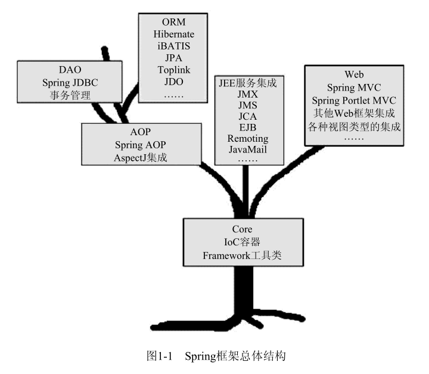

## incubator-servicecomb-java-chassis
```shell
git clone https://github.com/apache/incubator-servicecomb-java-chassis.git
cd ServiceComb-Java-Chassis
mvn clean install -DskipTests
```

- [[华为微服务框架ServiceComb的简要介绍]](https://www.jianshu.com/p/ba432eae0a8f)
- [[servicecomb quickStart]](http://servicecomb.incubator.apache.org/docs/quick-start/)


# spring

整个Spring框架构建在Core核心模块之上，它是整个框架的基础。在该模块中，Spring为我们提供了一个IoC容器（IoC Container）实现，用于帮助我们以依赖注入的方式管理对象之间的依赖关系。对
Spring的IoC容器的介绍将成为我们此次Spring之旅的第一站。除此之外，Core核心模块中还包括框架内部使用的各种工具类（如果愿意，我们也可以在框架之外使用），比如Spring的基础IO工具类等，
这些基础工具类我们也会在合适的地方介绍。



Spring为我们提供了一个IoC容器（IoC Container）实现，用于帮助我们以依赖注入的方式管理对象之间的依赖关系。

沿着Spring生命之树往上左序遍历，我们将来到AOP模块。该模块提供了一个轻便但功能强大的AOP框架，让我们可以以AOP的形式增强各POJO的能力，进而补足OOP/OOSD之缺憾。Spring的AOP框架符合AOP Alliance规范，采用Proxy模式构建，与IoC容器相结合，可以充分显示出Spring AOP的强大威力。

