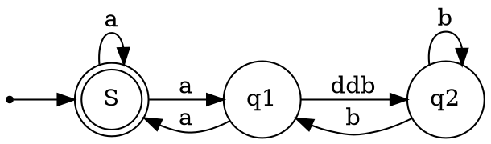

# 面向切面编程（AOP）

1、概念：AOP是建立在Java的反射基础之上，具体是指散落在程序中的公共部分提取出来，做成了切面类，这样做的好处在于代码的可重用。一旦涉及到该功能的需求发生变化，只要修改该代码就行。AOP的实现主要是由JDK的动态代理与CGLIB代理。下面会具体介绍这两种代理。

2、意义：增强类的功能（在目标对象的方法执行之间和执行之后）。

spring用代理类包裹切面，把他们织入到Spring管理的bean中，也就是说代理类伪装成目标类，它会截取对目标类中方法的调用，然调用者对目标类的调用都先变成伪装类，伪装类这就先执行了切面，再把调用转发给真正的目标bean。

- AOP中的概念实体
  
  |概念|说明|
  |--|--|
  |Joinpoint：|拦截点，如某个业务方法。 |
  |Pointcut： |Joinpoint的表达式，表示拦截哪些方法。一个Pointcut对应多个Joinpoint。org.sprngframework.aop.Pointcut|
  |Advice:    |要切入的逻辑。|
  |Before Advice |在方法前切入。|
  |After Advice  |在方法后切入，抛出异常时也会切入。|
  |After Returning Advice |在方法返回后切入，抛出异常则不会切入。|
  |After Throwing Advice  |在方法抛出异常时切入。|
  |Around Advice          |在方法执行前后切入，可以中断或忽略原有流程的执行 |


## spring如何实现伪装类（代理类）

### JDK PROXY:实现和目标类相同的接口

  我也实现和你一样的接口，反正上层都是接口级别的调用，这样我就伪装成了和目标类一样的类（实现了同一接口），也就逃过了类型检查，到java运行期的时候，利用多态的后期绑定（所以spring采用运行时），伪装类（代理类）就变成了接口的真正实现，二他里面包裹了真实的那个目标类，最后实现具体功能的还是目标类，只是不过伪装在之前干了点事情（写日志，安全检查，事物等）。
```java
interface Interface{
    void doSomething();
}

/*原始对象*/
class RealObject implements Interface{
    @Override
    public void doSomething() {
        System.out.println("原始对象的行为");
    }
}

/*代理*/
class SimplProxy implements Interface {
    private Interface proxied;

    public SimplProxy(Interface proxied){
        this.proxied = proxied;
    }

    public void doSomething(){
        System.out.println("处理一些通用的业务逻辑, 如参数校验等等");
        proxied.doSomething();
    }
}

/*调用者*/
class Caller{
    public static void call(Interface iface){
        iface.doSomething();
    }

    public static void main(String[] args){
        call(new SimplProxy(new RealObject()));
    }
}
/*输出：*/
//１．处理一些通用的业务逻辑, 如参数校验等等
//２．原始对象的行为
//就这样，一些通用的业务逻辑被代理简单地切入到了原始对象之前执行
```

### spring proxy实现方式

java.lang.reflect.Proxy, java.lang.reflect.InvocationHandler

演示为Isubject,IRequestable两种类型实现代理对象.

- step1: 
```java
public class RequestInvocationHandler implements InvocationHandler {
    private Object target;
    public RequestInvocationHandler(Object target) 
       this.target = target;
    }
    public Object invoke(Object proxy, Method method, Object[] args) {
        if(method.getName().equals("request")) {
            //....
        }
        return null;
    }
}
```
- step2: 生成对应的代理对象实例

```java
ISubject subject = (ISubject)Proxy.newProxyInstance(
    ProxyRunner.class.getClassLoader(),
    new Class[]{Isubject.class},
    new RequestInvocationHandler(new SubjectImpl())
);
subject.request();
//。。。
```




