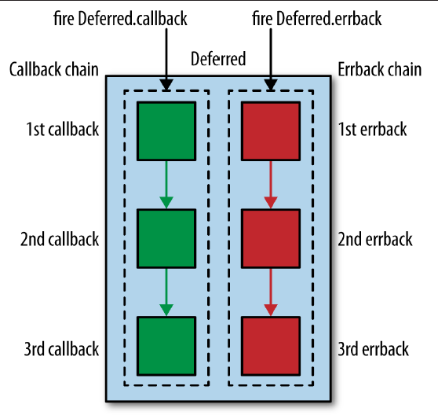

Twisted初始设计目的是作为开发internet程序的框架。

[Everything You Always Wanted to Know about Twisted](https://jml.io/pages/everything-you-always-wanted-to-know-about-twisted.html)

[Twisted中文教程](https://www.gitbook.com/book/fengyouchao/twisted-intro-cn)

look at the [Twisted core documentation](http://twistedmatrix.com/documents/current/core/howto/index.html) then refer to the [API](http://twistedmatrix.com/documents/current/api/) and then into the [source code](http://twistedmatrix.com/trac/browser/tags/releases/twisted-9.0.0/twisted).


异步编程： 简单理解就是在单线程下的任务交错完成。

虽然在操作系统层次，对单个处理器，多线程编程其实也是任务交错执行，但从逻辑角度还是必须按照多线程并发去理解，以避免迁移到多处理机的机器上出问题。


# part 1:

## 安装twisted

### 升级pip

采用下面的指令升级pip

```shell
#升级默认提供的pip3为最新版本
~$sudo python3 -m pip install --upgrade --force-reinstall pip  --trusted-host pypi.douban.com

~$pip3 -V
pip 20.1.1 from /usr/local/lib/python3.9/site-packages/pip (python 3.9)
```

### 源码安装twisted

先上[pypi官网](https://pypi.org/project/Twisted/)下载Twisted源码，然后通过`python setup.py install`指令进行安装

    ```sh
    $wget https://files.pythonhosted.org/packages/4a/b4/4973c7ccb5be2ec0abc779b7d5f9d5f24b17b0349e23240cfc9dc3bd83cc/Twisted-20.3.0.tar.bz2 --no-check-certificate
    $tar -xjvf Twisted-20.3.0.tar.bz2 
    $cd Twisted-20.3.0/
    $sudo python3 setup.py  install
    ```
安装完成以后，就正常import/使用了
    ```python
    In [1]: import twisted
    In [2]: twisted.__version__
    Out[2]: '20.3.0'
    In [3]:
    ```

## Building Basic Clients and Servers

注意， 在twisted中`transports`与`protocols`是完全分离的，这使得在同一个`transports`可以实现不同的`protocols`

### The Reactor

Twisted核心概念是reactor event loop. reactor可以处理network, filesystem,and timer事件。 它的核心是完成下面的循环, 启动这个循环是通过`reactor.run()`。一旦这个循环启动了，就一直在这个循环中，直到调用`reactor.stop()`:

```python
while True:
    timeout = time_until_next_timed_event()
    events = wait_for_events(timeout)
    events += timed_events_until(now())
    for event in events:
        event.process()
```

- Twisted的reactor只有通过调用reactor.run()来启动。
- reactor循环是在其开始的进程中运行，也就是运行在主进程中。
- 一旦启动，就会一直运行下去。reactor就会在程序的控制下（或者具体在一个启动它的线程的控制下）。
- reactor循环并不会消耗任何CPU的资源。
- 并不需要显式的创建reactor，只需要引入就OK了。因为reactor是Singleton模式，即在一个程序中只能有一个reactor，并且只要你引入它就相应地创建一个。

下面演示了两种启动reactor的方式,它们的不同是底层实现reactor的技术不一样

```python
#方式1使用select
from twisted.internet import reactor
reactor.run()

#方式2：使用poll
from twited.internet import pollreactor
pollreactor.install()
from twisted.internet import reactor
reactor.run()
```

使用reactor的常用方法：

```python
from twisted.internet import reactor

# tell the Twisted reactor to monitor this xx for reading，要求xx必须实现IFileDescriptor接口
reactor.addReader(xx)
# stop monitoring this socket
reactor.removeReader(xx)
# see if there are any poetry sockets left
for reader in reactor.getReaders():
    pass

#注册callback，当reactor run时，调用xx callback
reactor.callWhenRunning(hello)

#注册callback， 参数1是几秒后执行， 参数2是callback
reactor.callLater(1, func)

#启动reactor，进入监听态
reactor.run()

#停止reactor, 显然它只有在注册到reactor的callback中被调用才有执行机会
reactor.stop()
```


### Transports

transport代表网络两端节点的连接。连接的细节都封装在transport中，例如是tcp/UDP, or socket？ 端口是什么？`Transports` 实现的接口是`ITransport interface`, 该接口(`from  twisted.internet.interfaces  import ITransport`)包含以下方法:

```python
class ITransport(Interface):
    """
    I am a transport for bytes.

    I represent (and wrap) the physical connection and synchronicity
    of the framework which is talking to the network.  I make no
    representations about whether calls to me will happen immediately
    or require returning to a control loop, or whether they will happen
    in the same or another thread.  Consider methods of this class
    (aside from getPeer) to be 'thrown over the wall', to happen at some
    indeterminate time.
    """

    def write(data):
        """
        Write some data to the physical connection, in sequence, in a
        non-blocking fashion.

        If possible, make sure that it is all written.  No data will
        ever be lost, although (obviously) the connection may be closed
        before it all gets through.

        @type data: L{bytes}
        @param data: The data to write.
        """

    def writeSequence(data):
        """
        Write an iterable of byte strings to the physical connection.

        If possible, make sure that all of the data is written to
        the socket at once, without first copying it all into a
        single byte string.

        @type data: an iterable of L{bytes}
        @param data: The data to write.
        """

    def loseConnection():
        """
        Close my connection, after writing all pending data.

        Note that if there is a registered producer on a transport it
        will not be closed until the producer has been unregistered.
        """

    def getPeer():
        """
        Get the remote address of this connection.

        Treat this method with caution.  It is the unfortunate result of the
        CGI and Jabber standards, but should not be considered reliable for
        the usual host of reasons; port forwarding, proxying, firewalls, IP
        masquerading, etc.

        @return: An L{IAddress} provider.
        """

    def getHost():
        """
        Similar to getPeer, but returns an address describing this side of the
        connection.

        @return: An L{IAddress} provider.
        """
```

### Protocols

Protocols 描述了如何处理网络事件.最核心的是`from twisted.internet.protocol import Protocol` ,如何面向连接的流传输都需要以它作为基类来实现。例如twisted已经预实现了http/telent，dns，imap...:

```python
@implementer(interfaces.IProtocol, interfaces.ILoggingContext)
class Protocol(BaseProtocol):
    """
    This is the base class for streaming connection-oriented protocols.

    If you are going to write a new connection-oriented protocol for Twisted,
    start here.  Any protocol implementation, either client or server, should
    be a subclass of this class.

    The API is quite simple.  Implement L{dataReceived} to handle both
    event-based and synchronous input; output can be sent through the
    'transport' attribute, which is to be an instance that implements
    L{twisted.internet.interfaces.ITransport}.  Override C{connectionLost} to be
    notified when the connection ends.

    Some subclasses exist already to help you write common types of protocols:
    see the L{twisted.protocols.basic} module for a few of them.
    """
```

#### Protocol Factories

Protocol工厂是: `twisted.internet.protocol.Factory`与`twisted.internet.protocol.ClientFactory`

工厂的`buildProtocol method`是用来为每个新连接创建`protocol`, 并且该工厂会传递给`reactor`去注册callbacks

下面是一个最简单的例子

客户端
   ```python
    from twisted.internet import protocol, reactor
    class Echo(protocol.Protocol):
        def dataReceived(self, data):
            self.transport.write(data)
    class EchoFactory(protocol.Factory):
        def buildProtocol(self, addr):
            return Echo()
    reactor.listenTCP(8000, EchoFactory())
    reactor.run()
   ```

服务端

    ```python
    from twisted.internet import reactor, protocol
    class EchoClient(protocol.Protocol):
        def connectionMade(self):
            self.transport.write("Hello, world!")
    def dataReceived(self, data):
        print "Server said:", data
            self.transport.loseConnection()
    class EchoFactory(protocol.ClientFactory):
        def buildProtocol(self, addr):
            return EchoClient()
        def clientConnectionFailed(self, connector, reason):
            print "Connection failed."
            reactor.stop()
        def clientConnectionLost(self, connector, reason):
            print "Connection lost."
            reactor.stop()
    reactor.connectTCP("localhost", 8000, EchoFactory())
    reactor.run()
    ```

### 

## 使用Deferreds


## Web Servers


#


# part 2： 使用reactor以及Twisted event loop,


参照[How do I make pylint recognize twisted and ephem members?](https://stackoverflow.com/questions/17142236/how-do-i-make-pylint-recognize-twisted-and-ephem-members)
在`pylintrc`文件中增加
```python
# List of classes names for which member attributes should not be checked
# (useful for classes with attributes dynamically set).
ignored-classes=SQLObject,twisted.internet.reactor,ephem
```

## Scheduling 

`reactor`为支持scheduling， reactor实现了接口`twisted.internet.interfaces.IReactorTime`

[twisted scheduling官方说明](https://twistedmatrix.com/documents/current/core/howto/time.html)

### 在将来时刻执行某个task

在将来执行某个task的基本用法是

```python
from twisted.internet import reactor
def f(s):
    print("this will run 3.5 seconds after it was scheduled: %s" % s)
reactor.callLater(3.5, f, "hello, world")
# f() will only be called if the event loop is started.
reactor.run()
```

但如果你需要关心该task的执行结果以及异常，那应通过deferred的包装来执行该task，例如

```python
from twisted.internet import task
from twisted.internet import reactor
def f(s):
    return "This will run 3.5 seconds after it was scheduled: %s" % s
d = task.deferLater(reactor, 3.5, f, "hello, world")
def called(result):
    print(result)
d.addCallback(called)
# f() will only be called if the event loop is started.
reactor.run()    
```

### 每x秒执行某个task

通过`twisted.internet.task.LoopingCall`实现


## Using Deferreds 

下面描述如何使用`twisted.internet.defer.Deferred`


使用deferred的常用方法：


```python
# fire the chain with an error result
d.errback(Failure(Exception('I have failed.')))

#add a callback to callback chain ,and to errback chain
d.addBoth(poem_done)
```

下面演示了在deferred被激活后是如何销毁其引用的。这种方式普便存在于Twisted的源代码中，这样做可以保证我们不会激活一个deferred两次。这也为Python的垃圾回收带来的方便。

```python
class xxx:
    def __init__(self, deferred):
        self.deferred = deferred

    def yy(self, poem):
        if self.deferred is not None:
            d, self.deferred = self.deferred, None
            d.callback(poem)
    def zz(self, connector, reason):
        if self.deferred is not None:
            d, self.deferred = self.deferred, None
            d.errback(reason)
```

[官方介绍Introduction to Deferreds](https://twisted.readthedocs.io/en/twisted-18.4.0/core/howto/defer-intro.html)

`Deferreds`专注实现一样东西： 记录执行顺序， 使得执行顺序与源代码顺序完全隔离开来。

callback 是事件驱动编程的一个基本部分，由reactor向程序指示事件到来。 随着事件基于事件驱动的程序更多逻辑增加，处理应用程序中的成功/失败变得越来越复杂。一旦没有正确的注册callback，将可能使得应用程序阻塞在永远不会发生的事件上。同时对于`errors`也可能需要在`callback chain`上进行传播。

为解决这个问题， twisted提供了`Deferred`来管理callbacks。 对延时（Deferred）有几点需要着重强调下：

- • Deferreds主要是用来帮助你编写异步代码.
- • Deferreds并不会自动使得代码成为异步/非阻塞代码. 为使得同步代码成为异步代码, 需要你重构同步代码 并返回已注册callbacks的`Deferred`.

- 异步函数返回一个deferred，对用户意味着：

    我是一个异步函数。不管你想要什么，可能现在马上都得不到。但当结果来到时，我会激活这个deferred的callback链并返回结果。或者当出错时，相应地激活errback链并返回出错信息。


### The Structure of a Deferred Object

抽象机制-Deferred-让程序员在使用回调时更简便。

一个Deferred有一对回调链，一个是为针对正确结果的callbacks，另一个针对错误结果的callbacks，这两个链的长度是完全一样的。新创建的Deferred的这两条链是空的。我们可以向两条链里分别添加callback与errback。其后，就可以用正确的结果或异常来激活Deferred。一旦异步结果到了，Deferred就被命中，并且适当的callbacks 或 errbacks就会按照它们被添加到链中的顺序被调用。


下图显示了显示了Deferred的回调链。




`Deferreds`中的关键之处

- 1. Deferreds将会在调用其callback或errback时被触发；
- 2. Deferreds仅能被触发一次！如果尝试多次触发将会导致AlreadyCalledError异常；
- 3. 第N级callback或errback中的Exceptions将会传入第N+1级的errback中；如果没有errback，则会抛出Unhandled Error。如果第N级callback或errback中没有抛出Exception或返回Failure对象，那接下来将会由第N+1级中的callback进行处理；
- 4. callback中返回的结果将会传入下一级callback，并作为其第一个参数；
- 5. 如果传入errback的错误不是一个Failure对象，那将会被自动包装一次。

- 6. 值得注意的是，注册回调总是成对的。在使用d.addCallback和d.addErrorback方法时，我们看似只是添加了一个callback或一个errback。而实际上，为了完成这一级回调链的创建，这些方法还会为另一半注册一个pass-through(定义是`def passthru(arg):    return arg`)。要记住，回调链总是具有相同的长度。

下图显示了层级的产生，以及addcallbacks与单独addcallback/adderrback的差异


在下面这个例子中，演示了回调链的层级。以及从success callback链跳转到errback链，以及演示了如果N层errback没有抛出异常，将转移到N+1层的success callback链处理.

```python
from twisted.internet.defer import Deferred
from twisted.python.failure import Failure
from twisted.internet import defer

class MyCustomException(Exception):
    def __init__(self, msg, code):
        self.code = code
        self.message = msg

def callback1(result):
    print("callback1 with input:",result)
    #raise MyCustomException('Message', 23)
    return "from callback1:"+result
def callback2(result):
    print("callback2 with input:",result)
    raise MyCustomException('Message', 23)

def errback0(failure):
    # failure.value is an exception instance that you raised in callback
    print("in errback0:",failure.value.message, ' ',failure.value.code)
def errback1(failure):
    # failure.value is an exception instance that you raised in callback
    print("in errback1:",failure.value.message, ' ',failure.value.code)
def errback2(failure):
    # failure.value is an exception instance that you raised in callback
    print("in errback2:",failure.value.message, ' ',failure.value.code)
def errback3(failure):
    # failure.value is an exception instance that you raised in callback
    print("in errback3:",failure.value.message, ' ',failure.value.code)
def errback4(failure):
    # failure.value is an exception instance that you raised in callback
    print("in errback4:",failure.value.message, ' ',failure.value.code)

d = defer.Deferred()
d.addErrback(errback0)
d.addCallbacks(callback1,errback1)
d.addCallbacks(callback2,errback2)
d.addErrback(errback3)
d.addErrback(errback4)

#d.errback(MyCustomException('Message', 24))
d.callback("error")
callback1 with input: error
callback2 with input: from callback1:error
in errback3: Message   23
```


### Callback Chains and Using Deferreds in the Reactor

这一章将解释如何在reactor中使用callbacks与errbacks

下面的代码演示了在`reactor`中如何使用`Deferred`
```python
In [1]: from twisted.python.failure import Failure
   ...: from twisted.internet import reactor, task
   ...: class HeadlineRetriever(object):
   ...:     
   ...:     def preprocessHeadline(self, headline):
   ...:         print("call processHeadline\n")
   ...:         if len(headline) > 50:
   ...:             raise Failure(Exception(
   ...:             "The headline ``%s'' is too long!" % (headline,)))
   ...:         else:
   ...:             return headline
   ...:         
   ...:     def _toHTML(self, result):
   ...:         print("call _toHTML\n")
   ...:         return "<h1>%s</h1>" % (result,)
   ...:     
   ...:     def getHeadline(self, input):
   ...:         self.d = task.deferLater(reactor, 0, self.preprocessHeadline, input)
   ...:         self.d.addCallback(self._toHTML)
   ...:         self.d.addCallbacks(printData, printError)
   ...:         
   ...: def printData(result):
   ...:     print("call printData\n")
   ...:     print(result)
   ...: def printError(failure):
   ...:     print("来自:",failure)
   ...: 
   ...: 
   ...: h = HeadlineRetriever()
   ...: #h.getHeadline("Breaking News: Twisted Takes Us to the Moon!")
   ...: h.getHeadline("1234567890"*6)
   ...: h.d.addCallback(lambda ignored: reactor.stop())
   ...: reactor.run()
call processHeadline

来自: [Failure instance: Traceback: <class 'Exception'>: The headline ``123456789012345678901234567890123456789012345678901234567890'' is too long!
--- <exception caught here> ---
C:\tools\Anaconda3\envs\spider\lib\site-packages\twisted\internet\defer.py:654:_runCallbacks
C:\tools\Anaconda3\envs\spider\lib\site-packages\twisted\internet\task.py:866:<lambda>
<ipython-input-1-16223c6435d1>:8:preprocessHeadline
]

In [2]: 
```

### 理解defer.inlineCallbacks

使用python` generators`技术来写callback。 实现代码见[inlineCallbacks source code](https://github.com/twisted/twisted/blob/twisted-10.1.0/twisted/internet/defer.py#L973)

http://krondo.com/just-another-way-to-spell-callback/

`@inlineCallbacks` 修饰器(decorator)完成以下几个事情：

- 该修饰器应用在`generator function`上, 使得`generator function`转化为`asynchronous callbacks`.
- 当调用`@inlineCallbacks` 修饰器修饰的`generator function`，程序自动具备了`next`,`send`,`throw`的调用,不需要显示的去调用它们
- Third, if we yield a non-deferred value from the generator, it is immediately restarted with that same value as the result of the yield.
- And finally, if we yield a deferred from the generator, it will not be restarted until that deferred fires. If the deferred succeeds, the result of the yield is just the result from the deferred. And if the deferred fails, the yield statement raises the exception. Note the exception is just an ordinary Exception object, rather than a Failure, and we can catch it with a try/except statement around the yield expression.


解决`twisted.internet.error.ReactorNotRestartable`问题
<!-- def crawl():
    crawler = CrawlerProcess(settings)
    crawler.crawl(MySpider)
    crawler.start()

process = Process(target=crawl)
process.start()
process.join() -->